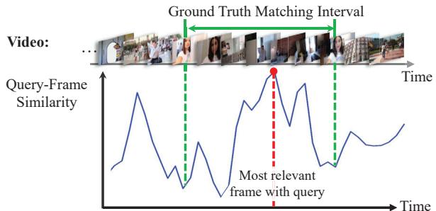
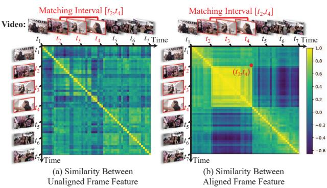
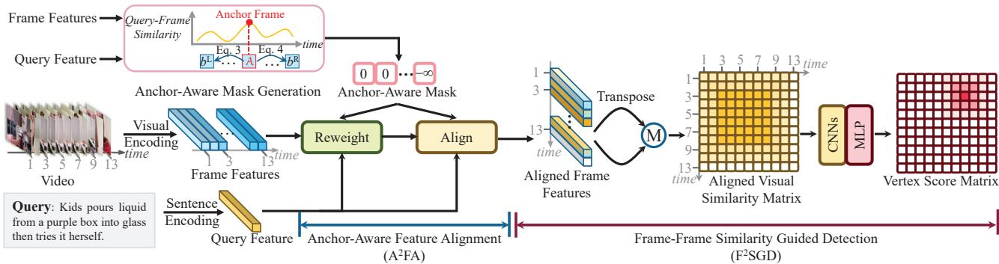
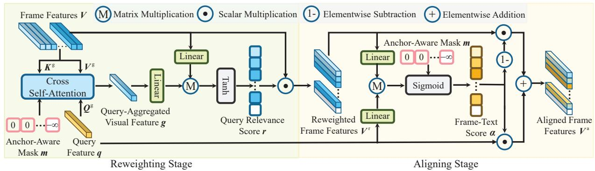
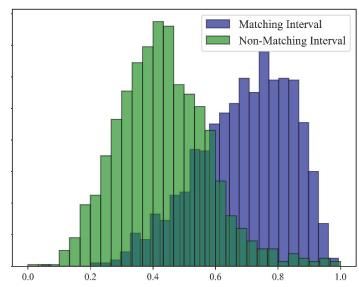
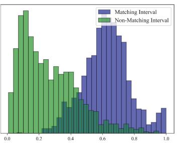
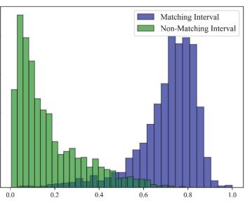
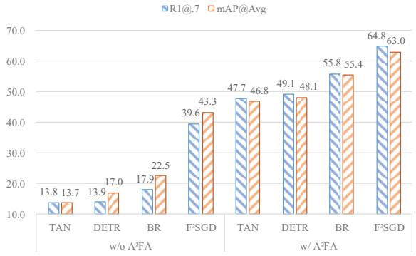
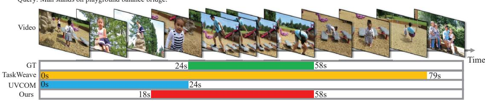

# Anchor-Aware Similarity Cohesion in Target Frames Enables Predicting Temporal Moment Boundaries in 2D

Jiawei Tan $^{1}$ , Hongxing Wang $^{1,2,*}$ , Junwu Weng $^{3}$ , Jiaxin Li $^{1}$ , Zhilong Ou $^{1}$ , Kang Dang $^{4}$ $^{1}$ School of Big Data and Software Engineering, Chongqing University, China

$^{2}$ Key Laboratory of Dependable Service Computing in Cyber Physical Society (Chongqing University), Ministry of Education, China $^{3}$ ByteDance Intelligent Creation

$^{4}$ School of AI and Advanced Computing, XJTLU Entrepreneur College (Taicang), Xi'an Jiaotong-Liverpool University, Suzhou, China
{jwtan, ihxwang}@cqu.edu.cn, we0001wu@e.ntu.edu.sg, jiaxin\_li@cqu.edu.cn,
zlou@stu.edu.cn, Kang.Dang@xjtlu.edu.cn

## Abstract

Video moment retrieval aims to locate specific moments from a video according to the query text. This task presents two main challenges: i) aligning the query and video frames at the feature level, and ii) projecting the query-aligned frame features to the start and end boundaries of the matching interval. Previous work commonly involves all frames in feature alignment, easy to cause aligning irrelevant frames with the query. Furthermore, they forcibly map visual features to interval boundaries but ignoring the information gap between them, yielding suboptimal performance. In this study, to reduce distraction from irrelevant frames, we designate an anchor frame as that with the maximum query-frame relevance measured by the established Vision-Language Model. Via similarity comparison between the anchor frame and the others, we produce a semantically compact segment around the anchor frame, which serves as a guide to align features of query and related frames. We observe that such a feature alignment will make similarity cohesive between target frames, which enables us to predict the interval boundaries by a single point detection in the 2D semantic similarity space of frames, thus well bridging the information gap between frame semantics and temporal boundaries. Experimental results across various datasets demonstrate that our approach significantly improves the alignment between queries and video frames while effectively predicting temporal moment boundaries. Especially, on QVHighlights Test and ActivityNet Captions datasets, our proposed approach achieves 3.8% and 7.4% respectively higher than current state-of-the-art R1@.7 performance. The code is available at https://github.com/ExMorgan-Alter/AFAFSGD.

## 1. Introduction

Video moment retrieval (VMR) aims to locate the start and end timestamps of the most semantically relevant segments in a video based on natural language queries. It holds a broad spectrum of applications, including video highlight detection $[24]$ and video summarization $[12]$ .

Due to the modality gap between video and text, VMR requires aligning the two modalities in the shared feature space. To this end, most existing methods $[17, 25, 26]$ rely on the vision-language model (VLM) to embed query text features into frame features. However, they tend to inject text information into all video frames, easy to suffer from irrelevant frames being aligned with the text. Alleviating irrelevant frames selection is challenging because we do not know which frames are truly relevant to the query text. In this study, we observe that the video frame that is most relevant to the query can commonly stand out from the others by the VLM based query-frame similarity ranking, as illustrated in Fig. 1, which was overlooked by previous VLM related methods $[17, 18, 27, 35, 36]$ . To catch more query-related frames, we anchor the top-ranked relevant frame to select a semantically compact segment where each frame has strong visual-textual similarity with the anchor frame. The semantically compact segment provides a rich semantic guidance, which enables us to have a focused attention for improved query-frame alignment in the feature space. Along this line, we propose the anchor-aware feature alignment ( $A^{2}FA$ ) scheme (Figs. 3 and 4) to adapt video frame representations to being better aligned with that of the query.

As a video moment is determined by its time interval from its start to end boundaries, query-frame alignment in the feature space does not reach the goal of VMR until the two temporal boundaries can be obtained. Previous methods either rely on frame features to estimate the probability of candidate intervals being the target interval $[9, 33, 40]$ or directly regress the frame features to interval boundaries $[18, 20, 35, 39]$ . However, they forcibly transform frame features into temporal boundaries, disregarding the inherent information heterogeneity between frame semantics and temporal boundaries, which results in suboptimal retrieval performance. To bridge this gap, we explore the properties of aligned frame features as a stepping stone from feature space to temporal boundary space. Compared with the unaligned frame features, the query-related aligned frame features are highly similar to each other, as exemplified in Fig. 2. The position coordinate of the upper right corner of the block with high similarity values exactly implies the start time and end time of the matching interval. This observation inspires us to design the Frame-Frame Similarity Guided Detection ( $F^{2}SGD$ ) (Fig. 3), in which we reformulate the interval boundary prediction as a single point detection problem in the 2D similarity space. In this way, the information heterogeneity between features and temporal boundaries is naturally compensated based on the similarity between frames. Notably, our method avoids performing interval boundary detection in the 1D query-frame similarity space, which requires separate start and end boundary detection and additional post-processing. Instead, by operating in a 2D similarity space, where the start and end timestamps are coupled, our approach eliminates the need for post-processing.

Query: A group of young people check into their AirBnB and love it.  
  
Figure 1. Query-frame similarity obtained by the popular VLM, CLIP [29]. Not all frames within the ground-truth matching interval exhibit high similarities with the query, but the most relevant one almost always appear in the ground-truth. Besides, matching frames are semantically related to each other, which motivates us to propagate from the most query-related frames, which we denote as anchor, to the rest frames for better modality alignment between query and video frames.  
Query: Women gives a speech with a mic.

In a nutshell, our contributions include:

\- We propose A $^{2}$ FA, which links the anchor frame identified by the established VLM with its semantically related frames to enable targeted alignment of query text and related video frames in feature space.

\- In the field of VMR, we are the first to perform temporal boundary detection in a 2D similarity space, rather than in frame feature space, to bridge the information gap between frame features and temporal boundaries.

  
Figure 2. Illustration of how VMR is converted into a single point detection in 2D similarity space. The query-related aligned frame features exhibit high similarity to each other compared to unaligned frame features. For the targeted matching interval $[t_{2}, t_{4}]$ to the query, the start time $t_{2}$ and end time $t_{4}$ exactly correspond to the 2D coordinate $(t_{2}, t_{4})$ of the upper right corner of the high-value block in the frame-frame similarity matrix. This observation enables us to narrow the information gap between frame features and temporal boundaries.

\- We perform comprehensive evaluations on three video moment retrieval datasets: QVHighlights [18], Charades-STA [8], and ActivityNet Captions [16]. Our proposed method surpasses previous approaches by large margins.

## 2. Related Work

Video moment retrieval aims to identify a semantically consistent video clip for a given query sentence and output the start and end boundaries of that clip. To achieve this, it must not only align text and video modalities but also map the aligned visual representations to the temporal coordinates of the clip. Below, we discuss relevant methods from these two aspects.

Video-Text Modality Alignment seeks to enhance the similarity between the features of query text and related frames. To this end, previous methods $[3, 4, 38]$ embed query text features into relevant frame features. Encouraged by the recent success in adopting vision-language models (VLMs) for video understanding $[10, 14]$ , many methods $[20, 22, 32, 34]$ are built on frame-wise features from VLMs. Most of methods $[23, 25, 27, 30, 37]$ employ the cross-attention mechanism $[31]$ to inject the query text features into relevant frame features. However, they make all frames embedded with query text information, resulting in aligning irrelevant frames with the query text. To mitigate the involvement of irrelevant frames, we exploit a fact that has been neglected by previous VLM methods [9, 13, 23, 25, 26, 35]: the video frames most relevant to the query can stand out from other video frames through VLM-based query-frame similarity ranking. In this way, we take a semantically compact segment based on the semantical relations between the top-ranked relevant frames and the remaining frames as a semantic guide to align text with video frames at the feature level.

  
Figure 3. The proposed method for video moment retrieval. It enhances the alignment between the query text and video frames in the feature space by Anchor-Aware Feature Alignment ( $A^{2}FA$ , see Fig. 4 for more details), bringing about high similarity between query-related frames. This, in turn, facilitates transforming frame features into precise temporal boundaries by Frame-Frame Similarity Guided Detection ( $F^{2}SGD$ ). $\widehat{M}$ denotes matrix multiplication.

Moment Localization involves projecting the aligned frame features to the start and end timestamps of the matching interval. Enumeration-based $[9, 40]$ and anchor-based methods $[21, 22]$ assess whether a candidate interval matches the query, while regression-based methods $[36, 39]$ directly project features onto the corresponding temporal pairs. However, these methods forcibly map the alignment features to interval coordinates, ignoring the information heterogeneity between visual semantics and coordinate, resulting in suboptimal retrieval performance. In contrast, We bridge the gap from frame features to temporal boundaries by the similarity between frame features. We identify the position coordinates of the upper-right corner of the high-similarity block in the 2D frame similarity space to determine the start and end boundaries of the target interval.

## 3. Method

## 3.1. Problem Formulation

Given an untrimmed video V with N sampled frames and a query sentence Q, video segment retrieval aims to learn a detector D to identify the start s and end boundaries e of the segment consisting of frames relevant to the query. Since the query-related frames do not stand out from the entire video without the help of the query, a mechanism F is need to inject query information into the query-related frames, with more discriminative aligned frame features $V^{a}$ . This enable D to act on $V^{a}$ for better boundary detection. In this study, as illustrated in Fig. 3, we propose Anchor-Aware

Feature Alignment (A²FA) for F and Frame-Frame Similarity Guided Detection (F²SGD) for D.

## 3.2. Anchor-Aware Feature Alignment

To represent video V and query Q of different modalities, we follow the widely practice of using frozen pre-trained CLIP [29] encoding for both. By CLIP encoding, we obtain N frame d-dimension features $V = [v_{1}, v_{2}, ..., v_{N}] \in R^{N \times d}$ for the video and a sentence-level query feature $q \in R^{d}$ for the query sentence.

Given the heterogeneity between visual and textual modalities, it is essential to align the query sentence with the matching video frames at the feature level. The key to alignment is to maximize the similarity between the matching frame and the query sentence. To this end, we propose the anchor-aware feature alignment ( $A^{2}FA$ ), which takes an anchor-aware segment from the video to guide modality alignment in video moment retrieval.

Generating Anchor-Aware Mask. We design an anchor-aware mask to focus on potential matching frames. Since the matched frames should be semantically similar to each other in both visual and textual levels, we embed the query feature q into the frame features V, based on the following query-frame similarity weighting, yielding query-embedded visual features $V^{e} = [v_{1}^{e}, v_{2}^{e}, ..., v_{N}^{e}] \in R^{N \times d}$ :

$$
\boldsymbol {v} _ {i} ^ {\mathrm{e}} = \cos (\boldsymbol {q}, \boldsymbol {v} _ {i}) \boldsymbol {q} + (1 - \cos (\boldsymbol {q}, \boldsymbol {v} _ {i})) \boldsymbol {v} _ {i},\tag{1}
$$

where $\cos(\boldsymbol{q},\boldsymbol{v}_{i})$ denotes the cosine similarity between its input features.

We then rely on $V^{e}$ to generate the anchor-aware mask. At first, we identify the anchor frame most similar to the query, which is indexed by:

$$
\mathcal {A} = \underset {i \in [ 1, N ]} {\arg \max} (\cos (\boldsymbol {v} _ {i} ^ {\mathrm{e}}, \boldsymbol {q})).\tag{2}
$$

  
Figure 4. Details of re-weighting and aligning stages in the proposed A²FA. We re-weight frame features by comparing the query-aggregated visual feature. After re-weighting, frame features become more aligned with the query feature based on frame-text scores.

Intuitively, frames that are semantically related to the anchor frame are likely to match the query. To this end, we apply dynamic time warping (DTW) to detect a semantic transition point in each of the intervals $[1, A]$ and $[A, N]$ , by which the semantic connection on both sides of the semantic transition point can be maximized [28]. We denote $b^{L}$ and $b^{R}$ the two semantic transition points, which can be obtained by

$$
b ^ {\mathrm{L}} = \underset {b = 1, \dots , \mathcal {A}} {\arg \max} (\sum_ {i = 2} ^ {b} \cos (\boldsymbol {v} _ {1} ^ {\mathrm{e}}, \boldsymbol {v} _ {i} ^ {\mathrm{e}}) + \sum_ {j = b + 1} ^ {\mathcal {A}} \cos (\boldsymbol {v} _ {\mathcal {A}} ^ {\mathrm{e}}, \boldsymbol {v} _ {j} ^ {\mathrm{e}})),\tag{3}
$$

$$
b ^ {\mathrm{R}} = \underset {b = \mathcal {A}, \dots , N} {\arg \max} \left(\sum_ {i = \mathcal {A}} ^ {b} \cos \left(\boldsymbol {v} _ {\mathcal {A}} ^ {\mathrm{e}}, \boldsymbol {v} _ {i} ^ {\mathrm{e}}\right) + \sum_ {j = b + 1} ^ {N} \cos \left(\boldsymbol {v} _ {N} ^ {\mathrm{e}}, \boldsymbol {v} _ {j} ^ {\mathrm{e}}\right)\right).\tag{4}
$$

As a result, we have a semantically related interval to the anchor frame $v_{A}^{e}$ :

$$
[ b ^ {\mathrm{L}}, b ^ {\mathrm{R}} ] = [ b ^ {\mathrm{L}}, \mathcal {A} ] \cup [ \mathcal {A}, b ^ {\mathrm{R}} ],\tag{5}
$$

which provides a coarse estimate on candidate matching to the query and cannot be used directly as a prediction result.

Based on $[b^{L}, b^{R}]$ , we define the anchor-aware mask $m = [m_{1}, m_{2}, ..., m_{N}] \in R^{N}$ in the following, which will mask frames semantically unrelated to the anchor frame but keeping those semantically related frames unmasked during query-frame feature alignment.

$$
m _ {i} = \left\{ \begin{array}{c l} 0, & i \in [ b ^ {\mathrm{L}}, b ^ {\mathrm{R}} ], \\ - \infty , & i \notin [ b ^ {\mathrm{L}}, b ^ {\mathrm{R}} ]. \end{array} \right.\tag{6}
$$

Re-weighting Frame Features. It is evident that some frames in $[b^{L}, b^{R}]$ may be irrelevant to the query. To address this issue, as shown in Fig. 4, we re-weight the frame-level features by comparing the query-aggregated visual features with each frame. To be specific, we employ the cross-attention mechanism to map the sentence feature q as the attention query to guide the aggregation of frame features V, which are mapped as the attention key and value. This process fuses the frame features related to the query to form query-aggregated visual feature $g \in R^{d}$ :

$$
\boldsymbol {A} ^ {\mathrm{g}} = \mathrm{softmax} (\boldsymbol {Q} ^ {\mathrm{g}} \boldsymbol {q} (\boldsymbol {K} ^ {\mathrm{g}} \boldsymbol {V}) ^ {\mathrm{T}} + \boldsymbol {m}),\tag{7}
$$

$$
\boldsymbol {g} = \boldsymbol {A} ^ {\mathrm{g}} (\boldsymbol {V} ^ {\mathrm{g}} \boldsymbol {V}) ^ {\mathrm{T}},\tag{8}
$$

where $Q^{g}$ , $K^{g}$ , and $V^{g}$ are learnable matrices.

We further compare g with each visual representation to assign high scores to frames that are relevant to the query, resulting in query relevance scores $r = [r_{1}, r_{2}, ..., r_{N}] \in R^{N}$ :

$$
r _ {i} = \tanh (w (\boldsymbol {W} _ {1} ^ {\mathrm{r}} \boldsymbol {v} _ {i} (\boldsymbol {W} _ {2} ^ {\mathrm{r}} \boldsymbol {g}) ^ {\mathrm{T}}) + \beta),\tag{9}
$$

where $W_{1}^{r}$ and $W_{2}^{r}$ are learnable matrices, w and $\beta$ are learnable scales, and tanh is the hyperbolic tangent activation function. The re-weighted frame features $V^{r} = [v_{1}^{r}, v_{2}^{r}, ..., v_{N}^{r}] \in R^{N \times d}$ are then computed as:

$$
\boldsymbol {v} _ {i} ^ {\mathrm{r}} = r _ {i} \boldsymbol {v} _ {i}.\tag{10}
$$

Aligning Query and Frame Representations. Once having $V^{r}$ , we proceed to align it with the query feature q. As shown in Fig. 4, we assess relations between the re-weighted frame features and the query text as:

$$
\boldsymbol {\alpha} = \mathrm{sigmoid} (\boldsymbol {W} _ {1} ^ {\mathrm{a}} \boldsymbol {V} ^ {\mathrm{r}} (\boldsymbol {W} _ {2} ^ {\mathrm{a}} \boldsymbol {q}) ^ {\mathrm{T}} + \boldsymbol {m}),\tag{11}
$$

where $\alpha = [\alpha_{1}, \alpha_{2}, ..., \alpha_{N}] \in R^{N}$ indicates frame-text matching scores, $W_{1}^{a}$ and $W_{2}^{a}$ are learnable matrices.

After that, we embed query information into frame-level features to obtain aligned frame features $V^{\mathrm{a}} = [\boldsymbol{v}_1^{\mathrm{a}}, \boldsymbol{v}_2^{\mathrm{a}}, ..., \boldsymbol{v}_N^{\mathrm{a}}] \in \mathbb{R}^{N \times d}$ based on $\alpha$ as follows:

$$
\boldsymbol {v} _ {i} ^ {\mathrm{a}} = \alpha_ {i} \boldsymbol {q} + (1 - \alpha_ {i}) \boldsymbol {v} _ {i} ^ {\mathrm{r}}.\tag{12}
$$

The closer $\alpha_{i}$ is to 1, the closer the aligned visual features of the i-th frame are to the query feature q, so that the similarity between the aligned visual features of the i-th frame and the query features is maximized.

## 3.3. Frame-Frame Similarity Guided Detection

Although the relevant frames are enriched with query text information and become more discriminative in the video frame feature sequence, there is an information gap between these frame features and the start and end coordinates of the interval required by VMR. In order to smoothly convert from frame features to temporal boundaries, we propose a novel detector, frame-frame similarity guided detection ( $F^{2}SGD$ ), by leveraging the properties of aligned frame features. Concretely, aligned frame features naturally boost the similarity between frames within the matching interval while weakening the similarity between matching and non-matching frames. As has been shown in Fig. 2, the frames within the matching interval are represented as high-value blocks in the inter-frame similarity matrix. Coincidentally, the top-right corner of the high-value square blocks corresponds to the start and end timestamps of the matching interval.

Formally, as shown in Fig. 3, given the aligned frame similarity matrix $S^{a}$ , with the entry $S_{ij}$ being the cosine similarity between $v_{i}^{a}$ and $v_{j}^{a}$ , we aim to detect the top-right vertex of high-value square blocks. To accomplish this, we apply a CNN-based network on $S^{a}$ , followed by a multilayer perceptron (MLP) to estimate the probability of each position in $S^{a}$ being the top-right vertex of a high-value square, having a vertex score matrix $P \in R^{N \times N}$ :

$$
\boldsymbol {P} = \mathrm{MLP} (\mathrm{CNNs} (\boldsymbol {S} ^ {\mathrm{a}})),\tag{13}
$$

where CNNs( $\cdot$ ) consists of two layer convolutional layers with kernel size of C, and MLP( $\cdot$ ) is a MLP classifier.

## 3.4. Training and Inference

For the training, we use the mean squared error (MSE) loss to penalize the squared element-wise differences between the predicted vertex score matrix and the ground truth, as defined below:

$$
L = \left\| \boldsymbol {P} - \boldsymbol {G} \right\| _ {2} ^ {2},\tag{14}
$$

where G is the ground truth matrix, $G(t^{\mathrm{s}}, t^{\mathrm{e}})$ is set to 1 for the ground truth start and end timestamps ( $t^{s}, t^{e}$ ), with all other elements being 0.

During inference, we select the indices of the top-k values in P as the predicted interval boundaries $\{(\widehat{s}_{i},\widehat{e}_{i})\}_{i=1}^{k}$ :

$$
\{(\widehat{s}_{1},\widehat{e}_{1}),\dots,(\widehat{s}_{k},\widehat{e}_{k})\} = \operatorname *{arg  top}_{\substack{1\leq i\leq j\leq N}}P_{i,j},\tag{15}
$$

where k is the number of candidate intervals. When retrieving multiple video segments, k > 1; otherwise, k = 1.

## 4. Experiments

## 4.1. Settings

Datasets: We evaluate our method on three large-scale Video Moment Retrieval (VMR) benchmark datasets:

QVHighlights [18] contains 10,148 videos, each approximately 150 seconds long. Every video is annotated with at least one query, with an average query length of 11.3 words. The target moment for each query has an average duration of 24.6 seconds. The dataset has 7,218 queries for training, 1,150 queries for validation (val for short), and 1,542 queries for test. The test set is kept on Codalab to ensure fair comparison. Following [18, 25, 27], we use the training split for training, both the val and test splits for testing, and the val split for ablation. ActivityNet Captions [16] comprises 20,000 videos, each averaging 2 minutes in duration, with 72,000 query-segment pairs. Each query contains an average of 13.5 words. The dataset is divided into training (37,421 pairs), val-1 (17,505 pairs), and val-2 (17,031 pairs) subsets. Following prior works [1, 35], we use the training set for training, val-1 for validation, and val-2 for testing. Charades-STA [8] consists of 9,848 indoor videos, each averaging 30.6 seconds in length. It includes 16,128 query-moment pairs, split into a training set with 12,408 pairs and a test set with 3,720 pairs.

Metrics: The most commonly used metrics for VMR are R1@τ and mAP@τ. R1@τ measures the percentage of top-1 retrieved moments that have an Intersection over Union (IoU) greater than τ. We report R1@τ results with τ values of 0.5 and 0.7. mAP@τ calculates the average precision (AP) at a specific τ value thresholding IoU, and mAP@Avg returns the mean average precision (mAP) across multiple τ values. We let τ = 0.75 for mAP@τ, and τ range from 0.5 to 0.95 in increments of 0.05 for mAP@Avg.

Implementation details: The frequency of our sampling frames is consistent with previous methods $[17, 18, 26]$ . For the QVHighlights and ActivityNet Captions datasets, we extract one frame every two seconds. For Charades-STA, due to the shorter duration of videos, we extract one frame per second. Frame features are encoded using the CLIP visual extractor (ViT-B/32), while sentence features are obtained using CLIP text extractor. The convolution size C in Eq. (13) is 21 for the QVHighlights dataset and 27 for the Charades-STA and ActivityNet Captions datasets. Following the previous methods $[18, 25, 26]$ , the number of candidate intervals k in the QVHighlights dataset is 10, and in other datasets it is 1. Model weights are initialized by Xavier $[7]$ . We use Adam optimizer $[15]$ with a batch size of 128. During the total 10 training epochs, we apply a linear warm-up strategy to gradually increase the learning rate to 0.0001 in the initial stage, and then decay the learning rate according to a cosine schedule in the remaining stages. We train our model on an NVIDIA RTX 3060 GPU.

## 4.2. Comparison with State-of-the-Art Methods

Results on QVHighlights [18]. As can be seen from Table 1, on QVHighlights, our method significantly outperforms all other state-of-the-art (SOTA) methods across all metrics. Notably, among those utilizing CLIP backbone encoder, ours performs better than the SOTA method $[25]$ by 12.1% on R1@.5, 12.2% on R1@.7, and 15.8% on mAP@Avg on the test split. The excellent performance results from improved alignment between query text features and video frame features, as well as bridging the information gap between frame features and temporal boundary. Notably, our method surpasses CG-DETR $[26]$ , which also aims to avoid query-irrelevant frames from participating in modality alignment, underscoring the superiority of our feature alignment A²FA. Even when compared with Mr. BLIP $[1]$ that leverages a more advanced backbone encoder, our method shows a 6.0% improvement in R1@0.5, a 3.8% increase in R1@0.7, and a 10.9% gain in mAP@0.75 on the test split. This further highlights the superiority of our proposed method.

<table><tr><td rowspan="3">Method</td><td rowspan="3">Backbone</td><td colspan="4">Val</td><td colspan="4">Test</td></tr><tr><td colspan="2">R1</td><td colspan="2">mAP</td><td colspan="2">R1</td><td colspan="2">mAP</td></tr><tr><td>@.5</td><td>@.7</td><td>@.75</td><td>avg</td><td>@.5</td><td>@.7</td><td>@.75</td><td>Avg</td></tr><tr><td>Moment DETR [18] (NIPS&#x27;21)</td><td>CLIP</td><td>53.5</td><td>34.1</td><td>30.8</td><td>32.4</td><td>55.8</td><td>33.8</td><td>31.2</td><td>32.7</td></tr><tr><td>QD-DETR [27] (CVPR&#x27;23)</td><td>CLIP</td><td>59.7</td><td>42.3</td><td>37.5</td><td>37.5</td><td>60.8</td><td>41.8</td><td>37.1</td><td>38.3</td></tr><tr><td>EaTR [11] (ICCV&#x27;23)</td><td>CLIP</td><td>54.9</td><td>36.0</td><td>33.5</td><td>34.1</td><td>54.6</td><td>34.0</td><td>32.6</td><td>33.2</td></tr><tr><td>TR-DETR [30] (AAAI&#x27;24)</td><td>CLIP</td><td>63.6</td><td>43.9</td><td>39.7</td><td>39.6</td><td>60.2</td><td>41.4</td><td>37.0</td><td>37.2</td></tr><tr><td>UVCOM [34] (CVPR&#x27;24)</td><td>CLIP</td><td>64.8</td><td>48.0</td><td>42.7</td><td>42.3</td><td>62.7</td><td>46.9</td><td>42.6</td><td>42.1</td></tr><tr><td>CG-DETR [26] (CoRR&#x27;23)</td><td>CLIP</td><td>66.6</td><td>49.9</td><td>44.2</td><td>43.9</td><td>64.5</td><td>46.0</td><td>41.6</td><td>41.8</td></tr><tr><td>QD-VMR [6] (CoRR&#x27;24)</td><td>CLIP</td><td>67.7</td><td>52.3</td><td>48.1</td><td>46.2</td><td>66.7</td><td>48.6</td><td>42.8</td><td>43.1</td></tr><tr><td>BAM-DETR [17] (ECCV&#x27;24)</td><td>CLIP+SF</td><td>65.1</td><td>51.6</td><td>48.6</td><td>47.6</td><td>62.7</td><td>48.6</td><td>46.3</td><td>45.4</td></tr><tr><td> $R^2$ -Tuning [25] (ECCV&#x27;24)</td><td>CLIP</td><td>67.7</td><td>51.9</td><td>-</td><td>47.9</td><td>68.7</td><td>52.1</td><td>-</td><td>47.6</td></tr><tr><td>Mr. BLIP [1] (CoRR&#x27;24)</td><td>BLIP-2</td><td>76.1</td><td>63.4</td><td>55.8</td><td>-</td><td>74.8</td><td>60.5</td><td>53.4</td><td>-</td></tr><tr><td>Ours</td><td>CLIP</td><td>79.4</td><td>64.8</td><td>64.1</td><td>63.0</td><td>80.8</td><td>64.3</td><td>64.3</td><td>63.4</td></tr></table>

Table 1. Comparison between our results and the previous reported on QVHighlights val and test splits. CLIP or BLIP-2 denotes CLIP [29] or BLIP-2 [19] is applied as visual and text encoders. SF denotes motion feature extractor SlowFast [5]. The best are indicated in Bold. “-” denotes that result does not get published.

Results on ActivityNet Captions. Table 2 shows that our method suppresses all reported SOTA results on the ActivityNet Captions dataset, demonstrating its effectiveness. Compared with Mr. BLIP [1] using a better backbone, our model still achieves substantial improvements across all metrics. The findings on this dataset are consistent with the conclusions drawn from the QVHighlights results.

Results on Charades-STA. In Table 3, we can see that our method beats other SOTAs on Charades-STA. However, the performance improvement is less significant compared to QVHighlights and ActivityNet Captions. This may be due to the shorter video lengths in Charades-STA videos, making it more challenging to differentiate and accurately localize the target intervals. Despite this, our model still achieves competitive results, highlighting its versatility across different VMR data environments.

<table><tr><td>Method</td><td>Backbone</td><td>R1@.5</td><td>R1@.7</td></tr><tr><td>Moment DETR [18] (NIPS&#x27;21)</td><td>CLIP</td><td>36.1</td><td>20.4</td></tr><tr><td>QD-DETR [27] (CVPR&#x27;23)</td><td>CLIP</td><td>36.9</td><td>21.4</td></tr><tr><td>UVCOM [34] (CVPR&#x27;24)</td><td>CLIP</td><td>37.0</td><td>21.5</td></tr><tr><td>CG-DETR [26] (CoRR&#x27;23)</td><td>CLIP</td><td>38.8</td><td>22.6</td></tr><tr><td>UnLoc-L [35] (ICCV&#x27;23)</td><td>CLIP</td><td>48.3</td><td>30.2</td></tr><tr><td>Mr. BLIP [1] (CoRR&#x27;24)</td><td>BLIP-2</td><td>53.9</td><td>35.6</td></tr><tr><td>Ours</td><td>CLIP</td><td>71.1</td><td>43.0</td></tr></table>

Table 2. Comparison between our results and the previous reported on ActivityNet Captions. CLIP or BLIP-2 denotes CLIP [29] or BLIP-2 [19] is applied as visual and text encoders.

<table><tr><td>Method</td><td>Backbone</td><td>R1@.5</td><td>R1@.7</td></tr><tr><td>Moment DETR [18] (NIPS&#x27;21)</td><td>SF+CLIP</td><td>52.1</td><td>30.6</td></tr><tr><td>QD-DETR [27] (CVPR&#x27;23)</td><td>SF+CLIP</td><td>57.3</td><td>32.6</td></tr><tr><td>UVCOM [34] (CVPR&#x27;24)</td><td>SF+CLIP</td><td>59.3</td><td>36.6</td></tr><tr><td>CG-DETR [26] (CoRR&#x27;23)</td><td>SF+CLIP</td><td>58.4</td><td>36.3</td></tr><tr><td>BAM-DETR [17] (ECCV&#x27;24)</td><td>SF+CLIP</td><td>59.9</td><td>39.4</td></tr><tr><td> $R^2$ -Tuning [25] (ECCV&#x27;24)</td><td>CLIP</td><td>59.8</td><td>37.0</td></tr><tr><td>UnLoc-L [35] (ICCV&#x27;23)</td><td>CLIP</td><td>60.8</td><td>38.4</td></tr><tr><td>UniMD+Sync. [39] (ECCV&#x27;24)</td><td>I3D+CLIP</td><td>63.9</td><td>44.5</td></tr><tr><td>Mr. BLIP [1] (CoRR&#x27;24)</td><td>BLIP-2</td><td>69.3</td><td>49.2</td></tr><tr><td>Ours</td><td>CLIP</td><td>83.8</td><td>50.1</td></tr></table>

Table 3. Comparison between our results and the previous reported on the Charades-STA test split. CLIP or BLIP-2 denotes CLIP $[29]$ or BLIP-2 $[19]$ is applied as visual and text encoders. SF and I3D denotes motion feature extractor SlowFast $[5]$ and I3D network $[2]$ .

## 4.3. Ablation Studies

We conduct ablation studies on the QVHighlights val dataset to evaluate the effectiveness of our proposed method for video moment retrieval. Experiments use the more challenging R1@.7 and mAP@Avg metrics. We also include more results, such as model parameter comparisons and visualizations, in the supplementary.

  
(a) Before Alignment

  
(b) After Alignment by CG-DETR

  
(c) After Alignment by Ours  
Figure 5. Cosine similarity distribution between query and matching intervals or non-matching intervals on the QVHighlights val split, including (a) before alignment, (b) alignment by CG-DETR [26], and (c) alignment by our $\mathrm{A}^2\mathrm{FA}$ .

Effectiveness of our proposed A $^{2}$ FA in making similarity cohesive. Fig. 5 illustrates the similarity distribution between the query and the matching or non-matching intervals before and after alignment. To better compare the results after alignment, we show the similarity distribution of CG-DETR [26], a SOTA method dedicated to removing irrelevant frame alignment. It is clear that the two distributions still overlap after CG-DETR alignment, while our method makes the two distributions clearly separated. It demonstrates that our A $^{2}$ FA effectively distinguishes matching intervals from non-matching ones in the frame feature space.

Advantages of using 2D similarity space to detect temporal boundaries. Fig. 6 compares our proposed $F^{2}SGD$ method based on 2D similarity space with some representative detectors that forcibly map frame features to temporal boundaries. In specific, TAN [40] estimates the probability that an enumerated interval matches the query, while DETR-like methods [18] use transformers to predict the center and length of the matching interval. BR [20] employs convolutional networks to regress the start and end boundaries. Our proposed $F^{2}SGD$ outperforms these competitors, demonstrating the advantages of temporal boundary detection in the 2D similarity space.

Impacts of anchor-aware masks (A²M) generated by different VLMs. Table 4 compares the performance of different VLMs, including CLIP [29] and BLIP-2 [19], used as encoders and in A²M generation defined in Eq. (6). Obviously, the more advanced VLMs like BLIP-2 are used to generate A²M, the better our method performs, indicating that the method of generating A²M is compatible with different VLMs. Furthermore, the choice of VLM for A²M generation has a greater impact on method performance than the choice of VLM as the encoder.

Necessity of refining the interval from Eq. (5). Table 5 presents the predication ability of $[b^{L}, b^{R}]$ coarsely estimated by Eq. (5) in comparison with our finally refined result by Eq. (15). While $[b^{L}, b^{R}]$ alone cannot accurately match the target interval, its integration as masks into our method significantly improves the performance, highlighting the necessity of our method in subsequent refinement. Component ablation. Table 6 presents the results of evaluating the contribution of each component in our method to overall performance. The first row shows the baseline results using only frame-query similarity for moment retrieval. After introducing the proposed F²SGD module,

  
Figure 6. Comparison of our $F^{2}$ SGD with other detectors that forcibly convert frame features to coordinates, including TAN [40], DETR [18], boundary regression (BR) [20].

<table><tr><td>Backbone</td><td> $A^{2}M$ </td><td>R1@.7</td><td>mAP@Avg</td></tr><tr><td rowspan="2">CLIP</td><td>CLIP</td><td>64.8</td><td>63.0</td></tr><tr><td>BLIP-2</td><td>66.0</td><td>65.1</td></tr><tr><td rowspan="2">BLIP-2</td><td>CLIP</td><td>64.8</td><td>63.1</td></tr><tr><td>BLIP-2</td><td>66.1</td><td>65.6</td></tr></table>

Table 4. Performance of anchor-aware masks ( $A^{2}M$ ) generated by different VLMs.

<table><tr><td>Method</td><td>R1@.7</td><td>mAP@Avg</td></tr><tr><td>Intermediate results by Eq. (5)</td><td>23.8</td><td>31.4</td></tr><tr><td>Final results by Eq. (15)</td><td>64.8</td><td>63.0</td></tr></table>

Table 5. Comparison of the intermediate result of Eq. (5) and the final result of Eq. (15).

  
Figure 7. Visualized comparisons of the proposed method with the SOTA methods TaskWeave [36] and UVCOM [34]. GT denotes ground-truth matching intervals for reference.

<table><tr><td colspan="2"> $A^2FA$ </td><td rowspan="2"> $F^2SGD$ </td><td rowspan="2">R1@.7</td><td rowspan="2">mAP@Avg</td></tr><tr><td>Reweight</td><td>Align</td></tr><tr><td>-</td><td>-</td><td>-</td><td>5.2</td><td>7.7</td></tr><tr><td>-</td><td>-</td><td>✓</td><td>39.6</td><td>43.3</td></tr><tr><td>-</td><td>✓</td><td>✓</td><td>57.6</td><td>56.4</td></tr><tr><td>✓</td><td>✓</td><td>✓</td><td>64.8</td><td>63.0</td></tr></table>

Table 6. Ablation study on our proposed method in different inclusions of $A^{2}FA$ in Sec. 3.2 and $F^{2}SGD$ in Sec. 3.3. √ signifies “included”, while - “excluded”.

<table><tr><td>Method</td><td>Alignment</td><td>R1@.7</td><td>mAP@Avg</td></tr><tr><td rowspan="2">MRNet-S [9]</td><td>Original</td><td>46.6</td><td>41.6</td></tr><tr><td> $A^{2}FA$ </td><td>47.7</td><td>46.8</td></tr><tr><td rowspan="2">Moment-DETR [18]</td><td>Original</td><td>34.1</td><td>32.4</td></tr><tr><td> $A^{2}FA$ </td><td>49.1</td><td>48.1</td></tr><tr><td rowspan="2">UniVTG [20]</td><td>Original</td><td>40.9</td><td>35.5</td></tr><tr><td> $A^{2}FA$ </td><td>55.8</td><td>55.4</td></tr></table>

Table 7. Performance of different methods with their alignment modules replaced by our $A^{2}FA$ .

R1@0.7 and mAP@Avg increase to 34.4% and 35.7%, respectively, highlighting the importance of detecting temporal boundaries in the 2D similarity space. The improvement in metrics by adding the 'Align' module further underscores the benefit of considering the relationships between query-relevant and irrelevant frames. The 'Reweight' module is added to achieve optimal performance.

Pluggability of $A^{2}FA$ . Table 7 reports the performance of competitors and our proposed $A^{2}FA$ mentioned in Sec. 3.2 followed with different detectors, including TAN [40], DETR [18], and Regression [20]. Across all combinations, $A^{2}FA$ outperforms competing methods, demonstrating its superiority and plug-and-play compatibility.

Pluggability of $F^{2}SGD$ . Table 8 shows the performance of our proposed $F^{2}SGD$ when combined with different alignment methods. Results indicate that $F^{2}SGD$ consistently improves over the original alternatives, emphasizing its generality to any aligning methods and advantage across different alignment techniques.

Convolution kernel size in $F^{2}SGD$ . Table 9 reports the effect of varying the convolution kernel size C in $F^{2}SGD$ . All performance metrics peak when the kernel size is set to 21, which allows $F^{2}SGD$ to effectively perceive matching intervals of varying lengths in the QVHighlights dataset.

<table><tr><td>Method</td><td>Detection</td><td>R1@.7</td><td>mAP@Avg</td></tr><tr><td rowspan="2">UVCOM [34]</td><td>Original</td><td>47.5</td><td>43.2</td></tr><tr><td> $F^2SGD$ </td><td>51.1</td><td>49.1</td></tr><tr><td rowspan="2">CG-DETR [26]</td><td>Original</td><td>52.1</td><td>44.9</td></tr><tr><td> $F^2SGD$ </td><td>55.8</td><td>49.6</td></tr><tr><td rowspan="2">TaskWeave [36]</td><td>Original</td><td>50.1</td><td>45.4</td></tr><tr><td> $F^2SGD$ </td><td>52.4</td><td>47.8</td></tr></table>

Table 8. Comparison of different methods with their original temporal boundary detection modules replaced by our $F^{2}$ SGD.

<table><tr><td>C</td><td>17</td><td>21</td><td>25</td><td>29</td></tr><tr><td>R1@.7</td><td>63.9</td><td>64.8</td><td>64.1</td><td>63.6</td></tr><tr><td>mAP@Avg</td><td>62.4</td><td>63.0</td><td>62.3</td><td>62.4</td></tr></table>

Table 9. Impact of convolution kernel size C in $F^{2}SGD$ .

Visualization of retrieval results. In Fig. 7, we present a sample result of VMR on the QVHighlights val dataset. We provide ground-truth annotations for reference and also include the previous state-of-the-art methods, TaskWeave $[36]$ and UVCOM $[34]$ , for comparison. Both TaskWeave and UVCOM simply use VLM as a feature extractor and directly regress frame features into target interval boundaries, which leads to inaccurate interval boundary positioning. In contrast, the intervals predicted by our method have a high overlap with the target interval, thanks to our targeted modality alignment and the bridging of the information gap between frame features and temporal boundaries.

## 5. Conclusion

We propose a novel framework for VMR. The proposed $A^{2}FA$ aligns feature modalities by anchor-aware masks, enhancing the cohesion of query-related frame similarities. It enables our $F^{2}SGD$ to effectively detect temporal boundaries in the 2D similarity space, bridging the gap between frame features and temporal boundaries. Experimental results in public datasets show the effectiveness and superiority of our proposed approach over previous SOTAs.

## Acknowledgments

This work is supported in part by the National Natural Science Foundation of China under Grant 61976029 and the Key Project of Chongqing Technology Innovation and Application Development under Grant cstc2021jscxgksbX0033.

## References

[1] Meinardus Boris, Batra Anil, Rohrbach Anna, and Rohrbach Marcus. The surprising effectiveness of multimodal large language models for video moment retrieval. CoRR, abs/2406.18113, 2024.

[2] João Carreira and Andrew Zisserman. Quo vadis, action recognition? A new model and the kinetics dataset. In CVPR, pages 4724–4733. IEEE Computer Society, 2017.

[3] Jingyuan Chen, Lin Ma, Xinpeng Chen, Zequn Jie, and Jiebo Luo. Localizing natural language in videos. In AAAI, pages 8175–8182, 2019.

[4] Zhenfang Chen, Lin Ma, Wenhan Luo, and Kwan-Yee Kenneth Wong. Weakly-supervised spatio-temporally grounding natural sentence in video. In ACL, pages 1884-1894, 2019.

[5] Christoph Feichtenhofer, Haoqi Fan, Jitendra Malik, and Kaiming He. Slowfast networks for video recognition. In ICCV, pages 6201–6210, 2019.

[6] Chenghua Gao, Min Li, Jianshuo Liu, Junxing Ren, Lin Chen, Haoyu Liu, Bo Meng, Jitao Fu, and Wenwen Su. QD-VMR: query debiasing with contextual understanding enhancement for video moment retrieval. CoRR, abs/2408.12981, 2024.

[7] Xavier Glorot and Yoshua Bengio. Understanding the difficulty of training deep feedforward neural networks. In AIS-TATS, pages 249-256, 2010.

[8] Lisa Anne Hendricks, Oliver Wang, Eli Shechtman, Josef Sivic, Trevor Darrell, and Bryan C. Russell. Localizing moments in video with natural language. In ICCV, pages 5804-5813, 2017.

[9] Jingjing Hu, Dan Guo, Kun Li, Zhan Si, Xun Yang, and Meng Wang. Maskable retentive network for video moment retrieval. In ACM MM, 2024.

[10] Siteng Huang, Biao Gong, Yulin Pan, Jianwen Jiang, Yiliang Lv, Yuyuan Li, and Donglin Wang. Vop: Text-video cooperative prompt tuning for cross-modal retrieval. In CVPR, pages 6565–6574, 2023.

[11] Jinhyun Jang, Jungin Park, Jin Kim, Hyeongjun Kwon, and Kwanghoon Sohn. Knowing where to focus: Event-aware transformer for video grounding. In ICCV, pages 13800–13810, 2023.

[12] Hao Jiang and Yadong Mu. Joint video summarization and moment localization by cross-task sample transfer. In CVPR, pages 16367–16377, 2022.

[13] Yiyang Jiang, Wengyu Zhang, Xulu Zhang, Xiaoyong Wei, Chang Wen Chen, and Qing Li. Prior knowledge integration via LLM encoding and pseudo event regulation for video moment retrieval. In ACM MM, 2024.

[14] Chen Ju, Tengda Han, Kunhao Zheng, Ya Zhang, and Weidi Xie. Prompting visual-language models for efficient video understanding. In ECCV, pages 105–124, 2022.

[15] Diederik P. Kingma and Jimmy Ba. Adam: A method for stochastic optimization. In ICLR, 2015.

[16] Ranjay Krishna, Kenji Hata, Frederic Ren, Li Fei-Fei, and Juan Carlos Niebles. Dense-captioning events in videos. In ICCV, pages 706–715, 2017.

[17] Pilhyeon Lee and Hyeran Byun. BAM-DETR: boundary-aligned moment detection transformer for temporal sentence grounding in videos. In ECCV, 2024.

[18] Jie Lei, Tamara L. Berg, and Mohit Bansal. Detecting moments and highlights in videos via natural language queries. In NeurIPS, pages 11846-11858, 2021.

[19] Junnan Li, Dongxu Li, Silvio Savarese, and Steven C. H. Hoi. BLIP-2: bootstrapping language-image pre-training with frozen image encoders and large language models. In ICML, pages 19730–19742, 2023.

[20] Kevin Qinghong Lin, Pengchuan Zhang, Joya Chen, Shraman Pramanick, Difei Gao, Alex Jinpeng Wang, Rui Yan, and Mike Zheng Shou. Univtg: Towards unified video-language temporal grounding. In ICCV, pages 2782–2792, 2023.

[21] Zhijie Lin, Zhou Zhao, Zhu Zhang, Zijian Zhang, and Deng Cai. Moment retrieval via cross-modal interaction networks with query reconstruction. IEEE TIP, 29:3750–3762, 2020.

[22] Daizong Liu, Xiaoye Qu, and Pan Zhou. Progressively guide to attend: An iterative alignment framework for temporal sentence grounding. In EMNLP, pages 9302-9311, 2021.

[23] Weijia Liu, Bo Miao, Jiuxin Cao, Xuelin Zhu, Bo Liu, Mehwish Nasim, and Ajmal Mian. Context-enhanced video moment retrieval with large language models. CoRR, abs/2405.12540, 2024.

[24] Ye Liu, Siyuan Li, Yang Wu, Chang Wen Chen, Ying Shan, and Xiaohu Qie. UMT: unified multi-modal transformers for joint video moment retrieval and highlight detection. In CVPR, pages 3032–3041, 2022.

[25] Ye Liu, Jixuan He, Wanhua Li, Junsik Kim, Donglai Wei, Hanspeter Pfister, and Chang Wen Chen. R²-tuning: Efficient image-to-video transfer learning for video temporal grounding. In ECCV, 2024.

[26] WonJun Moon, Sangeek Hyun, Su Been Lee, and Jae-Pil Heo. Correlation-guided query-dependency calibration in video representation learning for temporal grounding. CoRR, abs/2311.08835, 2023.

[27] WonJun Moon, Sangeek Hyun, Sanguk Park, Dongchan Park, and Jae-Pil Heo. Query - dependent video representation for moment retrieval and highlight detection. In CVPR, pages 23023-23033, 2023.

[28] Jonghwan Mun, Minchul Shin, Gunsoo Han, Sangho Lee, Seongsu Ha, Joonseok Lee, and Eun-Sol Kim. Bassl: Boundary-aware self-supervised learning for video scene segmentation. In ACCV, pages 485–501, 2022.

[29] Alec Radford, Jong Wook Kim, Chris Hallacy, Aditya Ramesh, Gabriel Goh, Sandhini Agarwal, Girish Sastry, Amanda Askell, Pamela Mishkin, Jack Clark, Gretchen Krueger, and Ilya Sutskever. Learning transferable visual

models from natural language supervision. In ICML, pages 8748-8763, 2021.

[30] Hao Sun, Mingyao Zhou, Wenjing Chen, and Wei Xie. TR-DETR: task-reciprocal transformer for joint moment retrieval and highlight detection. In AAAI, pages 4998–5007, 2024.

[31] Ashish Vaswani, Noam Shazeer, Niki Parmar, Jakob Uszkoreit, Llion Jones, Aidan N. Gomez, Lukasz Kaiser, and Illia Polosukhin. Attention is all you need. In NeurIPS, pages 5998–6008, 2017.

[32] Hao Wang, Zheng-Jun Zha, Xuejin Chen, Zhiwei Xiong, and Jiebo Luo. Dual path interaction network for video moment localization. In ACM MM, pages 4116-4124, 2020.

[33] Lan Wang, Gaurav Mittal, Sandra Sajeev, Ye Yu, Matthew Hall, Vishnu Naresh Boddeti, and Mei Chen. Protégé: Untrimmed pretraining for video temporal grounding by video temporal grounding. In CVPR, pages 6575–6585, 2023.

[34] Yicheng Xiao, Zhuoyan Luo, Yong Liu, Yue Ma, Hengwei Bian, Yatai Ji, Yujiu Yang, and Xiu Li. Bridging the gap: A unified video comprehension framework for moment retrieval and highlight detection. In CVPR, pages 18709–18719, 2024.

[35] Shen Yan, Xuehan Xiong, Arsha Nagrani, Anurag Arnab, Zhonghao Wang, Weina Ge, David Ross, and Cordelia Schmid. Unloc: A unified framework for video localization tasks. In ICCV, pages 13577–13587, 2023.

[36] Jin Yang, Ping Wei, Huan Li, and Ziyang Ren. Task-driven exploration: Decoupling and inter-task feedback for joint moment retrieval and highlight detection. In CVPR, pages 18308–18318, 2024.

[37] Shuo Yang and Xinxiao Wu. Entity-aware and motion-aware transformers for language-driven action localization. In IJ-CAI, pages 1552–1558. ijcai.org, 2022.

[38] Yitian Yuan, Lin Ma, Jingwen Wang, Wei Liu, and Wenwu Zhu. Semantic conditioned dynamic modulation for temporal sentence grounding in videos. IEEE TPAMI, 44(5):2725-2741, 2022.

[39] Yingsen Zeng, Yujie Zhong, Chengjian Feng, and Lin Ma. Unimd: Towards unifying moment retrieval and temporal action detection. In ECCV, 2024.

[40] Songyang Zhang, Houwen Peng, Jianlong Fu, and Jiebo Luo. Learning 2d temporal adjacent networks for moment localization with natural language. In AAAI, pages 12870–12877, 2020.