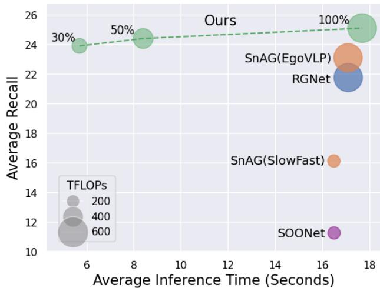
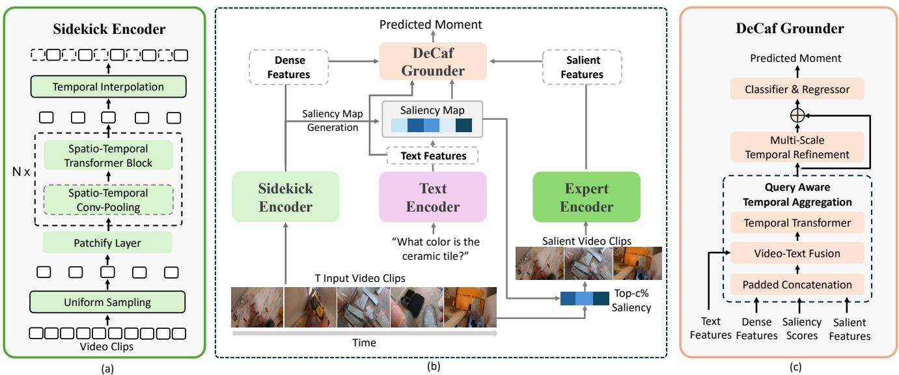
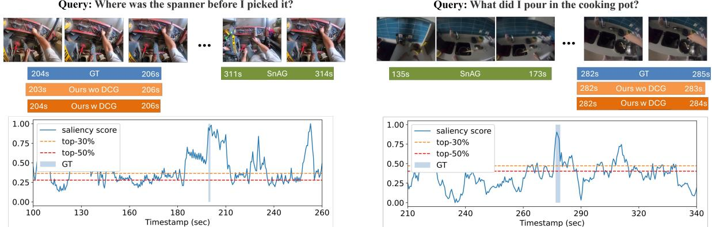

# DeCafNet: Delegate and Conquer for Efficient Temporal Grounding in Long Videos

Zijia Lu1,2†\*, A S M Iftekhar1†, Gaurav Mittal1, Tianjian Meng1, Xiawei Wang1, Cheng Zhao1, Rohith Kukkala1, Ehsan Elhamifar2, Mei Chen1 Microsoft1, Northeastern University2

lu.zij@northeastern.edu, {asmiftekhar, gamit, tianjianmeng, xiaweiwang}@microsoft.com {chengzhao, rokukkal, meic}@microsoft.com, e.elhamifar@northeastern.edu

## Abstract

Long Video Temporal Grounding (LVTG) aims at identifying specific moments within lengthy videos based on userprovided text queries for effective content retrieval. The approach taken by existing methods of dividing video into clips and processing each clip via a full-scale expert encoder is challenging to scale due to prohibitive computational costs of processing a large number of clips in long videos. To address this issue, we introduce DeCafNet, an approach employing “delegate-and-conquer” strategy to achieve computation efficiency without sacrificing grounding performance. DeCafNet introduces a sidekick encoder that performs dense feature extraction over all video clips in a resource-efficient manner, while generating a saliency map to identify the most relevant clips for full processing by the expert encoder. To effectively leverage features from sidekick and expert encoders that exist at different temporal resolutions, we introduce DeCaf-Grounder, which unifies and refines them via query-aware temporal aggregation and multi-scale temporal refinement for accurate grounding. Experiments on two LTVG benchmark datasets demonstrate that DeCafNet reduces computation by up to 47% while still outperforming existing methods, establishing a new state-of-the-art for LTVG in terms of both efficiency and performance.

## 1. Introduction

Long Video Temporal Grounding (LVTG) is the task of identifying specific moments or events within long videos (spanning from several minutes to a few hours [15]) based on a user-provided text query. LVTG allows effective retrieval of relevant content from lengthy videos with a range of applications, such as video summarization [12, 22, 34], content recommendation [18, 32], and surveillance [19, 54], where rapid detection of pertinent segments is critical.

  
Figure 1. Model inference time and grounding performance on Ego4d-NLQ [13] dataset using one A100 gpu. The circle sizes indicate the TFLOPs for methods. Numbers beside the green circles indicate the amount of salient clips processed by expert encoder.

State-of-the-art (SOTA) LVTG methods [15, 17, 33, 58] build on techniques originally developed for temporal video grounding in short videos, following a common two-step paradigm. First, they divide a long video into fixed-duration clips, processing each clip through an expert encoder–a large, pre-trained model trained on extensive, multi-domain video data–to extract video clip features. Second, a grounding model employs temporal and cross-modal reasoning to perform the grounding task. Although effective for short videos, such an approach struggles to scale with longer video lengths due to the high computational cost of processing each clip through the expert encoder. As video duration increases, the number of clips increases, leading to a significant surge in computational demands.

Long temporal sequences, whether visual [5], textual [3], or multimodal [42], are computationally heterogeneous, meaning that not all locations in the sequence are equally complex or contribute equally to the final prediction. Consequently, we find that, for a long video, the temporal moment associated with the input query mostly constitutes only a small portion of the whole video. Many clips in a long video are not relevant to the query in LVTG. Therefore, we can process them in a significantly more resourceefficient manner compared to the expert encoder, reducing overall computation required for LVTG and improving scalability while maintaining grounding performance.

Leveraging the mentioned observation, we introduce De-CafNet to overcome the limitations of existing methods. DeCafNet employs a delegate-and-conquer strategy by delegating a significant portion of the computation to an efficient sidekick encoder to conquer the computational bottleneck. The sidekick encoder serves two key functions. First, it computes features for each video clip in a resourceefficient manner to reduce the overall computational cost. Second, it generates a saliency map over video clips by comparing the extracted features with the text query. This allows DeCafNet to identify the top-c% of query-relevant clips that require full-scale processing by the expert encoder. This delegate-and-conquer approach ensures that only the most salient clips undergo intensive computation to achieve both high performance and efficiency.

With dense video features extracted by the sidekick encoder for every clip and the top-c% salient features from the expert encoder, directly using a standard LVTG grounding module like [15, 31] gives suboptimal performance due to the diverse temporal resolutions of these feature sets. To optimize performance, we introduce DeCaf-Grounder, a novel grounding module designed specifically for our delegateand-conquer encoder structure. DeCaf-Grounder unifies the features of sidekick and expert encoders via query-aware temporal aggregation and refines them over multiple temporal scales using multi-scale temporal refinement.

We evaluate DeCafNet on two LVTG benchmark datasets and successfully achieve stronger grounding performance compared to existing works with 47% less computation on average. Figure 1 visualizes DeCafNet’s computational efficiency and accuracy in Ego4D-NLQ [13] dataset. We outperform all existing methods when only processing top-50% of salient clips using the expert encoder, with negligible additional cost from the sidekick encoder. Overall, DeCafNet has 47% less TFLOPs and 51% less inference time than the existing works. Our contributions are,

• We introduce DeCafNet, a novel approach that enhances computational efficiency while improving grounding performance on LVTG.

• DeCafNet introduces a novel delegate-and-conquer approach, employing a combination of a sidekick encoder and an expert encoder to compute a set of dense and topc% salient features. Our DeCaf-Grounder then aggregates and refines these features across multiple temporal scales to perform LTVG optimally.

• DeCafNet significantly outperforms existing methods in terms of computational efficiency on two benchmark datasets. Even at much-reduced computation, DeCafNet achieves SOTA performance on temporal grounding in long videos, validating both efficiency and effectiveness.

## 2. Related Works

Short Video Temporal Grounding (SVTG). SVTG methods aim to locate specific events within short videos, typically lasting from a few seconds to a few minutes [16, 21, 35, 40]. There is extensive research in this area, which generally falls into proposal-based and proposal-free methods. Earlier proposal-based approaches have used techniques ranging from sliding windows [10, 11, 14, 51] to ranking mechanisms [46, 47, 55], to identify candidate segments. Proposal-free methods [23, 33, 50], on the other hand, leverage Transformer-based algorithms to directly predict start and end points of events. Initial efforts in SVTG detection focused on localizing predefined action categories [48, 62], meanwhile recent approaches [10, 21, 33] have broadened their scope by using free-form text queries, such as captions, to locate specific moments. These newer methods explore diverse cross-modal fusion strategies to better align video and textual information for improved grounding performance. However, all SVTG methods face scalability challenges when applied to long video temporal grounding.

Long Video Temporal Grounding (LVTG). Long video understanding has been studied for temporal grounding and many other tasks [6–9, 20, 26–28, 30, 37, 38, 44, 53, 61]. Early LVTG methods [21, 25, 58, 60] expanded SVTG methods with techniques like memory bank [52], sliding window [58] and object tracking [49]. They cannot capture long temporal information, and often struggle to achieve both high efficiency and accuracy. More recent methods, such as CONE [17], introduced a coarse-to-fine alignment approach, combining sliding windows, proposal generation, and ranking steps to improve performance. SOONet [33] further refines [17] by incorporating pre-ranking and reranking techniques to enhance precision. Most recently, RGNet [15] approaches LVTG as an integrated retrieval and grounding task, while SnAG [31] employs a late fusion strategy to combine textual and visual information in a scalable way. However, most LVTG methods focus primarily on refining the grounding architecture, often overlooking the considerable cost associated with feature extraction for each video clip. These methods typically depend on a pre-trained expert encoder for feature extraction.

  
Figure 2. DeCafNet Overview. The sidekick encoder efficiently extracts features from input video clips, which, combined with text features, generate a saliency map to select the most salient clips. The expert encoder then processes these salient clips. DeCaf-Grounder uses the extracted features from both the sidekick and the expert encoders to predict the moment associated with the input text query.

While the cost of such approach is manageable for SVTG, it becomes significantly high for LVTG, where long video lengths amplify the computational burden. Additionally, a substantial portion of the extracted features may not be relevant to the query. Our proposed DeCafNet addresses these challenges by delegating a large part of the computation to a more resource-efficient sidekick encoder, reducing unnecessary computational overhead while selecting queryrelevant salient clips and processing them with expert encoder, maintaining high grounding performance.

## 3. Methodology

## 3.1. Overview

Figure 2 gives an overview of our DeCafNet method. Given an input video V and query text q, DeCafNet aims to localize the temporal moment $( t _ { s } , t _ { e } )$ in the input video that corresponds to the text query. Here, $t _ { s } , t _ { e }$ refer to the start and end timestamp of the moment in the video.

DeCafNet divides the input video V into T fixed duration short clips such that, $V = [ v _ { 1 } , v _ { 2 } , \ldots , v _ { T } ]$ . Existing methods [15, 31, 33, 58] send all the T clips to a pretrained expert encoder, ΨE, leading to a prohibitive computation requirement particularly for long videos. In contrast, DeCafNet adopts a delegate-and-conquer strategy to reduce the computational cost. Specifically, we introduce a sidekick encoder, $\Psi _ { D } ,$ , that extracts dense clip features, $\mathbf { F } _ { D } = [ \mathbf { f } _ { 1 } ^ { \prime } , \mathbf { f } _ { 2 } ^ { \prime } , \ldots , \mathbf { f } _ { T } ^ { \prime } ]$ at a substantially reduced computational cost. Simultaneously, a text encoder, $\Psi _ { T } ,$ , obtains features $\mathbf { Q } = [ \mathbf { q } _ { \mathrm { c l s } } , \mathbf { q } _ { 1 } , \mathbf { q } _ { 2 } , . . , \mathbf { q } _ { N } ]$ for the input text query with N number of word tokens and $\mathbf { q } _ { \mathrm { c l s } }$ as the CLS token.

Next, we use $\mathbf { F } _ { D }$ and Q to create a saliency map S over the video clips and identify the top-c% salient clips, corresponding to M (M<T) clips, for the input query. The expert encoder $\Psi _ { E }$ only processes the M salient clips to extract salient features $\mathbf { F } _ { S } = [ \mathbf { f } _ { 1 } , \mathbf { f } _ { 2 } , \ldots , \mathbf { f } _ { M } ]$

The dense features $\mathbf { F } _ { D }$ and the salient features $\mathbf { F } _ { S }$ exist at different temporal resolutions. To ensure effective grounding, we introduce DeCaf-Grounder that unifies the two features along with the input query features via queryaware temporal aggregation and refines them over varied temporal scales using multi-scale refinement. Finally, following existing works [15, 31, 33, 58], we use regression and classification heads over the refined features to predict the temporal moment $( t _ { s } , t _ { e } )$ . In the following sub-sections, we describe the design of our sidekick encoder, its training, saliency map computation, and DeCaf-Grounder.

## 3.2. Sidekick Encoder

To improve computational efficiency and reduce the number of clips that undergo full-scale processing by the expert encoder $\Psi _ { E }$ , we design an efficient sidekick encoder $\Psi _ { D }$ (shown in Figure 2 (a)) with the following components.

Convolution Pooling. $\Psi _ { D }$ follows the architecture of [2], which is commonly adopted by most modern video encoders. It contains a patchify layer with multiple spatiotemporal transformer blocks. For an input clip v, the input to the i-th transformer block of $\Psi _ { D }$ is $\mathbf { \bar { \it G } } _ { i } \in \dot { \mathbb { R } } ^ { L \times H \times W \times C }$ where $L , H , W , C$ are the number of frames in v, height and width of the feature map, and number of feature channels, respectively. To reduce the feature dimension, we insert temporal and spatial pooling layers before the transformer block. We implement this pooling operation through convolutions, with stride size controlling the pooling ratio. By decreasing the temporal (L) and spatial (H, W) dimensions of the features, we reduce the computational load for the current and subsequent blocks, enabling efficient processing across $\Psi _ { D }$ . We determine the value of i empirically.

Temporal Interpolation. As adjacent clips in a video often contain similar contents, it is possible to infer the features of a clip from nearby clips without having to compute them from scratch. Thus, we further reduce computation for $\Psi _ { D }$ via temporal interpolation. Specifically, we first uniformly sample a subset of clips as the input of sidekick encoder and extract a set of features as, $[ { \bf f } _ { 1 } ^ { \prime } , { \bf f } _ { 1 + \tau } ^ { \prime } , { \bf f } _ { 1 + 2 \tau } ^ { \prime } , . . . ] =$ $\Psi _ { D } \big ( v _ { 1 } , v _ { 1 + \tau } , v _ { 1 + 2 \tau } , . . . \big )$ , where τ is the temporal sampling stride. Then we interpolate the features of the clips that did not get selected during sampling through the extracted features, e.g.,

$$
\mathbf {f} _ {2} ^ {\prime}, \dots , \mathbf {f} _ {1 + \tau - 1} ^ {\prime} = \mathrm{FFN} ([ \mathbf {f} _ {1} ^ {\prime}, \mathbf {f} _ {1 + \tau} ^ {\prime} ]),\tag{1}
$$

where we utilize $( \mathbf { f } _ { 1 } ^ { \prime } , \mathbf { f } _ { 1 + \tau } ^ { \prime } )$ to interpolate the clips between them, and similarly compute features for other un-sampled clips. Here FFN refers to the feed-forward network.

## 3.3. Sidekick Encoder Training

To train $\Psi _ { D }$ , we introduce two key losses: saliency loss and distillation loss. The saliency loss enhances video-text matching by using contrastive learning [4] to align relevant video and text features. This loss includes two symmetrical components for video and text features,

$$
\mathcal {L} _ {\text {saliency - text}} = \sum_ {\mathbf {q} _ {\mathrm{cls}}} \frac {\exp (\mathbf {f} _ {+} ^ {\prime} \cdot \mathbf {q} _ {\mathrm{cls}})}{\exp (\mathbf {f} _ {+} ^ {\prime} \cdot \mathbf {q} _ {\mathrm{cls}}) + \sum_ {n} \exp (\mathbf {f} _ {-} ^ {\prime} \cdot \mathbf {q} _ {\mathrm{cls}})}\tag{2}
$$

$$
\mathcal {L} _ {\text {saliency - video}} = \sum_ {\mathbf {f} ^ {\prime}} \frac {\exp (\mathbf {f} ^ {\prime} \cdot \mathbf {q} _ {\mathrm{cls} ^ {+}})}{\exp (\mathbf {f} ^ {\prime} \cdot \mathbf {q} _ {\mathrm{cls} ^ {+}}) + \sum_ {n} \exp (\mathbf {f} ^ {\prime} \cdot \mathbf {q} _ {\mathrm{cls} ^ {-}})}\tag{3}
$$

where $( \mathbf { f } _ { + } ^ { \prime } , \mathbf { f } _ { - } ^ { \prime } )$ denote positive and negative video clip features that contain and do not contain the queried moment, respectively. $\left( \mathbf { q } _ { \mathrm { c l s } ^ { + } } , \mathbf { q } _ { \mathrm { c l s } ^ { - } } \right)$ represent text queries that correspond and do not correspond to the given clip feature, $\mathbf { f ^ { \prime } }$ respectively. All positive and negative pairs are determined using ground-truth LVTG labels. Saliency loss encourages DeCafNet to increase the similarity between paired (positive) clips and queries while reducing it for unpaired (negative) instances, thereby enhancing the focus on query-salient video clips. The distillation loss further guides $\Psi _ { D }$ by aligning its features with that of the expert encoder, $\Psi _ { E }$ . This helps $\Psi _ { D }$ to retain high-quality feature representations. We define the loss as,

$$
\mathcal {L} _ {\mathrm{distill}} = | | \mathbf {f} _ {t} - \mathbf {f} _ {t} ^ {\prime} | | ^ {2}.\tag{4}
$$

Here, $\mathbf { f } _ { t }$ and $\mathbf { f } _ { t } ^ { \prime }$ refer to the t-th clip features from $\Psi _ { E }$ and $\Psi _ { D }$ respectively.

## 3.4. Saliency Selection

The sidekick encoder, $\Psi _ { D }$ , while efficient, relies on pooling layers that reduce feature resolution, leading to inevitable information loss. Therefore, while removing the expert encoder $\Psi _ { E }$ during inference would maximize cost reduction, $\Psi _ { E }$ remains essential for capturing high-quality, detailed features required for LVTG.

We retain $\Psi _ { E }$ but only apply it on the M most salient clips to each query. We achieve this by creating a saliency map over video clips. Specifically, given an input video, $\Psi _ { D }$ first processes all T clips to obtain dense clip features $\mathbf { F } _ { D }$ . By comparing $\mathbf { F } _ { D }$ with the class token of the query text feature $\mathbf { q } _ { \mathrm { c l s } } ,$ , we obtain a saliency score through inner product: $\mathbf { S } = \mathbf { F } _ { D } \cdot \mathbf { q } _ { \mathrm { c l s } } \in \mathbb { R } ^ { T }$ . The saliency score quantifies the semantic relevance between the clips and the text query based on their feature similarity. Based on S, we select top-c% salient clips (corresponding to M number of clips) and pass them to $\Psi _ { E }$ for extracting salient features $\mathbf { F } _ { S } ~ = ~ \left[ \mathbf { f } _ { 1 } , \mathbf { f } _ { 2 } , \ldots , \mathbf { f } _ { M } \right]$ . This delegate-and-conquer dualencoder design achieves an optimal balance between computational efficiency and feature quality.

## 3.5. Grounding Module: DeCaf-Grounder

To optimally leverage the features from our delegateand-conquer dual encoder design, we introduce DeCaf-Grounder to unify and refine the complementary features from the two encoders and locate the temporal moment for text query $\mathbf { Q } ,$ as shown in Figure $2 \ ( \mathrm { c } )$ . Dense features $\mathbf { F } _ { D }$ from the sidekick encoder cover every clip in the video while salient features $\mathbf { F } _ { S }$ from the expert encoder have finegrained semantic information covering the most salient M clips. We introduce Query-aware Temporal Aggregation that combines $\mathbf { F } _ { D }$ and $\mathbf { F } _ { S }$ to enhance query-relevant information and suppress irrelevant pieces, and Multi-Scale Temporal Refinement that efficiently synchronizes information across temporal scales for feature refinement. The features enable DeCaf-Grounder to predict the correct temporal moment $( t _ { s } , t _ { e } )$ for the text query.

Query-Aware Temporal Aggregation. To aggregate $\mathbf { F } _ { D }$ and $\mathbf { F } _ { S }$ , comprising features over different sets of clips, we first align their temporal dimensions. Specifically, if a clip is missing in ${ \bf F } _ { S } , i . e .$ , a non-salient clip, we add zero-padding to its location in $\mathbf { F } _ { S }$ to obtain $\hat { \mathbf { F } } _ { S }$ . With the padding, we ensure $\mathbf { F } _ { D }$ and $\hat { \mathbf { F } } _ { S }$ have the same temporal length, thus allowing a unified feature sequence across all temporal positions. We next enhance the text query-specific information by performing video-text fusion to align clip features with text query. For this, we concatenate $\mathbf { F } _ { D }$ with $\hat { \mathbf { F } } _ { S }$ and further concatenate them with saliency score S to provide the explicit context of clip relevance to the text query. This gives us the unified query-aware features $\mathbf { F } _ { C } =$ concatenate $( \mathbf { F } _ { D } , \hat { \mathbf { F } } _ { S } , \mathbf { S } ) \in \mathbb { R } ^ { \hat { T } \times ( \hat { 2 } C + 1 ) }$ . Next, we leverage video-text cross-attention that updates $\mathbf { F } _ { C }$ with text query $\mathbf { Q }$ to highlight query-relevant information while suppressing the irrelevant pieces.

With the unified query-aware features $\mathbf { F } _ { C } .$ , we perform temporal aggregation via a temporal transformer [56]. It fuses the information of dense and salient features for each clip while also accounting for the temporal context of neighboring clips. To capture information at different temporal scales, it transforms $\mathbf { F } _ { C }$ into multi-scale feature pyramid $\{ \mathbf { Z } ^ { l } \} _ { l = 0 } ^ { L }$ , where $L$ is the number of scales. Each scale reduces the temporal length by half, $e . g . , \textbf { Z } ^ { 0 } \in \mathbb { R } ^ { T \times C }$ 2 $\mathbf { Z } ^ { 1 } \in \mathbb { R } ^ { T / 2 \times C }$ , and $\mathbf { Z } ^ { l } \in \mathbb { R } ^ { ( T / 2 ^ { l } ) \times C }$

Multi-Scale Temporal Refinement. While the temporal transformer helps aggregate temporal information, it is confined to only local attention windows. So to learn temporal correlations over longer temporal horizons, we propose multi-scale temporal refinement that efficiently synchronizes grounding-specific information in $\{ \mathbf { Z } ^ { l } \}$ across temporal scales. This is necessary to maintain optimal grounding performance since the features from the two encoders exist at different temporal resolutions.

Specifically, to explicitly capture grounding information in ${ \bf Z } ^ { l } \left( i . e . \right.$ , the probable temporal location of the input text) and reduce feature dimensions, we transform $\{ \mathbf { Z } ^ { l } \} ^ { - } \mathrm { t o } \{ \mathbf { p } ^ { l } \}$ via a simple FFN classifier. $\mathbf { p } ^ { l } \in \mathbb { R } ^ { ( T / 2 ^ { l } ) }$ is a confidence score with the same length as $\mathbf { Z } ^ { l }$ . It denotes the probability that a queried moment happens in the temporal locations represented by features in $\bar { \mathbf Z ^ { \bar { l } } }$ . Next, we leverage dilated temporal convolution [29] to synchronize and find the consensus location of the queried moment across scales. This involves first expanding all $\mathbf { p } ^ { l }$ to length $T$ via linear interpolation, processing them through convolution, and applying average pooling on output of convolution to obtain a new set of multi-scale features $\{ \mathbf { U } ^ { l } \}$ , which encode refined grounding information.

Lastly, we combine $\mathbf { Z } ^ { l }$ and $\mathbf { U } ^ { l }$ as $\begin{array} { r l } { \mathbf { Z } _ { \mathrm { r e f i n e } } ^ { l } } & { { } = } \end{array}$ concatenate(Zl, Ul). $\{ \mathbf { Z } _ { \mathrm { r e f i n e } } ^ { l } \}$ unifies the clip features from the sidekick and expert encoders, the text query features, and has highlighted grounding information.

Classifier & Regressor. We use $\{ \mathbf { Z } _ { \mathrm { r e f i n e } } ^ { l } \}$ as input to our classification and regression heads to predict proposals of temporal moments. These heads follow the same design as prior works [15, 31]. At inference, we apply Soft-NMS to merge overlapping moment proposals. We use Focal loss and Distance-IoU loss [31] to train DeCaf-Grounder.

## 4. Experiments

## 4.1. Evaluation Settings

Datasets. We evaluate our approach on the standard LTVG benchmarks: Ego4D-NLQ, Ego4D-Goalstep and MAD.

Ego4D-NLQ [13] requires localizing temporal segments (moments) in videos that contains answer to a natural language query. It contains around 14K natural language queries. The video length ranges from 8 to 20 minutes and the average duration of the temporal moments is 8.3 seconds. This means the moments constitute only 1.7% of the input videos on average, highlighting the challenge of localizing brief relevant segments within much longer videos. Ego4d-Goalstep [43] uses action names as text queries. It contains 31.6K and 7.6K queries in training and validation sets, respectively. The video length ranges from 1 to 294 minutes, with an average of 25 minutes. The average moment duration is 33 seconds, constituting only 2.2% of the video on average. For both Ego4D datasets, as the labels of test sets are unavailable, we follow [15, 31] and report the performance on validation set. MAD [41] contains 1.2K hours of movies with 384K queries transcribed from audio description. The videos are 47 to 202 minutes long.

Metrics. We adopt the commonly used evaluation metric Recall@Top-K with IoU=θ (denoted as Rk@θ) [15, 31]. This metric represents the percentage of test samples with at least one correct prediction among the top-K predictions. A prediction is considered correct if its temporal overlap with the ground truth moment (measured by Intersection over Union) exceeds θ.

## 4.2. Implementation Details

Similar to [15, 31], we partition videos into clips via a sliding window. The input video resolution is $2 2 4 \times 2 2 4$ . In our sidekick encoder, we include the spatio-temporal convpooling layer before the first spatio-temporal transformer block, which reduces both spatial and temporal resolutions by a factor of 4. For temporal interpolation, we set $\tau = 2$ to process every other clip. To control the balance between contrastive and distillation losses, we set their weights as 1 and 0.75 respectively. In DeCaf-Grounder, we learn multiscale representations of 8 scales (L = 8). We use the same expert encoder as in [15, 24, 31] and freeze it during training. Please refer to supplementary for more details.

## 4.3. Comparison with State-of-the-art.

Ego4d-NLQ [13]. We report the model performance on Ego4D-NLQ dataset in Table 1. We follow prior methods [17, 31, 33] to train DeCafNet with only NLQ training data. For RGNet [15], we compare with its NLQ-only version for consistent comparison, and compare with its largescale pretrained version in supplementary materials.

For DeCafNet, we evaluate with two ratios: using $\Psi _ { E }$ for only the top 30% or top 50% salient clips, while processing all clips with our efficient sidekick encoder to achieve a controllable trade-off between computation and accuracy.

DeCafNet-30% uses $\Psi _ { E }$ to process only the top-30% most salient clips identified by $\Psi _ { D } .$ . Even with this aggressive saliency selection ratio, DeCafNet achieves similar or higher performance than prior best method SnAG [31], improving R1@0.3 and R1@0.5 by 2.3% and 1.6% respectively, while being only slightly lower in R5@0.3. It validates that many clips in long videos are not essential for grounding the text query, allowing delegating their computation to our efficient Ψ $D$ without sacrificing performance.

<table><tr><td></td><td>R1@0.3</td><td>R1@0.5</td><td>R5@0.3</td><td>R5@0.5</td><td>AVG</td></tr><tr><td>2D-TAN [60]</td><td>5.04</td><td>2.02</td><td>12.89</td><td>5.88</td><td>6.46</td></tr><tr><td>UniVTG [25]</td><td>11.74</td><td>3.25</td><td>7.54</td><td>7.88</td><td>7.60</td></tr><tr><td>VSLNet [58]</td><td>10.26</td><td>5.81</td><td>19.01</td><td>12.67</td><td>11.93</td></tr><tr><td>M-DETR [21]</td><td>8.23</td><td>5.01</td><td>23.23</td><td>13.37</td><td>12.46</td></tr><tr><td>SOONet [33]</td><td>8.00</td><td>3.76</td><td>22.40</td><td>11.09</td><td>11.31</td></tr><tr><td>H-Hands [57]</td><td>13.20</td><td>7.90</td><td>23.30</td><td>15.60</td><td>15.00</td></tr><tr><td>CONE [17]</td><td>14.15</td><td>8.18</td><td>30.33</td><td>18.02</td><td>17.67</td></tr><tr><td>RGNet [15]</td><td>18.28</td><td>12.04</td><td>34.02</td><td>22.89</td><td>21.81</td></tr><tr><td>SnAG [31]</td><td>15.87</td><td>11.26</td><td>38.26</td><td>27.16</td><td>23.14</td></tr><tr><td>DeCafNet-30%</td><td>18.07</td><td>12.41</td><td>37.68</td><td>27.47</td><td>23.91</td></tr><tr><td>DeCafNet-50%</td><td>18.10</td><td>12.55</td><td>38.85</td><td>28.27</td><td>24.44</td></tr></table>

Table 1. Model performance on Ego4D-NLQ dataset. 30% and 50% indicate the saliency selection ratio. DeCafNet establishes new SOTA with only 50% saliency clips.

<table><tr><td> $\Psi_D$ </td><td> $\Psi_E$ </td><td>TFLOPS</td><td>Mem (G)</td><td>Time (Sec)</td></tr><tr><td>100%</td><td>0%</td><td>21.6</td><td>10.9</td><td>0.6</td></tr><tr><td>0%</td><td>100%</td><td>668.2</td><td>224.2</td><td>17.1</td></tr><tr><td>100%</td><td>30%</td><td>222.1 ↓ 66%</td><td>79.9 ↓ 65%</td><td>5.7 ↓ 67%</td></tr><tr><td>100%</td><td>50%</td><td>355.7 ↓ 47%</td><td>126.2 ↓ 44%</td><td>8.4 ↓ 51%</td></tr></table>

Table 2. Average encoder computation measured on Ego4D-NLQ. Column 1, 2 show the amount of clips processed by each encoder. With saliency selection (row 3, 4), DeCafNet significantly reduces TFLOPs by 47% and 66% compared to the feature-extraction cost in prior works–processing all clips with expert encoder (row 2).

Next, we report the results of DeCafNet-50%, where $\Psi _ { E }$ processes top-50% salient clips. This setting consistently outperforms all prior methods across all metrics, exceeding prior works RGNet [15], and SnAG [31] in average recall (AVG) by 2.6% and 1.3%, respectively. These results clearly demonstrate the effectiveness of our overall architecture in achieving superior grounding performance while being resource-efficient in computing video clips’ features.

Computation Efficiency. Having validated the effectiveness of DeCafNet, we analyze their computational efficiency in Table 2. To put things into perspective, we first compare the average computation cost of processing the entire video with $\Psi _ { D }$ or $\Psi _ { E }$ (Row 1 vs. Row 2). Row 2 also denotes the computation cost of all previous methods, as they use $\Psi _ { E }$ to process 100% of video clips. With the proposed convolution pooling operation and temporal interpolation, $\Psi _ { D }$ achieves a 31× reduction in TFLOPs and 22× reduction in GPU memory compared to $\Psi _ { E } .$ . This shows the significantly more efficient design of our sidekick encoder $\Psi _ { D }$ compared to expert encoder $\Psi _ { E }$ and therefore, also compared to all prior methods.

<table><tr><td></td><td>R1@0.3</td><td>R1@0.5</td><td>R5@0.3</td><td>R5@0.5</td><td>AVG</td></tr><tr><td>VSLNet[58]</td><td>11.70</td><td>-</td><td>-</td><td>-</td><td>-</td></tr><tr><td>SnAG[31]</td><td>18.34</td><td>15.12</td><td>45.95</td><td>38.55</td><td>29.49</td></tr><tr><td>RGNet [15]</td><td>21.26</td><td>15.71</td><td>47.15</td><td>37.85</td><td>30.49</td></tr><tr><td>DeCafNet-30%</td><td>20.01</td><td>16.22</td><td>44.70</td><td>37.34</td><td>29.56</td></tr><tr><td>DeCafNet-50%</td><td>21.29</td><td>17.46</td><td>47.27</td><td>40.40</td><td>31.61</td></tr></table>

Table 3. Model performance on Ego4d-Goalstep dataset. 30% and 50% indicating the saliency selection ratio. DeCafNet establishes new SOTA with only 50% saliency clips.

<table><tr><td></td><td>R1@0.1</td><td>R1@0.3</td><td>R1@0.5</td><td>R5@0.1</td><td>R5@0.3</td><td>R5@0.5</td><td>AVG</td></tr><tr><td>M-Guide [1]</td><td>9.30</td><td>4.65</td><td>2.16</td><td>18.96</td><td>13.06</td><td>7.40</td><td>9.26</td></tr><tr><td>CONE [17]</td><td>8.90</td><td>6.87</td><td>4.10</td><td>20.51</td><td>16.11</td><td>9.59</td><td>11.01</td></tr><tr><td>SOONet [33]</td><td>11.26</td><td>9.00</td><td>5.32</td><td>23.21</td><td>19.64</td><td>13.14</td><td>13.59</td></tr><tr><td>RGNet [15]</td><td>12.43</td><td>9.48</td><td>5.61</td><td>25.12</td><td>18.72</td><td>10.86</td><td>13.70</td></tr><tr><td>SnAG [31]</td><td>10.28</td><td>8.46</td><td>5.55</td><td>24.42</td><td>20.60</td><td>13.75</td><td>13.84</td></tr><tr><td>DeCafNet</td><td>13.25</td><td>10.96</td><td>7.06</td><td>27.73</td><td>23.68</td><td>16.13</td><td>16.47</td></tr></table>

Table 4. Model performance on MAD dataset. With the same input features, DeCafNet outperforms prior works by large margins.

Thanks to this, Row 3 shows that if we select only top-30% clips as salient, DeCafNet-30% substantially reduce TFLOPs, GPU Memory, and inference time by 66%, 65% and 67% respectively compared to Row 2. If we select top-50% clips (Row 4), DeCafNet-50% reduces them by 47%, 44% and 51%, respectively compared to Row 2. Meanwhile, the TFLOPs of our DeCaf-Grounder is merely 0.06, negligible compared to that of the encoders. DeCafNet-50% establishes superior performance (Table 1) with the significantly lower computational cost (Table 2 Row 4 vs. Row 2). This highlights DeCafNet’s effectivenes in both grounding performance and computational efficiency.

Ego4d-Goalstep [43]. We validate DeCafNet on Ego4d-Goalstep in Table 3. Following our Ego4d-NLQ experiment, we test both 30% and 50% saliency ratios. DeCafNet-30% matches SnAG [31] in average performance, while improving R1@0.3 and R1@0.5 by 2% and 1% respectively. DeCafNet-50% demonstrates much stronger performance, outperforming SnAG significantly across all metrics and achieving a 2% gain in average (AVG) recall.

MAD [41]. We evaluate DeCafNet on MAD dataset in Table 4. MAD only provides pre-extracted video features without the source videos that are needed to train our sidekick encoder. Therefore, we train our DeCaf-Grounder with the same input features as all prior methods (i.e., using only features of the expert encoder). DeCafNet successfully outperforms all prior works, exceeding SnAG by 2.63% in average (AVG) recall. It also highlights the efficacy of our DeCaf-Grounder in isolation of the dual-encoder features. We further validate DeCaf-Grounder’s performance in Short Video Temporal Grounding datasets. Specifically, in Table 5, we evaluate DeCaf-Grounder on Charades-STA [39] and TACoS [36] where we outperform SnAG by 1.37% and 0.81%, respectively.

<table><tr><td>Charades-STA</td><td>R1@0.5</td><td>R1@0.7</td><td>R5@0.5</td><td>R5@0.7</td><td>AVG</td></tr><tr><td>SMIN [45]</td><td>64.06</td><td>40.75</td><td>89.49</td><td>68.09</td><td>65.60</td></tr><tr><td>SnAG [31]</td><td>64.62</td><td>46.26</td><td>92.55</td><td>71.94</td><td>68.84</td></tr><tr><td>DeCaf-Grounder</td><td>68.79</td><td>47.55</td><td>91.53</td><td>72.96</td><td>70.21</td></tr><tr><td>TACoS</td><td>R1@0.3</td><td>R1@0.5</td><td>R5@0.3</td><td>R5@0.5</td><td>AVG</td></tr><tr><td>MATN [59]</td><td>48.79</td><td>37.57</td><td>67.63</td><td>57.91</td><td>52.98</td></tr><tr><td>SnAG [31]</td><td>56.44</td><td>44.85</td><td>81.15</td><td>70.66</td><td>63.27</td></tr><tr><td>DeCaf-Grounder</td><td>57.36</td><td>46.79</td><td>81.05</td><td>71.13</td><td>64.08</td></tr></table>

Table 5. Model performance on short video temporal grounding datasets. Our DeCaf-Grounder shows better temporal modeling on short videos as well and surpasses SnAG.

<table><tr><td> $F_D$ </td><td> $F_S$ </td><td>S</td><td>R1@0.3</td><td>R1@0.5</td><td>R5@0.3</td><td>R5@0.5</td><td>AVG</td></tr><tr><td>✓</td><td>×</td><td>×</td><td>16.32</td><td>11.32</td><td>34.08</td><td>24.33</td><td>21.51</td></tr><tr><td>×</td><td>✓</td><td>×</td><td>16.27</td><td>11.21</td><td>36.68</td><td>26.13</td><td>22.57</td></tr><tr><td>✓</td><td>✓</td><td>×</td><td>18.12</td><td>12.84</td><td>37.11</td><td>27.16</td><td>23.91</td></tr><tr><td>✓</td><td>✓</td><td>✓</td><td>18.87</td><td>13.18</td><td>38.25</td><td>27.33</td><td>24.41</td></tr></table>

Table 6. Effect of encoder features and saliency map. Each feature provides complimentary information and contributes to overall performance.

<table><tr><td>Selection Ratio</td><td>Selection Method</td><td>R1@0.3</td><td>R1@0.5</td><td>R5@0.3</td><td>R5@0.5</td><td>AVG</td></tr><tr><td>30%</td><td>Random</td><td>15.78</td><td>11.31</td><td>34.85</td><td>25.64</td><td>21.90</td></tr><tr><td>30%</td><td>Uniform</td><td>16.98</td><td>12.21</td><td>35.05</td><td>26.59</td><td>22.70</td></tr><tr><td>30%</td><td>Saliency</td><td>18.21</td><td>12.86</td><td>37.48</td><td>27.19</td><td>23.94</td></tr><tr><td>50%</td><td>Random</td><td>16.98</td><td>12.04</td><td>37.39</td><td>26.93</td><td>23.33</td></tr><tr><td>50%</td><td>Uniform</td><td>17.15</td><td>12.44</td><td>36.94</td><td>26.84</td><td>23.34</td></tr><tr><td>50%</td><td>Saliency</td><td>18.87</td><td>13.18</td><td>38.25</td><td>27.33</td><td>24.41</td></tr></table>

Table 7. Accuracy of saliency maps. Our saliency selection is effective and outperforms both random and uniform selection.

## 4.4. Ablation Study

This section analyzes the effect of different components of DeCafNet through ablation. Unless otherwise specified, we evaluate on Ego4d-NLQ using top-50% salient clips.

Effect of Encoder Features and Saliency Map. Our dualencoder design provides three features to DeCaf-Grounder: dense features $\left( \mathbf { F } _ { D } \right)$ from the sidekick encoder, salient features $( \mathbf { F } _ { S } )$ from the expert encoder, and the saliency scores S. Table 6 analyzes the contribution of each feature. First, when using only features $\mathbf { F } _ { D }$ (Row 1, equivalent to selecting top-0% clips as salient), it leads to lower performance due to inevitable information loss from pooling operations in the sidekick encoder. This indicates the necessity of keeping the high-quality features from the expert encoder.

<table><tr><td>Row</td><td>Pooling Location (i)</td><td>Temporal Interpolate ( $\tau$ )</td><td> $\mathcal{L}_{\text{saliency}}$ </td><td> $\mathcal{L}_{\text{distill}}$ </td><td>Recall</td><td>TFLOPs</td></tr><tr><td>1</td><td>1</td><td>2</td><td> $\checkmark$ </td><td> $\checkmark$ </td><td>80.5</td><td>21.6</td></tr><tr><td>2</td><td>2</td><td>2</td><td> $\checkmark$ </td><td> $\checkmark$ </td><td>81.0</td><td>38.9</td></tr><tr><td>3</td><td>3</td><td>2</td><td> $\checkmark$ </td><td> $\checkmark$ </td><td>81.5</td><td>53.9</td></tr><tr><td>4</td><td>1</td><td>1</td><td> $\checkmark$ </td><td> $\checkmark$ </td><td>82.6</td><td>42.7</td></tr><tr><td>5</td><td>1</td><td>3</td><td> $\checkmark$ </td><td> $\checkmark$ </td><td>72.8</td><td>14.4</td></tr><tr><td>6</td><td>1</td><td>2</td><td> $\times$ </td><td> $\checkmark$ </td><td>51.1</td><td>21.6</td></tr><tr><td>7</td><td>1</td><td>2</td><td> $\checkmark$ </td><td> $\times$ </td><td>48.5</td><td>21.6</td></tr></table>

Table 8. Ablation study on sidekick encoder. Our default parameters (row 1) strike a balance between accuracy and efficiency. Here, recall refers to the percentage of ground truth clips present within the top 50% salient clips.

<table><tr><td>QTA</td><td>MTR</td><td>R1@0.3</td><td>R1@0.5</td><td>R5@0.3</td><td>R5@0.5</td><td>AVG</td></tr><tr><td>×</td><td>✓</td><td>16.34</td><td>11.21</td><td>36.13</td><td>25.79</td><td>22.37</td></tr><tr><td>✓</td><td>×</td><td>16.41</td><td>11.58</td><td>37.62</td><td>27.13</td><td>23.18</td></tr><tr><td>✓</td><td>✓</td><td>18.87</td><td>13.18</td><td>38.25</td><td>27.33</td><td>24.41</td></tr></table>

Table 9. Ablation for DeCaf-Grounder. QTA and MTR stand for Query-aware Temporal Aggregation and Multi-scale Temporal Refinement. Both contribute significantly to the performance.

<table><tr><td></td><td>R1@0.3</td><td>R1@0.5</td><td>R5@0.3</td><td>R5@0.5</td><td>AVG</td></tr><tr><td>SnAG[31]</td><td>15.87</td><td>11.26</td><td>38.26</td><td>27.16</td><td>23.14</td></tr><tr><td>DeCaf-Grounder</td><td>19.07</td><td>13.61</td><td>39.02</td><td>29.22</td><td>25.10</td></tr></table>

Table 10. Grounding performance with same input features as prior art [31]. DeCaf-Grounder outperforms on all metrics.

<table><tr><td></td><td>R1@0.3</td><td>R1@0.5</td><td>R5@0.3</td><td>R5@0.5</td><td>AVG</td></tr><tr><td>Lighting</td><td>18.27</td><td>12.64</td><td>38.14</td><td>27.44</td><td>24.12</td></tr><tr><td>Blurring</td><td>17.47</td><td>11.86</td><td>36.88</td><td>26.53</td><td>23.18</td></tr><tr><td>Occlusion</td><td>18.04</td><td>12.41</td><td>37.76</td><td>26.82</td><td>23.75</td></tr></table>

Table 11. Ablation on model robustness with data augmentation to lower video lighting, increase blurring and add occlusion.

Row 2 shows that using only the features $\mathbf { F } _ { S } .$ , which contains features of just salient clips, also yields lower performance. This is because some features of ground truth moments may be missed due to saliency selection. Row 3 demonstrates that combining both encoders’ features provides a balance between recall and efficiency. Additionally, incorporating saliency map S helps identify candidate regions, further boosting the performance by 0.5% (row 4).

Accuracy of Saliency Maps. Table 7 compares the performance of random and uniform clip selection against our saliency-based approach. At both 30% and 50% selection ratios, random and uniform selection degrades performance. As expected, the performance drop is more substantial with the lower 30% selection ratio, validating the effectiveness of our saliency maps in identifying relevant clips. Uniform selection outperforms random selection as it evenly samples clips from all regions of the video and is more likely to cover the ground truth moment.

Query: What did I pour in the cooking pot?  
Query: Where was the spanner before I picked it?  
  
Figure 3. DeCafNet’s qualitative results, where Ours wo DCG and Ours w DCG indicate predictions without and with DeCaf-Grounder, respectively. The second row displays the generated saliency maps. DeCafNet yields accurate saliency maps and better grounding results.

Effect of Sidekick Encoder. Table 8 shows the effect of different design choices of convolution-pooling and temporal interpolation. We use recall to measure the feature quality of sidekick encoder – the success rate of including ground truth clips when selecting top 50% salient clips. Row 1 shows our default configuration: spatial/temporal pooling before the first transformer block (i = 1) and temporal interpolation ratio τ = 2. This achieves 80% recall, meaning our efficient sidekick encoder successfully identifies most of ground truth clips for expert processing.

Next, adding pooling in later blocks (row 2-3) slightly improves recall but substantially increases computation costs. Thus we set i = 1 to maintain efficiency. Similarly, varying the temporal interpolation ratio τ (row 4-5) shows τ = 2 strikes a balance between accuracy and efficiency.

Effect of Encoder Losses. The bottom section of Table 8 (row 6-7) demonstrates the importance of both saliency loss and distillation loss. Removing $\mathcal { L } _ { \mathrm { s a l i e n c y } }$ prevents the sidekick encoder from learning accurate video-text similarities, while removing ${ \mathcal { L } } _ { \mathrm { d i s t i l l } }$ limits the encoder’s ability to learn generalizable features from limited training data. Both cases result in significant recall degradation.

Effect of DeCaf-Grounder. Table 9 studies the effect of the two key components in DeCaf-Grounder: query-aware temporal aggregation (QTA) and multi-scale temporal refinement (MTR). DeCaf-Grounder receives features from both encoders: dense features from $\Psi _ { D }$ covering all clips and salient features from $\Psi _ { E }$ covering only salient clips. Removing QTA (Row 1) results in a 2.04% reduction in average recall, highlighting the importance of guiding feature fusion via text query. Similarly, removing MTR (Row 2) decreases average recall by 1.23%, showing the negative impact of limiting temporal modeling to local attention windows. Table 10 evaluates DeCaf-Grounder by using the same input features as SnAG (equivalent to 100% feature computation via $\Psi _ { E } )$ . This setting outperforms SnAG by 1.9% on average recall, further proving the efficacy of DeCaf-Grounder.

Model Robustness. In Table 11, we evaluate our model robustness on three challenging scenarios by applying data augmentations on Ego4D-NLQ test videos. These include: (1) reduce lighting by 50%, (2) apply Gaussian blurring1, and (3) mask 10% of pixels for occlusion. Our average recall drops slightly from 24.41 to 24.12, 23.18, and 23.75 in three settings, yet remains higher than prior best result with no augmentation (SnAG - 23.14), validating our robustness.

## 4.5. Qualitative Results

Figure 3 presents qualitative results of our model, with saliency maps displayed at the bottom of our predictions. Ours wo DCG and Ours w DCG represent predictions without and with DeCaf-Grounder, respectively. In Ours wo DCG, we employ SnAG’s grounding module, using concatenated features as input. The concatenation of features is described in section 3.5. Notably, DeCafNet ’s saliency maps are accurate and consistently align with the ground truth. Even when only the top 30% of salient clips are considered, they still capture the ground truth, demonstrating the effectiveness of our dual-encoder design. Moreover, predictions without DeCaf-Grounder are occasionally inaccurate, as existing grounding models do not consider inputs of different temporal resolutions. However, these cases are effectively corrected with DeCaf-Grounder.

## 5. Conclusion

We present DeCafNet, a novel approach that employs a delegate-and-conquer strategy to improve computational efficiency without sacrificing performance for LVTG task. DeCafNet introduces a sidekick encoder that efficiently computes features for all clips, while generating a saliency map to identify the most salient clips for full processing by the expert encoder. We validate DeCafNet on three datasets. It achieves SOTA grounding performance while reducing computation by up to 47%, making it a promising solution for LVTG tasks.

## References

[1] Wayner Barrios, Mattia Soldan, Fabian Caba Heilbron, Alberto M. Ceballos-Arroyo, and Bernard Ghanem. Localizing moments in long video via multimodal guidance. ArXiv, abs/2302.13372, 2023. 6

[2] Gedas Bertasius, Heng Wang, and Lorenzo Torresani. Is space-time attention all you need for video understanding? In Proceedings of the International Conference on Machine Learning (ICML), 2021. 3

[3] Charlie Chen, Sebastian Borgeaud, Geoffrey Irving, Jean-Baptiste Lespiau, Laurent Sifre, and John Jumper. Accelerating large language model decoding with speculative sampling. arXiv preprint arXiv:2302.01318, 2023. 2

[4] Ting Chen, Simon Kornblith, Mohammad Norouzi, and Geoffrey Hinton. A simple framework for contrastive learning of visual representations. In Proceedings of the 37th International Conference on Machine Learning, pages 1597–1607, 2020. 4

[5] Feng Cheng and Gedas Bertasius. Tallformer: Temporal action localization with a long-memory transformer. In European Conference on Computer Vision, pages 503–521. Springer, 2022. 2

[6] Guodong Ding, Fadime Sener, Shugao Ma, and Angela Yao. Every mistake counts in assembly. arXiv preprint arXiv:2307.16453, 2023. 2

[7] Guodong Ding, Hans Golong, and Angela Yao. Coherent temporal synthesis for incremental action segmentation. In 2024 IEEE/CVF Conference on Computer Vision and Pattern Recognition (CVPR), 2024.

[8] G. Donahue and E. Elhamifar. Learning to predict activity progress by self-supervised video alignment. IEEE Conference on Computer Vision and Pattern Recognition, 2024.

[9] Yazan Abu Farha and Jurgen Gall. Ms-tcn: Multi-stage temporal convolutional network for action segmentation. In Proceedings of the IEEE Conference on Computer Vision and Pattern Recognition, pages 3575–3584, 2019. 2

[10] Jiyang Gao, Chen Sun, Zhenheng Yang, and Ram Nevatia. Tall: Temporal activity localization via language query, 2017. 2

[11] Runzhou Ge, Jiyang Gao, Kan Chen, and Ram Nevatia. Mac: Mining activity concepts for language-based temporal localization, 2018. 2

[12] Boqing Gong, Wei-Lun Chao, Kristen Grauman, and Fei Sha. Diverse sequential subset selection for supervised video summarization. In Advances in Neural Information Processing Systems, pages 2069–2077, 2014. 1

[13] Kristen Grauman, Andrew Westbury, Eugene Byrne, Zachary Chavis, Antonino Furnari, Rohit Girdhar, Jackson Hamburger, Hao Jiang, Miao Liu, Xingyu Liu, et al. Ego4d: Around the world in 3,000 hours of egocentric video. pages 18995–19012, 2022. 1, 2, 5

[14] Meera Hahn, Asim Kadav, James M. Rehg, and Hans Peter Graf. Tripping through time: Efficient localization of activities in videos, 2020. 2

[15] Tanveer Hannan, Md Mohaiminul Islam, and Thomas Seidl. Rgnet: A unified clip retrieval and grounding network for

long videos. In European Conference on Computer Vision, 2024. 1, 2, 3, 5, 6

[16] Lisa Anne Hendricks, Oliver Wang, Eli Shechtman, Josef Sivic, Trevor Darrell, and Bryan Russell. Localizing moments in video with natural language, 2017. 2

[17] Zhijian Hou, Wanjun Zhong, Lei Ji, Difei Gao, Kun Yan, Wing-Kwong Chan, Chong-Wah Ngo, Zheng Shou, and Nan Duan. Cone: An efficient coarse-to-fine alignment framework for long video temporal grounding. arXiv preprint arXiv:2209.10918, 2022. 1, 2, 5, 6

[18] Puskal Khadka and Prabhav Lamichhane. Content-based recommendation engine for video streaming platform. arXiv preprint arXiv:2308.08406, 2023. 1

[19] Huai-Qian Khor and John See. Lost in time: Temporal analytics for long-term video surveillance. arXiv preprint arXiv:1712.07322, 2017. 1

[20] S. Lee, Z. Lu, Z. Zhang, M. Hoai, and E. Elhamifar. Error detection in egocentric procedural task videos. IEEE Conference on Computer Vision and Pattern Recognition, 2024. 2

[21] Jie Lei, Tamara L Berg, and Mohit Bansal. Detecting moments and highlights in videos via natural language queries. Advances in Neural Information Processing Systems, 34: 11846–11858, 2021. 2, 6

[22] Haopeng Li, Qiuhong Ke, Mingming Gong, and Tom Drummond. Progressive video summarization via multimodal selfsupervised learning. In Proceedings of the IEEE/CVF Winter Conference on Applications ofComputer Vision (WACV), pages 5584–5593, 2023. 1

[23] Kun Li, Dan Guo, and Meng Wang. Vigt: proposal-free video grounding with a learnable token in the transformer. Science China Information Sciences, 66(10), 2023. 2

[24] Kevin Qinghong Lin, Alex Jinpeng Wang, Mattia Soldan, Michael Wray, Rui Yan, Eric Zhongcong Xu, Difei Gao, Rongcheng Tu, Wenzhe Zhao, Weijie Kong, et al. Egocentric video-language pretraining. arXiv preprint arXiv:2206.01670, 2022. 5

[25] Kevin Qinghong Lin, Pengchuan Zhang, Joya Chen, Shraman Pramanick, Difei Gao, Alex Jinpeng Wang, Rui Yan, and Mike Zheng Shou. Univtg: Towards unified videolanguage temporal grounding. In Proceedings of the IEEE/CVF International Conference on Computer Vision, pages 2794–2804, 2023. 2, 6

[26] Jinyang Liu, Wondmgezahu Teshome, Sandesh Ghimire, Mario Sznaier, and Octavia Camps. Solving masked jigsaw puzzles with diffusion vision transformers. In Proceedings of the IEEE/CVF Conference on Computer Vision and Pattern Recognition (CVPR), pages 23009–23018, 2024. 2

[27] Z. Lu and E. Elhamifar. Weakly-supervised action segmentation and alignment via transcript-aware union-of-subspaces learning. International Conference on Computer Vision, 2021.

[28] Z. Lu and E. Elhamifar. Set-supervised action learning in procedural task videos via pairwise order consistency. IEEE Conference on Computer Vision and Pattern Recognition, 2022. 2

[29] Z. Lu and E. Elhamifar. Fact: Frame-action cross-attention temporal modeling for efficient action segmentation. IEEE

Conference on Computer Vision and Pattern Recognition, 2024. 5

[30] Zijia Lu, Bing Shuai, Yanbei Chen, Zhenlin Xu, and Davide Modolo. Self-supervised multi-object tracking with path consistency. In Proceedings of the IEEE/CVF Conference on Computer Vision and Pattern Recognition (CVPR), pages 19016–19026, 2024. 2

[31] Fangzhou Mu, Sicheng Mo, and Yin Li. Snag: Scalable and accurate video grounding. In Proceedings of the IEEE/CVF Conference on Computer Vision and Pattern Recognition, pages 18930–18940, 2024. 2, 3, 5, 6, 7

[32] Yongxin Ni, Yu Cheng, Xiangyan Liu, Junchen Fu, Youhua Li, Xiangnan He, Yongfeng Zhang, and Fajie Yuan. A content-driven micro-video recommendation dataset at scale. arXiv preprint arXiv:2309.15379, 2023. 1

[33] Yulin Pan, Xiangteng He, Biao Gong, Yiliang Lv, Yujun Shen, Yuxin Peng, and Deli Zhao. Scanning only once: An end-to-end framework for fast temporal grounding in long videos. In Proceedings ofthe IEEE/CVF International Conference on Computer Vision, pages 13767–13777, 2023. 1, 2, 3, 5, 6

[34] Danila Potapov, Matthijs Douze, Zaid Harchaoui, and Cordelia Schmid. Category-specific video summarization. In European Conference on Computer Vision, pages 540–555, 2014. 1

[35] Michaela Regneri, Marcus Rohrbach, Dominikus Wetzel, Stefan Thater, Bernt Schiele, and Manfred Pinkal. Grounding action descriptions in videos. Transactions of the Associationfor Computational Linguistics, 1:25–36, 2013. 2

[36] Michaela Regneri, Marcus Rohrbach, Dominikus Wetzel, Stefan Thater, Bernt Schiele, and Manfred Pinkal. Grounding action descriptions in videos. Transactions of the Associationfor Computational Linguistics, 2013. 7

[37] Sakib Reza, Yuexi Zhang, Mohsen Moghaddam, and Octavia Camps. Hat: History-augmented anchor transformer for online temporal action localization. In European Conference on Computer Vision, pages XXX–XXX. Springer, 2024. 2

[38] Y. Shen and E. Elhamifar. Progress-aware online action segmentation for egocentric procedural task videos. IEEE Conference on Computer Vision and Pattern Recognition, 2024. 2

[39] Gunnar Sigurdsson, Gul Varol, Xiaolong Wang, Ali Farhadi,¨ Ivan Laptev, and Abhinav Gupta. In Hollywood in Homes: Crowdsourcing Data Collection for Activity Understanding, 2016. 7

[40] Gunnar A. Sigurdsson, Gul Varol, X. Wang, Ali Farhadi,¨ Ivan Laptev, and Abhinav Kumar Gupta. Hollywood in homes: Crowdsourcing data collection for activity understanding. In European Conference on Computer Vision, 2016. 2

[41] Mattia Soldan, Alejandro Pardo, Juan Leon Alc´ azar, Fabian´ Caba, Chen Zhao, Silvio Giancola, and Bernard Ghanem. Mad: A scalable dataset for language grounding in videos from movie audio descriptions. In Proceedings of the IEEE/CVF Conference on Computer Vision and Pattern Recognition, pages 5026–5035, 2022. 5, 6

[42] Qiya Song, Bin Sun, and Shutao Li. Multimodal sparse transformer network for audio-visual speech recognition.

IEEE Transactions on Neural Networks and Learning Systems, 34(12):10028–10038, 2022. 2

[43] Yale Song, Eugene Byrne, Tushar Nagarajan, Huiyu Wang, Miguel Martin, and Lorenzo Torresani. Ego4d goal-step: Toward hierarchical understanding of procedural activities. In Advances in Neural Information Processing Systems, 2023. 5, 6

[44] Yuhao Su and Ehsan Elhamifar. Two-stage active learning for efficient temporal action segmentation. In European Conference on Computer Vision, pages 161–183. Springer, 2024. 2

[45] Hao Wang, Zheng-Jun Zha, Liang Li, Dong Liu, and Jiebo Luo. Structured multi-level interaction network for video moment localization via language query. In 2021 IEEE/CVF Conference on Computer Vision and Pattern Recognition (CVPR), pages 7022–7031, 2021. 7

[46] Jingwen Wang, Lin Ma, and Wenhao Jiang. Temporally grounding language queries in videos by contextual boundary-aware prediction, 2019. 2

[47] Weining Wang, Yan Huang, and Liang Wang. Languagedriven temporal activity localization: A semantic matching reinforcement learning model. In 2019 IEEE/CVF Conference on Computer Vision and Pattern Recognition (CVPR), pages 334–343, 2019. 2

[48] Xiang Wang, Zhiwu Qing, Ziyuan Huang, Yutong Feng, Shiwei Zhang, Jianwen Jiang, Mingqian Tang, Changxin Gao, and Nong Sang. Proposal relation network for temporal action detection, 2021. 2

[49] Syed Talal Wasim, Muzammal Naseer, Salman Khan, Ming-Hsuan Yang, and Fahad Shahbaz Khan. Videogroundingdino: Towards open-vocabulary spatio-temporal video grounding, 2024. 2

[50] Sangmin Woo, Jinyoung Park, Inyong Koo, Sumin Lee, Minki Jeong, and Changick Kim. Explore-and-match: Bridging proposal-based and proposal-free with transformer for sentence grounding in videos, 2022. 2

[51] Aming Wu and Yahong Han. Multi-modal circulant fusion for video-to-language and backward. In Proceedings of the Twenty-Seventh International Joint Conference on Artificial Intelligence, IJCAI-18, pages 1029–1035. International Joint Conferences on Artificial Intelligence Organization, 2018. 2

[52] Chao-Yuan Wu, Christoph Feichtenhofer, Haoqi Fan, Kaiming He, Philipp Krahenb ¨ uhl, and Ross Girshick. Long-term¨ feature banks for detailed video understanding, 2019. 2

[53] Angchi Xu and Wei-Shi Zheng. Efficient and effective weakly-supervised action segmentation via actiontransition-aware boundary alignment. In Proceedings of the IEEE/CVF Conference on Computer Vision and Pattern Recognition (CVPR), pages 18253–18262, 2024. 2

[54] Shoou-I Yu, Yi Yang, Xuanchong Li, and Alexander G. Hauptmann. Long-term identity-aware multi-person tracking for surveillance video summarization. arXiv preprint arXiv:1604.07468, 2016. 1

[55] Runhao Zeng, Haoming Xu, Wenbing Huang, Peihao Chen, Mingkui Tan, and Chuang Gan. Dense regression network for video grounding, 2020. 2

[56] Chenlin Zhang, Jianxin Wu, and Yin Li. Actionformer: Localizing moments of actions with transformers. In Proceedings of the European Conference on Computer Vision (ECCV), pages 492–510, 2022. 5

[57] Chuhan Zhang, Ankush Gupta, and Andrew Zisserman. Helping hands: An object-aware ego-centric video recognition model. In Proceedings of the IEEE/CVF International Conference on Computer Vision, pages 13901–13912, 2023. 6

[58] Hao Zhang, Aixin Sun, Wei Jing, and Joey Tianyi Zhou. Span-based localizing network for natural language video localization. arXiv preprint arXiv:2004.13931, 2020. 1, 2, 3, 6

[59] Mingxing Zhang, Yang Yang, Xinghan Chen, Yanli Ji, Xing Xu, Jingjing Li, and Heng Tao Shen. Multi-stage aggregated transformer network for temporal language localization in videos. In 2021 IEEE/CVF Conference on Computer Vision and Pattern Recognition (CVPR), 2021. 7

[60] Songyang Zhang, Houwen Peng, Jianlong Fu, and Jiebo Luo. Learning 2d temporal adjacent networks for moment localization with natural language. In Proceedings of the AAAI Conference on Artificial Intelligence, pages 12870–12877, 2020. 2, 6

[61] Qing Zhong, Guodong Ding, and Angela Yao. OnlineTAS: An online baseline for temporal action segmentation. In The Thirty-eighth Annual Conference on Neural Information Processing Systems, 2024. 2

[62] Zixin Zhu, Wei Tang, Le Wang, Nanning Zheng, and Gang Hua. Enriching local and global contexts for temporal action localization, 2021. 2