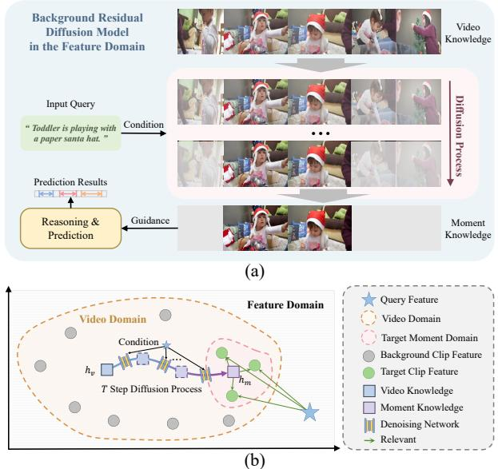
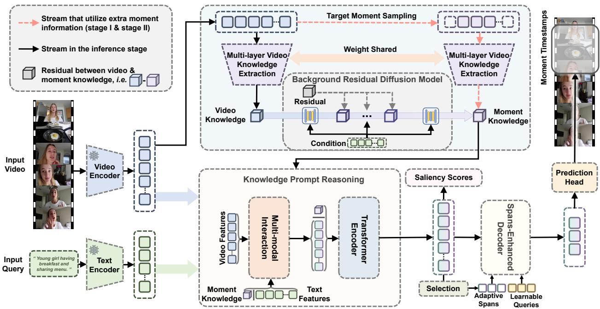
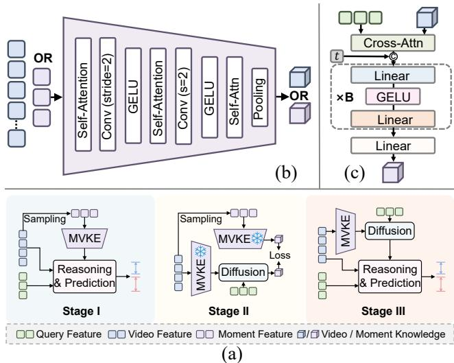
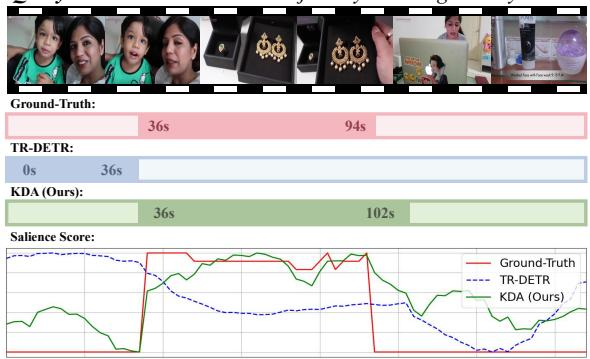
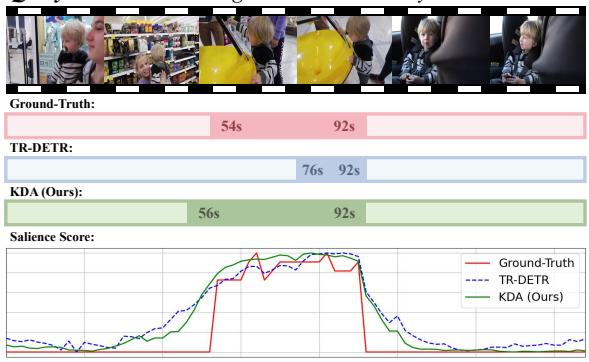
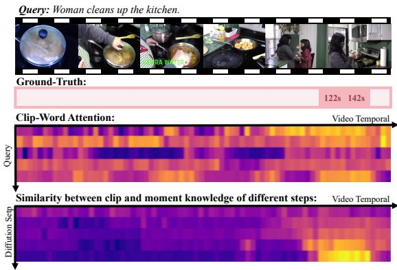

# KDA: Knowledge Diffusion Alignment with Enhanced Context for Video Temporal Grounding

Ran Ran1, Jiwei Wei1,2∗, Shiyuan He1, Zeyu Ma1, Chaoning Zhang1, Ning Xie1, Yang Yang1,2 1 University of Electronic Science and Technology of China 2Institute of Electronic and Information Engineering of UESTC, Guangdong

ranran@std.uestc.edu.cn, {mathematic6, shiyuanhe.david}@gmail.com, cnzeyuma@hotmail.com, {chaoningzhang1990, seanxiening, dlyyang}@gmail.com

## Abstract

Video Temporal Grounding (VTG) confronts the challenge of bridging the semantic gap between concise textual queries and the rich complexity of video content, further compounded by the difficulty of capturing discriminative features without explicit target cues. To address these chal lenges, we propose Knowledge Diffusion Alignment (KDA), a framework that leverages the generative prowess of diffu sion models. KDA introduces a multi-layer video knowledge extraction module alongside a background residual diffusion model that progressively prunes irrelevant background informationfrom global videofeatures, thereby distilling query-relevant moment knowledge enriched with visual context. By a three-stage training approach that harnesses annotated moment guidance, KDA guarantees that the extracted moment knowledge incorporates the discriminative features necessary for accurate localization. A knowledge prompt reasoning module facilitates the comprehensive interaction and utilization ofmoment knowledge and multimodal features. Moreover, we introduce a spansenhanced decoder that selectively integrates spans from multi-modal features, capitalizing on intrinsic alignment cues. Comprehensive experiments on three datasets demonstrate performance that surpasses state-of-the-art methods, attesting to the effectiveness ofthe proposedframework.

## 1. Introduction

Videos dominate online information, making it crucial to process untrimmed footage efficiently. Video Temporal Grounding (VTG) [1, 5, 24, 31] pinpoints the clip that answers a natural-language query, enabling accurate retrieval and content understanding. Due to the intricate demands of temporal modeling and accuracy cross-modal alignment [47, 54], VTG has become a pivotal research frontier in multi-modal video understanding [3, 20, 28].

  
Figure 1. (a) The proposed method introduces a background residual diffusion model, which progressively removes background information from the full video features, generating specific moment knowledge to guide grounding inference. (b) An illustration of our method in the feature domain. The DM gradually generates queryrelevant moment knowledge from the global video knowledge, to bridge the semantic gap between query and moment features.

VTG methods fall into two main paradigms: candidate proposal generation and proposal-free regression [12, 17, 49, 56]. The former uses sliding windows or anchors to generate and rank candidate segments [10, 16, 45, 57], but suffers from low efficiency due to repetitive and complex post-processing. The latter directly predicts target timestamps via temporal boundary regression and cross-modal interaction [34, 55]. Recently, Transformer-based frameworks leveraging attention interactions have become mainstream [9, 15, 20], with contrastive learning and joint optimization further enhancing multi-modal [33, 42, 51], leading to notable performance improvements.

However, existing methods struggle because textual queries are often concise to fully describe the redundant semantic information in videos [44, 46]. This limitation causes them to overlook the rich contextual details of video moments, leading to suboptimal feature alignment with target moments [19]. In addition, the lack of target-guided moment cues makes it difficult for models to effectively capture task-required discriminative features. Extracting accurate contextual knowledge from video content, especially generating discriminative features specific to queryrelevant moments, can significantly enhances the ability to align with temporal semantics and improve performance.

Diffusion models (DMs) excel at capturing complex details, enabling precise semantic generation in semantic feature spaces [7, 8, 23]. Based on this, we propose a novel Background Residual Diffusion Model (BRDM) that progressively removes query-irrelevant temporal background information from the global video features, ultimately generating moment knowledge essential for alignment. BRDM leverages the proximity between video and moment features, beginning with video to reduce DM generation complexity and improve stability. Figure 1 illustrates that the generated moment knowledge bridges the gap between query and moment features, effectively guiding alignment.

In this paper, we propose an innovative DM-based video temporal grounding method called Knowledge Diffusion Alignment (KDA). KDA integrates a BRDM within the video feature space, conditioning on the query to transform global video semantics into query-relevant moment knowledge. This knowledge captures both the query content and the complex video context, enabling precise matching of temporal semantics. The model includes a knowledge prompt reasoning, which aligns and interacts with moment knowledge as prompt tokens. Moreover, we propose a Spans-Enhanced Decoder (SED) that selects the most relevant parts from multi-modal features to obtain span information, incorporating it into the decoder for prediction, further leveraging alignment cues within the features.

KDA training consists of three stages. First, the proposed KDA obtains the target moment annotation and samples the video clip feature, then extracts moment knowledge using Multi-layer Video Knowledge Extraction (MVKE) for grounding prediction. Second, the same MVKE module extracts global video knowledge from the entire video. A BRDM is trained to generate features that closely resemble real moment knowledge from the video knowledge. Third, the DM-generated features are used as moment knowledge to complete remaining VTG inference. This enables KDA to leverage annotated moment guidance to capture taskrequired discriminative features, while utilizing the DM’s strong generative capability to enrich visual context.

Our contributions can be summarized as follows:

• We propose KDA, a novel DM-based framework for VTG. KDA leverages a background residual diffusion model to transform global video semantics into queryrelevant moment knowledge using the query as a condition. This moment knowledge encapsulates both query semantics and visual context, enhancing semantic consistency and facilitating alignment of temporal features.

• We design a multi-layer video knowledge extraction combined with a three-stage training to extract taskrequired discriminative moment knowledge. Moreover, we introduce a spans-enhanced decoder with a selection mechanism to obtain adaptive spans, effectively leveraging alignment cues in the multi-modal feature.

• Comprehensive experimental results validate the effectiveness of the proposed KDA, achieving superior VTG performance that surpasses state-of-the-art methods.

## 2. Related Works

Video Temporal Grounding. VTG aims to localize temporal segments in untrimmed videos that correspond to natural language queries, a task pioneered by early works [1, 6, 11, 54]. Current methodologies are broadly categorized into candidate proposal and proposal-free paradigms [43, 48]. Candidate proposal approaches [21, 22, 27, 50, 57] generate candidate moments using sliding windows or anchor and rank them through cross-modal feature matching. Although they achieve commendable performance, the redundant computations inherent in candidate lead to lower efficiency. In contrast, proposal-free methods [2, 29, 34, 53] eliminate explicit proposal generation by directly regressing temporal boundaries through a regression module after multi-modal interaction, achieving superior efficiency.

Recent advancements have focused on Transformerbased methods [9, 15, 32, 37, 42], which model global dependencies between video frames and textual semantics for end-to-end training. For instance, QD-DETR [33] introduces negative video-text pair learning to refine discriminative alignment. TR-DETR [42] advances cross-modal reasoning by jointly optimizing local clip-text interactions and global temporal coherence. LLMEPET [12] integrates large language model layers, leveraging linguistic priors to enhance semantic understanding of complex queries. Despite progress, challenges remain due to some limitations. Queries are too concise to fully align with the rich context of moments, and the absence of explicit target cues hampers the extraction of discriminative features. To address this, we propose the KDA with a three-stage training strategy, leveraging the powerful generative capability of DM to acquire target-aware moment guidance, thereby steering the model to accurately align with the target moment.

  
Figure 2. Overview of the proposed KDA framework. KDA is trained in three stages, differing from the acquisition of moment knowledge: (1) using target moments to sample the video and employing MVKE for moment knowledge; (2) fixing MVKE and using BRDM to generate moment knowledge from full video features, aligning it with real moment knowledge; and (3) removing the sampling step so that BRDM’s outputs directly serve as moment knowledge. Then, the moment knowledge is injected into the knowledge prompt reasoning for interaction. Finally, a spans-enhanced decoder with a spans selection mechanism, outputs the moment boundaries.

Diffusion Models for Video Understanding. Diffusion models [8, 41] are powerful generative frameworks that iteratively refine data via denoising. While widely used in visual synthesis [38, 52], their use in video understanding remains limited. Recent works explore DMs for textvideo alignment [13, 18, 58], achieving promising performance, but primarily focusing on recovering labels from noise. In VTG task, some works [23, 30] leverage diffusionbased approaches, either generating interpolated frames to aid localization or synthesizing diverse videos to enhancing model generalization, through intensive computation. Other methods use diffusion models to directly regress predictions in localization tasks [18, 58], first generating a series of random moment spans and then progressively denoising them to obtain the desired target spans. These approaches have achieved significant improvements.

However, video generation incurs significant computational costs, and obtaining spans from noise fails to tap into the DM’s content generation capabilities. In contrast, our background residual diffusion model generates queryrelevant moment knowledge enriched with visual context by initiating from a global video representation rather than random noise. This not only reduces computation but also effectively bridges the gap between two modalities.

## 3. Methodology

## 3.1. Problem Formulation

Given an untrimmed video $V = \{ f _ { i } \} _ { i = 1 } ^ { N _ { f } }$ , where $N _ { f }$ denotes the total number of frames, and a natural language query $Q \ = \ \{ w _ { i } \} _ { i = 1 } ^ { L }$ , where L represents the number of tokens in the query, the goal of VTG is to identify the temporal segment that best aligns with the semantic meaning of the query. Specifically, we predict the start and end timestamps $( t _ { s } , t _ { e } )$ of the relevant moment within the video.

## 3.2. Overall Framework

As shown in Figure 2, the proposed KDA framework consists of several components. KDA includes two modality encoders, a Multi-layer Video Knowledge Extraction module, a Background Residual Diffusion Model, a Knowledge Prompt Reasoning module that contains a Multi-modal Interaction and a Transformer Encoder, and finally a Spans-Enhanced Decoder and prediction head. Specifically, in line with prior works [15, 33, 42], we first use video and text modality encoders to encode the input video and query sentence into clip-level video features and word-level text features, respectively. Based on the training stages (three stages), MVKE utilizes additional annotated moment guidance to acquire moment knowledge, or alternatively, it extracts global video knowledge and then uses the background residual diffusion model to generate moment knowledge. In the knowledge prompt reasoning, moment knowledge is used as a prompt token for interaction and Transformerbased reasoning, allowing the model to utilize the guiding cues in the moment knowledge effectively. Finally, KDA introduces a spans-enhanced decoder that integrates a selection mechanism to obtain adaptive spans from multi-modal features as the initial decoder spans, with a prediction head subsequently generating the desired timestamps.

  
Figure 3. (a) An overview of the three-stage training process, where reasoning & prediction represents the inference and decoder modules. In the second stage, all parameters except the diffusion model remain fixed. (b) The architecture of the proposed multilayer video knowledge extraction. (c) The structure of the denoising network in the background residual diffusion model.

## 3.3. Three-Stage Training

We adopt a three-stage training process as shown in Figure 3 (a). In stage I, we directly obtain the ground truth timestamps of the target moment, sample the video to extract moment features, and use MVKE to acquire moment knowledge, training the model to learn target-guided moment cues required for VTG. In stage II, we fix all parameters except for the DM, utilize MVKE to extract both global video knowledge and real moment knowledge, and employ the background residual diffusion model to progressively generate the desired moment knowledge conditioned on the query features, and optimize the DM. In stage III, we unfreeze all parameters, discard both the process of obtaining the target moment and directly extract moment knowledge, and rely on the moment knowledge generated by DM to complete the VTG task. Thus, the KDA could utilize guidance knowledge from the target moment and the strong generative capacity of DM to capture complex visual context features, improving the model’s ability to match temporal information in videos accurately.

## 3.4. Feature Extraction

In line with prior methods in VTG [15, 33], we utilize pretrained feature extractors to obtain feature representations from both the video V and the query Q to capture their semantics. These feature extractors are generally separated into two categories: video encoder and text encoder. To bring the extracted features from both modalities into a common space, we use MLPs for feature projection. Finally, the video features are represented as $\bar { \mathcal { V } } \in \mathbb { R } ^ { N \times D }$ where N denotes the number of video clips and D is the feature dimension. Similarly, the text features are represented as $\mathcal { Q } = \{ q _ { i } \} _ { i = 1 } ^ { L } \in \bar { \mathbb { R } } ^ { L \times D }$ , where L represents the number of words in the query.

## 3.5. Multi-Layer Video Knowledge Extraction

The multi-layer video knowledge extraction encodes video V or sampled moment features $\mathcal { M } \in \mathbb { R } ^ { M \times D }$ (M is the clip number of moment) into a knowledge that represents the entire video or moment information. The MVKE module adopts a hierarchical feature extraction architecture and employs progressive temporal modeling across three levels to extract visual semantics. The structure is shown in Figure 3 (b), where each processing unit of the MVKE module extracts hierarchical representations through several selfattention layers that model temporal dependencies:

$$
\hat {\mathcal {V}} _ {k} ^ {d} = S A _ {k} (\mathcal {V} _ {k} ^ {d}),\tag{1}
$$

where $S A _ { k } ( \cdot )$ denotes the self-attention module at layer $k ,$ and $\mathcal { V } _ { k } ^ { d }$ represents the input features for the k layer, with $\mathcal { V } _ { 1 } ^ { d }$ being the initial input to MVKE (V or M). The temporal dimension is then downsampled via a convolution operation with a stride of 2 and a GELU activation function:

$$
\mathcal {V} _ {k + 1} ^ {d} = G E L U (C o n v _ {k} (\hat {\mathcal {V}} _ {k} ^ {d}; s = 2)) \in \mathbb {R} ^ {\lceil T / 2 ^ {k} \rceil \times D},\tag{2}
$$

where $C o n v _ { k } ( \cdot )$ refers to a convolution in k layer, s represents the stride, and $\mathcal { V } _ { k + 1 } ^ { d }$ denotes the input to the next layer. The final layer does not perform further downsampling, and a max pooling is applied to obtain the desired video knowledge $h _ { v }$ or moment knowledge $h _ { m }$ in $\mathbb { R } ^ { D }$

MVKE effectively leverages multi-layer and multi-scale temporal features, enabling the model to capture complex high-level visual semantics across different temporal scales from the video by a hierarchical structure.

## 3.6. Background Residual Diffusion Model

We propose the background residual diffusion model to achieve precise conversion from global video semantics to the target moment knowledge. Given the global video knowledge $h _ { v }$ and the real moment knowledge $h _ { m }$ , we define the residual $e ~ = ~ h _ { v } - h _ { m }$ to represent the redundant background. The forward process controls the residual injection strength using temporal coefficients $\{ \gamma _ { t } \} _ { t = 1 } ^ { T }$ $( \gamma _ { 1 }  0 , \gamma _ { T }  1 )$ . The feature state at step t is modeled as:

$$
q (h ^ {t} | h ^ {t - 1}, h _ {v}) = \mathcal {N} \left(h ^ {t}; h ^ {t - 1} + \alpha_ {t} e, \alpha_ {t} \sigma^ {2} I\right),\tag{3}
$$

where $h ^ { t }$ denotes intermediate state $( h ^ { 0 } \to h _ { m }$ and $h ^ { T } \to h _ { v } )$ $\alpha _ { 1 } = \gamma _ { 1 }$ and $\alpha _ { t } = \gamma _ { t } - \gamma _ { t - 1 }$ for $t > 1$ . I is the identity matrix, σ is the standard deviation. The marginal distribution is:

$$
q (h ^ {t} | h _ {v}) = \mathcal {N} \left(h ^ {t}; h _ {v} - \gamma_ {t} e, \gamma_ {t} \sigma^ {2} I\right).\tag{4}
$$

The reverse denoising process is conditioned on the query feature Q and directly regresses the target feature through the denoising network φ , as shown in Figure 3 (c). The conditional distribution for the reverse process is:

$$
q (h ^ {t - 1} | h ^ {t}, h _ {v}) = \mathcal {N} \bigg (h ^ {t - 1}; \frac {\gamma_ {t - 1}}{\gamma_ {t}} h ^ {t} + \frac {\alpha_ {t}}{\gamma_ {t}} h _ {m}, \frac {\gamma_ {t - 1}}{\gamma_ {t}} \alpha_ {t} \sigma^ {2} I \bigg).\tag{5}
$$

The reverse process is parameterized as:

$$
\mu_ {\theta} (h ^ {t}, t, \mathcal {Q}) = \frac {\gamma_ {t - 1}}{\gamma_ {t}} h ^ {t} + \frac {\alpha_ {t}}{\gamma_ {t}} \phi_ {\theta} (h ^ {t}, t, \mathcal {Q}),\tag{6}
$$

$$
h ^ {t - 1} = \mu_ {\theta} (h ^ {t}, t, \mathcal {Q}) + \lambda_ {t} \epsilon ,\tag{7}
$$

where $\begin{array} { r } { \lambda _ { t } = \sqrt { \frac { \gamma _ { t - 1 } \alpha _ { t } } { \gamma _ { t } } } \sigma } \end{array}$ , and $\epsilon \sim \mathcal { N } ( 0 , I )$ is the Gaussian noise. Finally, the $h ^ { 0 }$ is the generated target moment knowledge $h _ { m }$ . This process avoids predicting from noise by performing regression in the feature space, enhancing the accuracy of semantic. The loss is defined as an $\mathcal { L } _ { 2 }$ norm:

$$
\mathcal {L} _ {d m} = \| \phi_ {\theta} (h ^ {t}, t, \mathcal {Q}) - h _ {m} \| ^ {2}.\tag{8}
$$

## 3.7. Knowledge Prompt Reasoning

Knowledge prompt reasoning is employed for cross-modal interaction between the video and the query and reasoning over temporal information. It leverages moment knowledge as a crucial guiding signal, effectively assisting in aligning the query semantics with the relevant video segments. By fully exploiting the guidance knowledge within the moment knowledge, it enhances the grounding performance. The module includes two parts: multi-modal interaction and the Transformer encoder. Both parts incorporate moment knowledge as an additional prompt token to guide crossmodal semantic alignment and temporal reasoning.

Specifically, in multi-modal interaction, video and text features usually interact directly. However, the significant contextual and semantic differences between the two modalities often make this interaction challenging. In the multi-modal interaction of KDA, we embed moment knowledge $h _ { m }$ as prompt tokens into the text, thus bringing video features and moment knowledge, which are more aligned with the video context and closer to the target feature space, into the cross-modal reasoning process, as follows:

$$
\mathcal {F} ^ {\prime} = \text {Softmax} \left(\frac {(W _ {q} \mathcal {V}) (W _ {k} [ h _ {m} ; \mathcal {Q} ]) ^ {T}}{\sqrt {D}}\right) \cdot W _ {v} [ h _ {m}; \mathcal {Q} ],\tag{9}
$$

where $W _ { q } , W _ { k }$ , and $W _ { v }$ are learnable mappings, and $[ \cdot ; \cdot ]$ denotes concatenation along the token dimension.

To enhance the temporal causal relationship between the video and moment knowledge, reasoning also uses a Transformer encoder for further refinement of the multi-modal representations. Again, moment knowledge is embedded as an additional prompt token into the multi-modal feature ${ \mathcal { F } } ^ { \prime }$ which is represented as:

$$
_-, \mathcal {F} = T r a n s f o r m e r ([ h _ {m}; \mathcal {F} ^ {\prime} ]),\tag{10}
$$

where the moment knowledge is discarded after reasoning, leaving only the refined temporal multi-modal features $\mathcal { F }$

## 3.8. Decoder and Prediction

We adopt a spans-enhanced decoder, which introduces a selection mechanism to adaptively learn relevant spans, combined with a Transformer decoder [25] to fully leverage alignment cues in multi-modal features for temporal prediction. Specifically, the spans-enhanced decoder selects the top-K features from the multi-modal feature set $\mathcal { F }$ using class embedding, then uses span embedding to obtain the corresponding spans for these K features:

$$
\mathcal {E} = T o p _ {K} (\mathcal {F}, \psi (\mathcal {F}))) \in \mathbb {R} ^ {K \times D},\tag{11}
$$

$$
S = \varphi (\mathcal {E}) \in \mathbb {R} ^ {K \times 2},\tag{12}
$$

where $\mathcal { E }$ contains the top-K features selected from $\mathcal { F }$ based on $\psi ( { \mathcal { F } } ) , \psi ( \cdot )$ denotes the class embedding. S is the adaptive spans, $\varphi ( \cdot )$ represents the span embedding in model.

Unlike traditional methods [15, 33], our decoder does not rely on static queries and spans. Instead, it uses dynamic spans, which provide greater flexibility in handling the feature variations of different queries and moments, and allow for more effective focus on the relevant temporal information. Furthermore, we select and generate only spans as inputs to the decoder, rather than selecting both the query content and spans simultaneously, in order to avoid potential misguidance caused by using the unrefined feature set F as query contents. Finally, the desired moment predictions are obtained through the prediction head.

## 3.9. Training Objective

The training loss functions for the three-stage are as:

$$
\mathcal {L} _ {S 1} = \mathcal {L} _ {v t g} + \mathcal {L} _ {s a l} + \lambda_ {a l i g} \mathcal {L} _ {a l i g},\tag{13}
$$

$$
\mathcal {L} _ {S 2} = \mathcal {L} _ {d m},\tag{14}
$$

<table><tr><td rowspan="3">Method</td><td colspan="5">test</td><td colspan="5">val</td></tr><tr><td colspan="2">R1</td><td colspan="3">mAP</td><td colspan="2">R1</td><td colspan="3">mAP</td></tr><tr><td>@0.5</td><td>@0.7</td><td>@0.5</td><td>@0.75</td><td>Avg.</td><td>@0.5</td><td>@0.7</td><td>@0.5</td><td>@0.75</td><td>Avg.</td></tr><tr><td>M-DETR [15]</td><td>52.89</td><td>33.02</td><td>54.82</td><td>29.17</td><td>30.73</td><td>53.94</td><td>34.84</td><td>-</td><td>-</td><td>32.20</td></tr><tr><td>UMT [26]</td><td>56.23</td><td>41.18</td><td>53.83</td><td>37.01</td><td>36.12</td><td>60.26</td><td>44.26</td><td>56.70</td><td>39.90</td><td>38.59</td></tr><tr><td>QD-DETR [33]</td><td>62.40</td><td>44.98</td><td>62.52</td><td>39.88</td><td>39.86</td><td>62.68</td><td>46.66</td><td>62.23</td><td>41.82</td><td>41.22</td></tr><tr><td>UniVTG [20]</td><td>58.86</td><td>40.86</td><td>57.60</td><td>35.59</td><td>35.47</td><td>59.74</td><td>-</td><td>-</td><td>-</td><td>36.13</td></tr><tr><td>EaTR [9]</td><td>-</td><td>-</td><td>-</td><td>-</td><td>-</td><td>61.36</td><td>45.79</td><td>61.86</td><td>41.91</td><td>41.74</td></tr><tr><td>MomentDiff [18]</td><td>57.42</td><td>39.66</td><td>54.02</td><td>35.73</td><td>35.95</td><td>-</td><td>-</td><td>-</td><td>-</td><td>-</td></tr><tr><td>TR-DETR [42]</td><td>64.66</td><td>48.96</td><td>63.98</td><td>43.73</td><td>42.62</td><td>67.10</td><td>51.48</td><td>66.27</td><td>46.42</td><td>45.09</td></tr><tr><td>LLMEPET [12]</td><td>66.73</td><td>49.94</td><td>65.76</td><td>43.91</td><td>44.05</td><td>66.58</td><td>51.10</td><td>-</td><td>-</td><td>46.24</td></tr><tr><td>TaskWeave [51]</td><td>-</td><td>-</td><td>-</td><td>-</td><td>-</td><td>64.26</td><td>50.06</td><td>65.39</td><td>46.47</td><td>45.38</td></tr><tr><td>UVCOM [49]</td><td>63.55</td><td>47.47</td><td>63.37</td><td>42.67</td><td>43.18</td><td>65.10</td><td>51.81</td><td>-</td><td>-</td><td>45.79</td></tr><tr><td>KDA (Ours)</td><td>66.70</td><td>50.88</td><td>67.57</td><td>46.31</td><td>45.67</td><td>69.11</td><td>53.46</td><td>68.17</td><td>48.04</td><td>47.41</td></tr></table>

Table 1. Performance comparison on the QVHighlights dataset for both test and val splits, using SlowFast [4] and CLIP [36] features. The Bold indicates the best performance, and the Underline denotes the second-best.

$$
\mathcal {L} _ {S 3} = \mathcal {L} _ {v t g} + \mathcal {L} _ {s a l},\tag{15}
$$

where $\mathcal { L } _ { S 1 } , \mathcal { L } _ { S 2 } ,$ , and $\mathcal { L } _ { S 3 }$ correspond to the losses for stage I, II, and III. $\mathcal { L } _ { v t g }$ and $\mathcal { L } _ { s a l }$ denote the loss functions for VTG and saliency scores. $\mathcal { L } _ { a l i g }$ denotes the cross-entropy loss between $h _ { m }$ and the pooled Q with controlled coefficient $\lambda _ { a l i g } .$ , ensuring that the moment knowledge aligns with the query semantics. $\mathcal { L } _ { d m }$ is the DM loss. In the stage II, all parameters in the KDA except for the DM are fixed.

## 4. Experiments

## 4.1. Datasets

QVHighlights [15] constitutes a multi-modal benchmark comprising 10,148 YouTube videos paired with humanannotated textual descriptions that specify both temporal segments and highlight-worthy moments. This dataset uniquely supports dual evaluation of temporal grounding and saliency detection [15]. For fair evaluation, test annotations are hidden, and predictions must be submitted to the QVHighlights CodaLab platform for assessment.

Charades-STA [6] extends the original Charades dataset with 16,128 temporal-text annotations across 9,848 videos capturing daily indoor activities. Adhering to the standardized split established in recent works [33], we utilize 12,408 samples for training and 3,720 for performance validation. TACoS [39] provides extended cooking activity recordings with dense annotations, offering evaluation scenarios that demand precise grounding within complex workflows.

## 4.2. Evaluation Metrics

Our evaluation protocol follows established metrics from prior works [15, 42, 49]. We employ Recall@1 (R1) with IoU thresholds {0.5, 0.7}, which measures the percentage of test samples where the top-scored temporal proposal intersects with any ground-truth moment above specified IoU levels. For comprehensive precision analysis, mean Average Precision (mAP) computes averaged precision scores across multiple IoU thresholds ranging from 0.5 to 0.95 with 0.05 increments. Additionally, we evaluate mAP at IoU thresholds of 0.5 and 0.75.

## 4.3. Implementation Details

Experiments use SlowFast [4] and CLIP [36] for video encoder (SF+C), text queries are embedded via CLIP’s text encoder. VGG [40] and GloVe [35] were specifically adopted for Charades-STA. The model is trained for 500 epochs in three stages, with stage I, II, and III consisting of 100, 200, and 300 epochs, respectively. The training uses Adam [14] with weight decay 1e-4 and learning rate 1e-4. K is set to 15, $\lambda _ { a l i g }$ is set to 0.1 to incorporate query semantics into moment knowledge while preserving flexibility. The iteration number of the BRDM is set to 4, B in the denoising network is set to 3, and the number of layers in MVKE is 3.

## 4.4. Comparison with State-of-the-art

We evaluated the performance comparison between the KDA method and the current state-of-the-art methods on three benchmark datasets. First, the results on the QVHighlights dataset are shown in Table 1. On the test split, KDA surpasses the latest method LLMEPET by 0.94% and 1.62% on the key metrics R1@0.7 and mAP (avg.), respectively, verifying the effectiveness of using diffusiongenerated moment knowledge. Furthermore, the results on the val set further demonstrate the strong grounding ability for VTG, as its average mAP metric still achieves the best performance, showing significant advantages. The results on the Charades-STA dataset are shown in Table 2. Under the VGG feature setting, KDA surpasses TR-DETR by 3.69% in R1@0.7. When using SF+C multi-model features, KDA achieves overall superiority, improving by 0.98% and

<table><tr><td>Method</td><td>Feat.</td><td>R1@0.5</td><td>R1@0.7</td></tr><tr><td>2D-TAN [57]</td><td>VGG</td><td>40.94</td><td>22.85</td></tr><tr><td>FVMR [5]</td><td>VGG</td><td>42.36</td><td>24.14</td></tr><tr><td>UMT† [26]</td><td>VGG</td><td>48.31</td><td>29.25</td></tr><tr><td>QD-DETR [33]</td><td>VGG</td><td>52.77</td><td>31.13</td></tr><tr><td>TR-DETR [42]</td><td>VGG</td><td>53.47</td><td>30.81</td></tr><tr><td>KDA (Ours)</td><td>VGG</td><td>55.36</td><td>34.50</td></tr><tr><td>2D-TAN [57]</td><td>SF+C</td><td>46.02</td><td>27.50</td></tr><tr><td>VSLNet [55]</td><td>SF+C</td><td>42.69</td><td>24.14</td></tr><tr><td>M-DETR [15]</td><td>SF+C</td><td>52.07</td><td>30.59</td></tr><tr><td>MomentDiff [18]</td><td>SF+C</td><td>55.57</td><td>32.42</td></tr><tr><td>QD-DETR [33]</td><td>SF+C</td><td>57.31</td><td>32.55</td></tr><tr><td>UniVTG [20]</td><td>SF+C</td><td>58.01</td><td>35.65</td></tr><tr><td>TR-DETR [42]</td><td>SF+C</td><td>57.61</td><td>33.52</td></tr><tr><td>LLMEPET [12]</td><td>SF+C</td><td>-</td><td>36.49</td></tr><tr><td>UVCOM [49]</td><td>SF+C</td><td>59.25</td><td>36.64</td></tr><tr><td>KDA (Ours)</td><td>SF+C</td><td>60.23</td><td>37.63</td></tr></table>

Table 2. Results on the Charades-STA. † denotes the use of audio. Bold and Underline indicate best and second-best, respectively.

<table><tr><td>Method</td><td>Feat.</td><td>R1@0.5</td><td>R1@0.7</td></tr><tr><td>2D-TAN [57]</td><td>SF+C</td><td>27.99</td><td>12.92</td></tr><tr><td>VSLNet [55]</td><td>SF+C</td><td>23.54</td><td>13.15</td></tr><tr><td>M-DETR [15]</td><td>SF+C</td><td>24.67</td><td>11.97</td></tr><tr><td>MomentDiff [18]</td><td>SF+C</td><td>33.68</td><td>-</td></tr><tr><td>UniVTG [20]</td><td>SF+C</td><td>34.97</td><td>17.35</td></tr><tr><td>LLMEPET [12]</td><td>SF+C</td><td>-</td><td>22.78</td></tr><tr><td>UVCOM [49]</td><td>SF+C</td><td>36.39</td><td>23.32</td></tr><tr><td>KDA(Ours)</td><td>SF+C</td><td>40.13</td><td>24.34</td></tr></table>

Table 3. Comparison on TACoS dataset with SF+C features. Bold and Underline indicate best and second-best, respectively.

0.99% compared to the second-best method UVCOM. This confirms the ability of the cross-modal dynamic fusion module to adapt to multi-source features. On the most challenging long-video dataset, TACoS, as shown in Table 3, KDA achieves a 3.74% relative improvement in R1@0.5 compared to the current state-of-the-art, UVCOM. Moreover, its R1@0.7 performance also surpasses the best existing results. These experiments demonstrate that the proposed KDA achieves results that surpass the current stateof-the-art methods, proving the rationality of the design.

## 4.5. Ablation Study

We conduct extensive ablation studies on the QVHighlights val set to evaluate the impact of our proposed components. Main Components. Table 4 presents the ablation results for the key components: Moment Knowledge from Diffusion Model (MKDM), Multi-Layer Video Knowledge Extraction (MVKE), and Spans-Enhanced Decoder (SED). The baseline excludes these components: removing MKDM eliminates the moment knowledge-related parts of

<table><tr><td>MKDM</td><td>MVKE</td><td>SED</td><td>R1@0.5</td><td>R1@0.7</td><td>mAP</td></tr><tr><td></td><td></td><td></td><td>64.64</td><td>49.76</td><td>43.16</td></tr><tr><td>✓</td><td></td><td></td><td>66.05</td><td>50.53</td><td>44.77</td></tr><tr><td>✓</td><td>✓</td><td></td><td>67.57</td><td>51.34</td><td>45.79</td></tr><tr><td></td><td></td><td>✓</td><td>65.20</td><td>51.32</td><td>44.86</td></tr><tr><td>✓</td><td></td><td>✓</td><td>67.76</td><td>51.97</td><td>46.08</td></tr><tr><td>✓</td><td>✓</td><td>✓</td><td>69.11</td><td>53.46</td><td>47.41</td></tr></table>

Table 4. Ablation study for moment knowledge based on diffusion model (MKDM), multi-layer video knowledge extraction (MVKE), and spans-enhanced decoder (SED).

<table><tr><td>Diffusion Model</td><td>R1@0.5</td><td>R1@0.7</td><td>mAP</td></tr><tr><td>DDPM [8] (Step = 32)</td><td>66.68</td><td>51.61</td><td>45.53</td></tr><tr><td>DDIM [41] (Step = 4)</td><td>66.47</td><td>51.66</td><td>44.78</td></tr><tr><td>BRDM (Step = 4)</td><td>69.11</td><td>53.46</td><td>47.41</td></tr></table>

Table 5. Ablation experiments using different diffusion models.

<table><tr><td>DM Step</td><td>R1@0.5</td><td>R1@0.7</td><td>mAP</td><td>Time</td></tr><tr><td>w/o DM</td><td>65.20</td><td>51.32</td><td>44.86</td><td>8.0s</td></tr><tr><td>Step = 2</td><td>66.92</td><td>52.23</td><td>46.03</td><td>8.8s</td></tr><tr><td>Step = 4</td><td>69.11</td><td>53.46</td><td>47.41</td><td>9.3s</td></tr><tr><td>Step = 8</td><td>69.12</td><td>53.50</td><td>47.30</td><td>11.5s</td></tr></table>

Table 6. Result and total inference time on different step numbers.

KDA, while removing MVKE replaces it with a linear layer and pooling. Since MVKE depends on MKDM, it does not appear independently. Removing SED replaces it with a standard Transformer decoder. MKDM provides a significant 1.41% improvement in R1@0.5, validating our hypothesis that diffusion-generated moment knowledge enhance localization accuracy. MVKE improves average mAP by 1.33%, demonstrating its ability to extract multi-scale semantic features. SED further boosts average mAP by 1.62% due to its adaptive span decoding. The best performance is achieved when all components are combined, confirming the effectiveness of our proposed KDA.

Diffusion Model. To assess the effectiveness of the BRDM, we compare different diffusion models and step settings. As shown in Table 5, using DDPM [8] (32 steps) or DDIM [41] (4 steps) results in performance degradation, as both sample from pure Gaussian noise, making it difficult to generate moment features with rich contextual semantics. In contrast, BRDM starts from a structured video representation, reducing generation difficulty and improving performance. Table 6 examines performance and inference time across different step numbers, w/o DM denotes the removal of moment knowledge and DM. While performance improves with more steps, we set the count to 4 to maintain efficiency. Decoder Types. We conduct ablation studies on different decoder types in Table 7, comparing SED with static spans and query contents (1st row) and adaptive spans and query contents (2nd row). The first uses fixed spans and query contents after training, the second dynamically selects both. Our SED adaptively selects spans only. Results show that SED performs best, whereas fully adaptive designs degrade performance due to ambiguity in feature selection.

Query: A woman talks about thejewelry she bought today.  

Query: A child is checking out a device with a yellow sink.  
  
Figure 4. Visualization examples on the QVHighlights val split, including grounding results and corresponding saliency scores.

  
Figure 5. Attention between video and query word-level features, as well as between video and outputs at various diffusion steps.

## 4.6. Visualization Results

Figure 4 shows video grounding examples from the QVHighlights val set. Specifically, compared with TR-DETR, it demonstrates the effectiveness of KDA in temporal localization. Furthermore, by visualizing the temporal saliency scores, we observe that our model focuses more effectively on semantically relevant content in the video.

Figure 5 visualizes the attention mechanisms in the multi-modal interaction. Clip-word attention reflects alignment between query words and video clips, while similarity with moment knowledge tracks how BRDM-generated features evolve over steps. Notably, the final moment knowledge aligns more accurately with key semantic regions than direct query-word attention, benefiting from integrated video context. As BRDM iterations, the generated moment knowledge progressively refines toward query-relevant clip.

<table><tr><td>Decoder Type</td><td>R1@0.5</td><td>R1@0.7</td><td>mAP</td></tr><tr><td>Static Spans+Query</td><td>67.62</td><td>51.37</td><td>45.86</td></tr><tr><td>Adaptive Spans+Query</td><td>66.83</td><td>51.02</td><td>44.76</td></tr><tr><td>Adaptive Spans (SED)</td><td>69.11</td><td>53.46</td><td>47.41</td></tr></table>

Table 7. Ablation study on different types of decoder.

## 5. Conclusion

In this paper, we introduced Knowledge Diffusion Alignment (KDA), a novel framework for video temporal grounding that leverages DM to bridge the gap between concise queries and complex video content. KDA employs a background residual diffusion model to progressively remove query-irrelevant information from global video features, distilling query-specific moment knowledge enriched with visual context. A multi-layer video knowledge extraction and three-stage training enable the model to capture discriminative features essential for precise temporal localization. Moreover, the proposed spans-enhanced decoder adaptively selects pertinent spans from multi-modal feature, further leveraging the alignment cues inherent in the temporal representations. Extensive experiments demonstrate that KDA outperforms existing state-of-the-art methods.

Acknowledgments: This work was supported in part by National Natural Science Foundation of China (Grants 62306067 & 62220106008), Sichuan Science and Technology Program (Grant 2024NSFSC1463), Guangdong Basic and Applied Basic Research Foundation (Grant 2025A1515010108), and Sichuan Province Innovative Talent Funding Project for Postdoctoral Fellows (BX202405).

## References

[1] Lisa Anne Hendricks, Oliver Wang, Eli Shechtman, Josef Sivic, Trevor Darrell, and Bryan Russell. Localizing moments in video with natural language. In ICCV, pages 5803– 5812, 2017.

[2] Long Chen, Chujie Lu, Siliang Tang, Jun Xiao, Dong Zhang, Chilie Tan, and Xiaolin Li. Rethinking the bottom-up framework for query-based video localization. In AAAI, pages 10551–10558, 2020.

[3] Xinpeng Ding, Nannan Wang, Shiwei Zhang, De Cheng, Xiaomeng Li, Ziyuan Huang, Mingqian Tang, and Xinbo Gao. Support-set based cross-supervision for video grounding. In ICCV, pages 11573–11582, 2021.

[4] Christoph Feichtenhofer, Haoqi Fan, Jitendra Malik, and Kaiming He. Slowfast networks for video recognition. In ICCV, pages 6202–6211, 2019.

[5] Junyu Gao and Changsheng Xu. Fast video moment retrieval. In ICCV, pages 1523–1532, 2021.

[6] Jiyang Gao, Chen Sun, Zhenheng Yang, and Ram Nevatia. Tall: Temporal activity localization via language query. In ICCV, pages 5267–5275, 2017.

[7] Jonathan Ho and Tim Salimans. Classifier-free diffusion guidance. In NeurIPS 2021 Workshop on Deep Generative Models and Downstream Applications.

[8] Jonathan Ho, Ajay Jain, and Pieter Abbeel. Denoising diffusion probabilistic models. NeurIPS, 33:6840–6851, 2020.

[9] Jinhyun Jang, Jungin Park, Jin Kim, Hyeongjun Kwon, and Kwanghoon Sohn. Knowing where to focus: Event-aware transformer for video grounding. In ICCV, pages 13846– 13856, 2023.

[10] Xun Jiang, Xing Xu, Jingran Zhang, Fumin Shen, Zuo Cao, and Heng Tao Shen. Semi-supervised video paragraph grounding with contrastive encoder. In CVPR, pages 2466– 2475, 2022.

[11] Xun Jiang, Xing Xu, Jingran Zhang, Fumin Shen, Zuo Cao, and Heng Tao Shen. Sdn: Semantic decoupling network for temporal language grounding. IEEE TNNLS, 35(5):6598– 6612, 2024.

[12] Yiyang Jiang, Wengyu Zhang, Xulu Zhang, Xiao-Yong Wei, Chang Wen Chen, and Qing Li. Prior knowledge integration via llm encoding and pseudo event regulation for video moment retrieval. In ACM MM, pages 7249–7258, 2024.

[13] Peng Jin, Hao Li, Zesen Cheng, Kehan Li, Xiangyang Ji, Chang Liu, Li Yuan, and Jie Chen. Diffusionret: Generative text-video retrieval with diffusion model. In ICCV, pages 2470–2481, 2023.

[14] Diederik P Kingma and Jimmy Ba. Adam: A method for stochastic optimization. arXiv preprint arXiv:1412.6980, 2014.

[15] Jie Lei, Tamara L Berg, and Mohit Bansal. Detecting moments and highlights in videos via natural language queries. NeurIPS, 34:11846–11858, 2021.

[16] Hongxiang Li, Meng Cao, Xuxin Cheng, Yaowei Li, Zhihong Zhu, and Yuexian Zou. G2l: Semantically aligned and uniform video grounding via geodesic and game theory. In ICCV, pages 12032–12042, 2023.

[17] Juncheng Li, Junlin Xie, Long Qian, Linchao Zhu, Siliang Tang, Fei Wu, Yi Yang, Yueting Zhuang, and Xin Eric Wang. Compositional temporal grounding with structured variational cross-graph correspondence learning. In CVPR, pages 3032–3041, 2022.

[18] Pandeng Li, Chen-Wei Xie, Hongtao Xie, Liming Zhao, Lei Zhang, Yun Zheng, Deli Zhao, and Yongdong Zhang. Momentdiff: Generative video moment retrieval from random to real. NeurIPS, 36, 2024.

[19] Victor Weixin Liang, Yuhui Zhang, Yongchan Kwon, Serena Yeung, and James Y Zou. Mind the gap: Understanding the modality gap in multi-modal contrastive representation learning. NeurIPS, 35:17612–17625, 2022.

[20] Kevin Qinghong Lin, Pengchuan Zhang, Joya Chen, Shra man Pramanick, Difei Gao, Alex Jinpeng Wang, Rui Yan, and Mike Zheng Shou. Univtg: Towards unified videolanguage temporal grounding. In ICCV, pages 2794–2804, 2023.

[21] Daizong Liu, Xiaoye Qu, Xiao-Yang Liu, Jianfeng Dong, Pan Zhou, and Zichuan Xu. Jointly cross-and self-modal graph attention network for query-based moment localization. In ACM MM, pages 4070–4078, 2020.

[22] Daizong Liu, Xiaoye Qu, Jianfeng Dong, Pan Zhou, Yu Cheng, Wei Wei, Zichuan Xu, and Yulai Xie. Context-aware biaffine localizing network for temporal sentence grounding. In CVPR, pages 11235–11244, 2021.

[23] Daizong Liu, Jiahao Zhu, Xiang Fang, Zeyu Xiong, Huan Wang, Renfu Li, and Pan Zhou. Conditional video diffusion network for fine-grained temporal sentence grounding. IEEE TMM, 26:5461–5476, 2023.

[24] Meng Liu, Xiang Wang, Liqiang Nie, Qi Tian, Baoquan Chen, and Tat-Seng Chua. Cross-modal moment localization in videos. In ACM MM, pages 843–851, 2018.

[25] Shilong Liu, Feng Li, Hao Zhang, Xiao Yang, Xianbiao Qi, Hang Su, Jun Zhu, and Lei Zhang. Dab-detr: Dynamic anchor boxes are better queries for detr. In ICLR, 2021.

[26] Ye Liu, Siyuan Li, Yang Wu, Chang-Wen Chen, Ying Shan, and Xiaohu Qie. Umt: Unified multi-modal transformers for joint video moment retrieval and highlight detection. In CVPR, pages 3042–3051, 2022.

[27] Ye Liu, Jixuan He, Wanhua Li, Junsik Kim, Donglai Wei, Hanspeter Pfister, and Chang Wen Chen. R 2-tuning: Efficient image-to-video transfer learning for video temporal grounding. In ECCV, pages 421–438, 2024.

[28] Zhihang Liu, Jun Li, Hongtao Xie, Pandeng Li, Jiannan Ge, Sun-Ao Liu, and Guoqing Jin. Towards balanced alignment: Modal-enhanced semantic modeling for video moment retrieval. In AAAI, pages 3855–3863, 2024.

[29] Chujie Lu, Long Chen, Chilie Tan, Xiaolin Li, and Jun Xiao. Debug: A dense bottom-up grounding approach for natural language video localization. pages 5144–5153, 2019.

[30] Dezhao Luo, Shaogang Gong, Jiabo Huang, Hailin Jin, and Yang Liu. Generative video diffusion for unseen crossdomain video moment retrieval. In AAAI, 2025.

[31] Kaijing Ma, Xianghao Zang, Zerun Feng, Han Fang, Chao Ban, Yuhan Wei, Zhongjiang He, Yongxiang Li, and Hao

Sun. Llavilo: Boosting video moment retrieval via adapterbased multimodal modeling. In ICCV, pages 2798–2803, 2023.

[32] WonJun Moon, Sangeek Hyun, SuBeen Lee, and Jae-Pil Heo. Correlation-guided query-dependency calibration in video representation learning for temporal grounding. arXiv preprint arXiv:2311.08835, 2023.

[33] WonJun Moon, Sangeek Hyun, SangUk Park, Dongchan Park, and Jae-Pil Heo. Query-dependent video representation for moment retrieval and highlight detection. In CVPR, pages 23023–23033, 2023.

[34] Jonghwan Mun, Minsu Cho, and Bohyung Han. Localglobal video-text interactions for temporal grounding. In CVPR, pages 10810–10819, 2020.

[35] Jeffrey Pennington, Richard Socher, and Christopher D Manning. Glove: Global vectors for word representation. In EMNLP, pages 1532–1543, 2014.

[36] Alec Radford, Jong Wook Kim, Chris Hallacy, Aditya Ramesh, Gabriel Goh, Sandhini Agarwal, Girish Sastry, Amanda Askell, Pamela Mishkin, Jack Clark, et al. Learning transferable visual models from natural language supervision. In ICML, pages 8748–8763, 2021.

[37] Ran Ran, Jiwei Wei, Xiangyi Cai, Xiang Guan, Jie Zou, Yang Yang, and Heng Tao Shen. Cdtr: Semantic alignment for video moment retrieval using concept decomposition transformer. In AAAI, pages 6684–6692, 2025.

[38] Chen Rao, Guangyuan Li, Zehua Lan, Jiakai Sun, Junsheng Luan, Wei Xing, Lei Zhao, Huaizhong Lin, Jianfeng Dong, and Dalong Zhang. Rethinking video deblurring with wavelet-aware dynamic transformer and diffusion model. In ECCV, pages 421–437. Springer, 2024.

[39] Michaela Regneri, Marcus Rohrbach, Dominikus Wetzel, Stefan Thater, Bernt Schiele, and Manfred Pinkal. Grounding action descriptions in videos. Trans. Assoc. Comput., 1: 25–36, 2013.

[40] Karen Simonyan and Andrew Zisserman. Very deep convolutional networks for large-scale image recognition. arXiv preprint arXiv:1409.1556, 2014.

[41] Jiaming Song, Chenlin Meng, and Stefano Ermon. Denoising diffusion implicit models. arXiv preprint arXiv:2010.02502, 2020.

[42] Hao Sun, Mingyao Zhou, Wenjing Chen, and Wei Xie. Trdetr: Task-reciprocal transformer for joint moment retrieval and highlight detection. In AAAI, pages 4998–5007, 2024.

[43] Xin Sun, Xuan Wang, Jialin Gao, Qiong Liu, and Xi Zhou. You need to read again: Multi-granularity perception network for moment retrieval in videos. In Int. ACM SIGIR Conf. on Res.& Dev. in Inform. Ret., pages 1022–1032, 2022.

[44] Jiamian Wang, Guohao Sun, Pichao Wang, Dongfang Liu, Sohail Dianat, Majid Rabbani, Raghuveer Rao, and Zhiqiang Tao. Text is mass: Modeling as stochastic embedding for text-video retrieval. In CVPR, pages 16551–16560, 2024.

[45] Zhenzhi Wang, Limin Wang, Tao Wu, Tianhao Li, and Gangshan Wu. Negative sample matters: A renaissance of metric learning for temporal grounding. In AAAI, pages 2613–2623, 2022.

[46] Jiwei Wei, Xing Xu, Zheng Wang, and Guoqing Wang. Meta self-paced learning for cross-modal matching. In ACM MM, pages 3835–3843, 2021.

[47] Jiwei Wei, Yang Yang, Xing Xu, Xiaofeng Zhu, and Heng Tao Shen. Universal weighting metric learning for cross-modal retrieval. IEEE TPAMI, 44(10):6534–6545, 2021.

[48] Shaoning Xiao, Long Chen, Songyang Zhang, Wei Ji, Jian Shao, Lu Ye, and Jun Xiao. Boundary proposal network for two-stage natural language video localization. In AAAI, pages 2986–2994, 2021.

[49] Yicheng Xiao, Zhuoyan Luo, Yong Liu, Yue Ma, Hengwei Bian, Yatai Ji, Yujiu Yang, and Xiu Li. Bridging the gap: A unified video comprehension framework for moment retrieval and highlight detection. In CVPR, pages 18709– 18719, 2024.

[50] Huijuan Xu, Kun He, Bryan A Plummer, Leonid Sigal, Stan Sclaroff, and Kate Saenko. Multilevel language and vision integration for text-to-clip retrieval. In AAAI, pages 9062– 9069, 2019.

[51] Jin Yang, Ping Wei, Huan Li, and Ziyang Ren. Task-driven exploration: Decoupling and inter-task feedback for joint moment retrieval and highlight detection. In CVPR, pages 18308–18318, 2024.

[52] Zongsheng Yue, Jianyi Wang, and Chen Change Loy. Efficient diffusion model for image restoration by residual shifting. IEEE TPAMI, 2024.

[53] Runhao Zeng, Haoming Xu, Wenbing Huang, Peihao Chen, Mingkui Tan, and Chuang Gan. Dense regression network for video grounding. In CVPR, pages 10287–10296, 2020.

[54] Da Zhang, Xiyang Dai, Xin Wang, Yuan-Fang Wang, and Larry S Davis. Man: Moment alignment network for natural language moment retrieval via iterative graph adjustment. In CVPR, pages 1247–1257, 2019.

[55] Hao Zhang, Aixin Sun, Wei Jing, and Joey Tianyi Zhou. Span-based localizing network for natural language video localization. arXiv preprint arXiv:2004.13931, 2020.

[56] Mingxing Zhang, Yang Yang, Xinghan Chen, Yanli Ji, Xing Xu, Jingjing Li, and Heng Tao Shen. Multi-stage aggregated transformer network for temporal language localization in videos. In CVPR, pages 12669–12678, 2021.

[57] Songyang Zhang, Houwen Peng, Jianlong Fu, and Jiebo Luo. Learning 2d temporal adjacent networks for moment localization with natural language. In AAAI, pages 12870–12877, 2020.

[58] Henghao Zhao, Kevin Qinghong Lin, Rui Yan, and Zechao Li. Diffusionvmr: Diffusion model for joint video moment retrieval and highlight detection. IEEE TNNLS, pages 1–14, 2024.