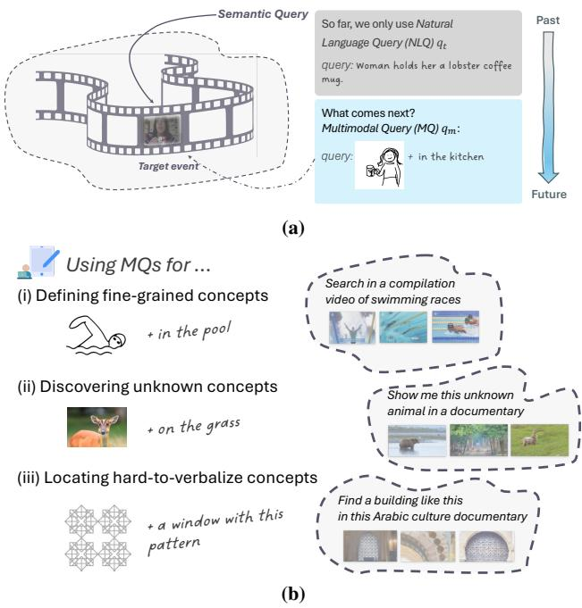
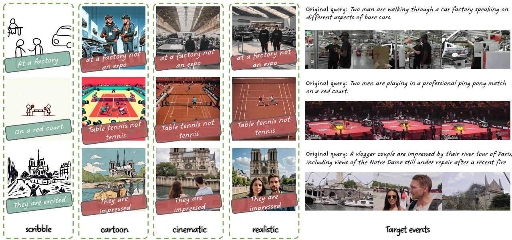
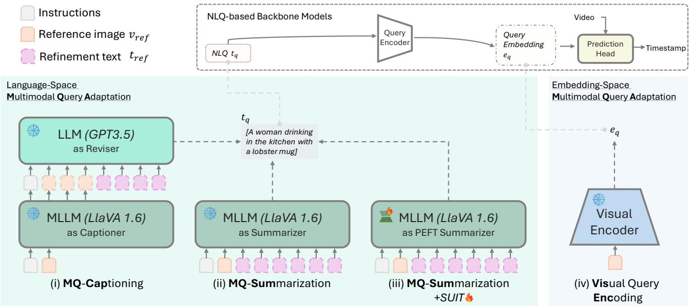
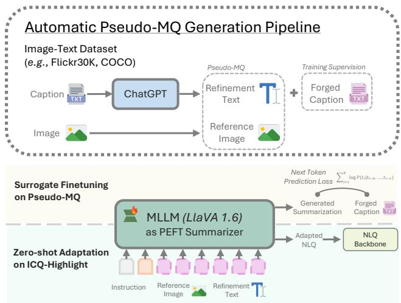
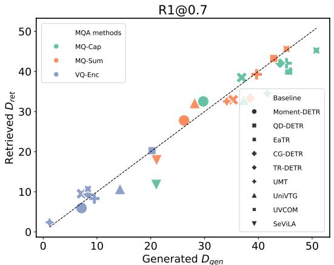
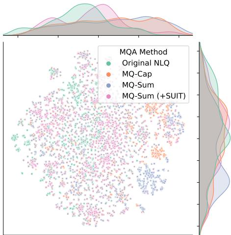

# Localizing Events in Videos with Multimodal Queries

Gengyuan Zhang 1,4\* Daniel Cremers 2,4

1 LMU Munich

Mang Ling Ada Fok 2\* Jialu Ma 1 Yan Xia 2,4† Philip Torr 3 Volker Tresp 1,4 Jindong Gu 2 TU Munich 3 University of Oxford

4 Munich Center for Machine Learning (MCML)

{zhang, tresp}@dbs.ifi.lmu.de {ada.fok, yan.xia, daniel.cremers}@tum.de {philip.torr, jindong.gu}@eng.ox.ac.uk

## Abstract

Localizing events in videos based on semantic queries is a pivotal task in video understanding research and useroriented applications like video search. Yet, current research predominantly relies on natural language queries (NLQs), overlooking the potential of using multimodal queries (MQs) that incorporate images toflexibly represent semantic queries, particularly when it is difficult to express non-verbal or unfamiliar concepts in words. To bridge this gap, we introduce ICQ, a new benchmark designed for localizing events in videos with MQs, alongside an evaluation dataset ICQ-Highlight. To adapt and reevaluate existing video localization models for this new task, we propose 3 Multimodal Query Adaptation methods and a novel Surrogate Fine-tuning strategy, serving as strong baseline methods. ICQ systematically benchmarks 12 state-of-theart backbone models, spanning from specialized video localization models to Video Large Language Models. Our extensive experiments highlight the high potential of using MQs in real-world applications. We believe this is a first step toward video event localization with MQs1.

## 1. Introduction

Localizing semantic events in videos has long been a prominent task in the field of video understanding [5, 41, 64, 66, 88, 91, 97]. User-centric applications like streaming media and short video platforms underscore the growing need to parse video segments for video search and video highlight or recommend video moments given user needs.

Conventional video event localization encompasses a broad spectrum of related tasks explored in prior research, such as video moment retrieval [20, 21, 53], highlight detection [2, 42, 60], and video temporal grounding [14, 15,

  
Figure 1. Localizing Events in Videos with Semantics Queries. Fig. 1a: So far, the community has only focused on natural language query-based video event localization as in [42]. Our benchmark ICQ focuses on a more general scenario: localizing events in video with multimodal queries (MQs). Fig. 1b: Localizing video events with MQs has broad applications: users often use brief, ambiguous text queries like “swimming” or struggle to find precise terms when it comes to unfamiliar or abstract concepts. MQs —like scribbles or example images— can help in such cases.

18, 23, 31, 73, 91]. A plethora of datasets and benchmarks [6, 22, 42, 70] has been established for exploring video event localization using Natural Language Queries (NLQs) as semantic queries. Building on these foundations, existing models have primarily focused on the NLQ setting [1, 8–12, 15, 18, 22, 25, 42, 80].

However, with the increasing need for human users to efficiently process massive video data online, multimodal interaction with videos is a promising scenario. In other words, texts should not be the only means of querying events in videos. As the saying goes, “A picture is worth a thousand words,” images act as a non-verbal language and convey rich semantic meaning to describe events. For instance, as illustrated in Fig. 1b, the query “swim” can refer to various styles of swimming, such as freestyle, butterfly, and backstroke. Using such an ambiguous query to localize fine-grained events in videos may yield imprecise results. As users, we often opt for writing brief, simple text queries over detailed descriptions, especially when it is hard to find the exact wording, such as unfamiliar concepts (e.g., unknown objects) or abstract ideas (e.g., aesthetic or geometric concepts). Additionally, for illiterate or cross-lingual users where texting is challenging, allowing users to search for events in videos through Multimodal Queries (MQs) like images can also increase inclusivity.

MQs, also referred to as composed queries [4, 30, 34, 77] in other contexts, offer practical benefits for video event localization. As illustrated in Fig. 1, using intuitive queries like user-drawn “scribble images” or example images as references can enhance human-computer interaction, particularly in the scenarios described above. While using MQs for video event localization may seem straightforward and intuitive, several questions remain: (1) visual queries can introduce irrelevant or even conflicting details unrelated to the target events, and (2) visual queries align only semantically with target video events, while distribution shifts in image styles are inevitable. How can models adapt to this more diverse and flexible MQ setting compared to the conventional NLQ-based task?

To address these questions, we propose a new task: localizing events in videos with MQs. We formulate an MQ consisting of a reference image, which conveys the core semantics of the query, and a refinement text for adjusting query details optionally. This enables a more flexible and versatile application of MQs. To bridge the research gap, we introduce ICQ (Image-Text Composed Queries), as the first benchmark for this task, along with a new evaluation dataset, ICQ-Highlight, with synthetic reference images and human-curated queries as a testbed for our task. Considering that reference images in MQs may vary significantly from videos in terms of styles, we define 4 reference image styles to assess performance across diverse scenarios.

Another gap to mind is that existing models designed for NLQs do not seamlessly accommodate MQs. This raises the question: how can we adapt these models for MQs? To address this, we propose 2 Multimodal Query Adaptation (MQA) approaches, Language-Space MQA and Embedding-Space MQA, to enable preceding models as backbone models to integrate MQs. Within these approaches, we introduce 3 training-free adaptation methods (MQ-Cap, MQ-Sum,VQ-Enc) along with the Surrogate

Fine-tuning on Pseudo-MQs strategy, SUIT, which together establish our adaptation as a SOTA baseline for video event localization using MQs. We have selected and evaluated a broad spectrum of 12 backbone models, from specialized models to Video Large Language Models (Video LLMs).

Our study demonstrates that existing models can effectively adapt to our new benchmark with MQA, establishing a solid baseline for future studies. A key insight from our findings is that, despite the potential semantic gap between MQ and NLQ, MQs remain effective for video event localization. Notably, even when MQs are minimalistic and abstract, such as scribble images, model performance is not strictly limited, envisioning new application scenarios.

Our contributions are summarized as follows:

1. We introduce a new task, video event localization with MQs, alongside a new evaluation benchmark, ICQ, with an evaluation dataset, ICQ-Highlight;

2. We propose 3 MQA methods and Surrogate Fine-tuning on Pseudo-MQs strategy to adapt NLQ-based models;

3. We systematically evaluate the combination of MQA methods and 12 SOTA backbone models ranging from specialized models to large-scale Video LLMs;

4. Our comprehensive experiments show that our MQA methods offer a powerful approach for adapting existing models to ICQ. These findings highlight the promising potential of using MQs in video event localization.

## 2. Related Work

## 2.1. Localizing Event in Videos with NLQs

Query-based video temporal localization has been a longstanding research topic and is an umbrella of several related tasks. According to their scenarios and motivation, they can be further categorized into several similar but slightly different tasks. Video moment retrieval [46, 52, 56–58, 90, 93, 96] aims to localize a video segment based on a textual caption query that describes events in the video. Video temporal grounding/localization [19, 29, 48, 49, 61, 62, 89, 92, 94] with NLQs aims to determine the video segment that corresponds with the textual description and usually serves downstream Question-Answering task [3, 84, 91, 98] and aims to provide relevant segments in videos. Other similar yet less relevant tasks include video highlight detection [2, 42, 60, 70] and action detection; these tasks also involve localizing video segments but with an implicit query or a category-level action label. Our benchmark steps toward localizing video events with MQs, which underline a composed query of images and text, which are different from other works, as a semantic search for events in videos.

Regarding the methodology, a line of works is focused on NLQ-based video moment retrieval/ video temporal grounding tasks: this includes two-stage (i.e. proposalbased) models [47] that firstly generate moment candidates and then filter out the matched moment based on the query and one-stage (i.e. proposal-free) models [9, 67, 92], including DETR [7]-based models have been widely employed in a line of work [35, 42, 59, 60, 71, 86]. More recent works [44, 54, 83, 87] attempt to unify multiple video localization tasks, including video moment retrieval and highlight detection in a single framework. In addition, with the large-scale LLMs gaining increasing attention, temporal grounding has also been adopted as a core module in MLLMs like SeViLA [91], InternVideo2 [81], TimeChat [66], VTimeLLM [33], etc. [95, 100].

  
Figure 2. Examples of ICQ-Highlight. Multimodal queries consist of a reference image and a refinement text. We consider 4 different reference image styles: scribble, cartoon, cinematic, and realistic. They describe a target event that corresponds to moments or segments in original videos and are equivalent to natural language queries in the original dataset [42]. Refinement texts add either complementary information if reference images are minimal like for scribble images, or corrective information if reference images are more complicated.

## 2.2. Multimodal Query for Image/Video Tasks

Using MQs is a practical and important scenario for holistic image/video retrieval [13, 24, 28, 34, 36, 37, 40, 55, 63, 68, 72, 74, 77–79, 82, 85]. Yet, it is necessary to note that video event localization with MQs differs from image/video retrieval tasks, which primarily involve instance-level similarity matching. Temporal localization requires dense video processing, significantly increasing the task complexity.

For video localization tasks, [99] is the first work to use image queries to localize unseen activities in videos to our knowledge. [75] also considers visual queries in video event localization but limits to visual-audio data. More recently, [27] proposes to ground videos spatiotemporally using images or texts, although their queries are still limited to object or action levels. To the best of our knowledge, our work is the first to attempt localizing events in videos using multimodal semantic queries.

## 3. Video Event Localization with Multimodal Queries: A Testbed

In the following section, we will elaborate on the definition of our new task, the benchmark ICQ, and ICQ-Highlight.

## 3.1. Task Definition

We define a multimodal query (MQ) $q _ { m }$ as consisting of a reference image $v _ { r e f }$ accompanied by a refinement text $t _ { r e f }$ for minor adjustments to localize a target event that corresponds to the query semantically. The reference image captures the key semantics of the target event, while the refinement text provides extra information that can be either complementary or corrective. This enables MQs to be more adaptable to real-world applications.

Given the query $q _ { m } .$ , the model predicts all the relevant segments or moments $[ \tau _ { s t a r t } , \tau _ { e n d } ]$ ]. We employ Recall and mean Average Precision as the evaluation metrics for this task as NLQ-based localization.

Reference Image Reference images $v _ { r e f }$ visually describe the semantics of an event in a video. They can be simple scribble images with minimal strokes that describe an event succinctly, effectively summarizing an event for non-verbal semantic queries in video localization or more detailed webcrawled images that depict semantically relevant scenes in a video. As illustrated in Fig. 2, reference images describe semantically similar scenes yet might vary in details as target videos. In practice, visual queries can differ in style, which may impact model performance. Therefore, we explore multiple reference image styles, as detailed in the subsequent section, to assess whether the model maintains consistent performance across various styles.

  
Figure 3. Multimodal Query Adaptation (MQA). We propose 3 MQA methods to bridge the current gap between natural language query-based models and our multimodal query-based benchmark: MQ-Cap, MQ-Sum, and VQ-Enc and MQ-Sum(+SUIT) enhanced by Surrogate Fine-tuning on Pseudo-MQs (MQ-Sum(+SUIT)) strategy, to adapt MQs to the conventional NLQ-based backbones.

Refinement Texts Refinement texts refer to simple phrases to either complement or correct descriptions that are either missing or contradictory in the reference images. This is particularly practical in real-world applications, as reference images often do not semantically align perfectly with the target video event. We identify 6 different types of refinement texts that can be applied to various aspects of the reference image semantics: “object”, “action”, “relation”, “attribute”, “environment”, and “others” as shown in Fig. 8 in Appx. B.3. This categorization is designed for elements of a semantic scene graph [38] and we borrowed it to summarize different semantic elements of the MQs.

## 3.2. Dataset Construction

We introduce our new evaluation dataset, ICQ-Highlight, as a testbed for ICQ. This dataset is built upon the validation set of QVHighlights [42], a popular NLQ-based video localization dataset. For each original query in QVHighlights, we construct multimodal semantic queries that incorporate reference images paired with refinement texts. Considering the reference image style distribution discussed earlier, ICQ-Highlight features 4 varied styles based on different image styles. Detailed statistics can be found in Appx. B.

Reference Image Generation We generate reference images based on the original NLQs and refinement texts using a suite of state-of-the-art Text-to-Image models, including

DALL-E-21 and Stable Diffusion2. For the reference image styles mentioned earlier, we select 4 representative styles: scribble, cartoon, cinematic, and realistic. These styles effectively capture a variety of real-world scenarios such as user inputs, book illustrations, television shows, and actual photographs, where images are often used as queries.

Data Annotation and Preprocessing We emphasize the meticulous crowd-sourced data curation and annotation effort applied to QVHighlights for 2 main reasons: (1) To introduce refinement texts, we purposefully modify the original semantics of text queries in QVHighlights to generate queries that are similar yet subtly different; (2) Given that the original queries in QVHighlights can be too simple and ambiguous to generate reasonable reference images, we add necessary annotations to ensure that the generated image queries are more relevant to the original video semantics. We employed human annotators to annotate and modify the NLQs. Each query is annotated and reviewed by different annotators to ensure consistency. Further details can be found in the Appx. B.

## 4. Adapting Multimodal Query

To explore the performance of preceding NLQ-based video localization methods on ICQ, we propose 2 Multimodal Query Adaptation (MQA) (in Sec. 4.1) strategies to bridge the gap between natural language queries (NLQs) and multimodal queries (MQs): Language-Space MQA and Embedding-Space MQA. Among them, we propose 3 training-free methods that adapt MQs to NLQs and a parameter-efficient fine-tuned (PEFT)-based method tailored for MQA task with a novel Surrogate Fine-tuning strategy to tackle data insufficiency (in Sec. 4.2). In total, we have benchmarked 12 video event localization models (in Sec. 4.3) for a thorough evaluation.

## 4.1. Multimodal Query Adaptation

In the conventional paradigm, input NLQs $t _ { q }$ are embedded in a high-dimensional space as query embeddings $\boldsymbol { e } _ { q } .$ . A common practice is leveraging CLIP [65] text encoder as the query encoder shown in Tab. 6 in Appx. C.2.

To align the MQs with pre-trained NLQs, we categorize MQA by different adaptation stages: Language-Space MQA, where MQs are transcribed to NLQs, and Embedding-Space MQA, where MQs are directly encoded as query embeddings, as illustrated in Fig. 3.

For Language-Space MQA, we first propose 2 trainingfree methods, MQ-Captioning (MQ-Cap) and MQ-Summarization (MQ-Sum), to leverage the power of MLLMs. MQ-Cap uses MLLMs as a captioner to caption reference images and LLMs as a reviser to integrate refinement texts. In contrast, MQ-Sum utilizes MLLMs to directly summarize reference images and refinement texts in one step. Generated text queries are denoted by $t _ { q } .$

For Embedding-Space MQA, we propose Visual Query Encoding (VQ-Enc) to embed the reference images as query embeddings $\boldsymbol { e } _ { q } .$ . This is based on the precondition that all selected models employ a dual-stream pre-trained encoder that embeds image/text in a joint embedding space.

Nevertheless, such methods still confront some performance issues (discussed in Sec. 5), including i) different prompt selection causes unstable performance; ii) MLLMs tend to generate lengthy and less task-specific outputs, which lead to NLQ distribution shift that backbone mod els rely on and harm the model performance. Therefore, we also propose a fine-tuning strategy for MQA, which is called Surrogate Fine-tuning on Pseudo-MQs for MQA.

## 4.2. SUIT: Surrogate Fine-tuning on Pseudo-MQs

Fine-tuning MLLMs on the task of summarizing MQs could counteract the impact of selective prompt engineering and mitigate the distribution shift between original NLQs and regenerated NLQs in Language-Space MQA. However, an underlying challenge for fine-tuning lies in the lack of training data for MQ-based localization. Compared to establishing an evaluation testbed, the larger-scale training data is more time- and labor-intensive. Besides, synthetic training data could pose risks of overfitting on generation bias and artifacts in the model, which are supposed to be avoided.

  
Figure 4. Surrogate Fine-tuning on Pseudo-MQs (SUIT). for MQ-Sum. To solve the issue of training data deficiency, we propose an automatic pseudo-MQ generation pipeline to construct a “surrogate” dataset for fine-tuning MQ-Sum.

To overcome this challenge, we propose a novel strategy, SUrrogate FIne-Tuning (SUIT) on Pseudo-MQs, to alleviate the training data deficiency issue.

As illustrated in Fig. 4, SUIT consists of 2 steps:

Automatic Pseudo-MQ Generation Pipeline To deal with the insufficient training data problem, we propose leveraging the abundant image-text datasets like Flickr30K [39] and COCO [45] to generate pseudo-MQs. We automate this generation process by leveraging GPT3.5 to convert each caption in the datasets to a pair of a “forged” caption and a refinement text that reflects the forge. As a result, the original image and the refinement text constitute a pseudo-MQ that is equivalent to a forged caption semantically.

Surrogate Fine-tuning on Pseudo-MQs We further utilize generated pseudo-MQs as inputs and fine-tune MLLMs to generate a summarizing caption as in MQ-Sum. Distorted captions are used as supervision to fine-tune the model with the next-token prediction loss and the PEFT approach as a surrogate training task. In this way, the MLLMs are finetuned to generate task-specific and formatted outputs akin to the target task. Then, we can transfer the fine-tuned MLLMs to our ICQ-Highlight dataset for evaluation.

## 4.3. Backbone Model Selection

We have selected and benchmarked 12 models specifically designed for video event localization with NLQs. Particularly, we categorize the selected models as follows: (1) Specialized models use natural language as a semantic query and are targeted at video moment retrieval tasks. We have selected a series of models including Moment-DETR[42], QD-DETR[60], EaTR[35], CG-DETR[59], and in videos? (2) Can varied styles of reference images and refinement texts impact the results?

<table><tr><td rowspan="2"></td><td rowspan="2">Model</td><td colspan="2">scribble</td><td colspan="2">cartoon</td><td colspan="2">cinematic</td><td colspan="2">realistic</td></tr><tr><td>R1@0.5</td><td>R1@0.7</td><td>R1@0.5</td><td>R1@0.7</td><td>R1@0.5</td><td>R1@0.7</td><td>R1@0.5</td><td>R1@0.7</td></tr><tr><td rowspan="9">VQ-Enc</td><td>Moment-DETR (2021)</td><td>12.55</td><td>5.69</td><td>13.38</td><td>6.59</td><td>14.36</td><td>6.01</td><td>14.88</td><td>6.53</td></tr><tr><td>QD-DETR (2023)</td><td>15.91</td><td>9.12</td><td>14.88</td><td>8.62</td><td>13.90</td><td>8.49</td><td>14.62</td><td>8.36</td></tr><tr><td>QD-DETR† (2023)</td><td>15.65</td><td>10.03</td><td>12.60</td><td>6.79</td><td>12.34</td><td>6.72</td><td>12.34</td><td>7.44</td></tr><tr><td>EaTR (2023)</td><td>19.86</td><td>13.00</td><td>19.91</td><td>12.99</td><td>21.15</td><td>13.45</td><td>21.48</td><td>13.38</td></tr><tr><td>CG-DETR (2023)</td><td>22.90</td><td>13.00</td><td>24.93</td><td>13.58</td><td>23.24</td><td>13.12</td><td>24.74</td><td>14.23</td></tr><tr><td>TR-DETR (2024)</td><td>17.92</td><td>11.19</td><td>17.36</td><td>11.10</td><td>15.14</td><td>9.86</td><td>15.60</td><td>9.53</td></tr><tr><td>UMT† (2022)</td><td>5.43</td><td>2.85</td><td>4.77</td><td>2.09</td><td>5.22</td><td>2.35</td><td>4.57</td><td>2.42</td></tr><tr><td>UniVTG (2023)</td><td>21.93</td><td>13.00</td><td>23.89</td><td>13.64</td><td>22.78</td><td>13.19</td><td>22.52</td><td>12.79</td></tr><tr><td>UVCOM (2023)</td><td>17.08</td><td>9.77</td><td>16.78</td><td>10.97</td><td>17.36</td><td>11.68</td><td>17.10</td><td>11.23</td></tr><tr><td rowspan="12">MQ-Cap</td><td>Moment-DETR (2021)</td><td>44.83 (±2.7)</td><td>27.97 (±2.2)</td><td>46.02 (±1.5)</td><td>29.36 (±0.9)</td><td>46.89 (±0.7)</td><td>30.35 (±1.2)</td><td>47.16 (±1.5)</td><td>30.53 (±0.8)</td></tr><tr><td>QD-DETR (2023)</td><td>48.92 (±4.1)</td><td>33.57 (±3.3)</td><td>52.87 (±0.8)</td><td>36.01 (±1.3)</td><td>54.01 (±0.7)</td><td>37.29 (±0.5)</td><td>53.07 (±0.8)</td><td>37.53 (±1.1)</td></tr><tr><td>QD-DETR† (2023)</td><td>50.15 (±4.6)</td><td>34.67 (±3.9)</td><td>53.53 (±1.3)</td><td>38.30 (±1.2)</td><td>53.37 (±0.6)</td><td>37.93 (±0.5)</td><td>53.39 (±1.0)</td><td>38.47 (±0.8)</td></tr><tr><td>EaTR (2023)</td><td>49.20 (±3.2)</td><td>34.82 (±3.5)</td><td>50.50 (±0.6)</td><td>35.27 (±0.7)</td><td>51.76 (±0.5)</td><td>36.92 (±0.7)</td><td>52.33 (±0.5)</td><td>37.01 (±0.3)</td></tr><tr><td>CG-DETR (2023)</td><td>50.65 (±3.5)</td><td>36.37 (±2.9)</td><td>56.26 (±0.7)</td><td>40.82 (±0.7)</td><td>54.53 (±0.9)</td><td>39.32 (±0.8)</td><td>56.72 (±0.7)</td><td>41.79 (±1.2)</td></tr><tr><td>TR-DETR (2024)</td><td>50.99 (±3.3)</td><td>35.55 (±3.7)</td><td>55.37 (±1.0)</td><td>39.92 (±2.0)</td><td>56.03 (±1.0)</td><td>40.69 (±0.9)</td><td>56.94 (±0.5)</td><td>41.99 (±0.3)</td></tr><tr><td>UMT† (2022)</td><td>44.76 (±3.5)</td><td>29.41 (±3.0)</td><td>48.15 (±1.7)</td><td>32.18 (±1.6)</td><td>49.96 (±0.9)</td><td>33.90 (±0.9)</td><td>48.83 (±1.0)</td><td>34.09 (±1.2)</td></tr><tr><td>UniVTG (2023)</td><td>47.50 (±3.1)</td><td>31.58 (±3.0)</td><td>49.50 (±0.8)</td><td>33.09 (±1.1)</td><td>50.98 (±0.2)</td><td>33.36 (±0.6)</td><td>51.42 (±1.1)</td><td>43.75 (±0.2)</td></tr><tr><td>UVCOM (2023)</td><td>50.99 (±3.6)</td><td>37.36 (±3.1)</td><td>54.39 (±0.5)</td><td>40.06 (±1.0)</td><td>55.88 (±0.7)</td><td>40.88 (±0.5)</td><td>54.92 (±0.9)</td><td>41.08 (±0.9)</td></tr><tr><td>SeViLA (2023)</td><td>17.37 (±1.3)</td><td>10.56 (±0.8)</td><td>22.72 (±0.8)</td><td>15.31 (±0.7)</td><td>25.94 (±0.1)</td><td>16.99 (±0.3)</td><td>26.83 (±0.8)</td><td>16.83 (±0.6)</td></tr><tr><td>TimeChat (2024)</td><td>6.63 (±0.8)</td><td>3.07 (±0.7)</td><td>8.24 (±1.0)</td><td>3.62 (±0.8)</td><td>8.15 (±0.6)</td><td>3.15 (±0.4)</td><td>7.70 (±0.5)</td><td>3.17 (±0.5)</td></tr><tr><td>VTimeLLM (2024)</td><td>16.24 (±0.9)</td><td>6.98 (0.4)</td><td>19.49 (±0.4)</td><td>7.86 (±0.2)</td><td>20.9 (±0.4)</td><td>8.64 (±0.4)</td><td>20.75 (±0.5)</td><td>8.67 (±0.2)</td></tr><tr><td rowspan="12">MQ-Sum</td><td>Moment-DETR (2021)</td><td>42.00 (±3.3)</td><td>25.14 (±3.0)</td><td>44.56 (±2.4)</td><td>27.24 (±2.1)</td><td>43.73 (±2.0)</td><td>27.00 (±1.8)</td><td>44.34 (±2.6)</td><td>27.74 (±2.0)</td></tr><tr><td>QD-DETR (2023)</td><td>45.56 (±3.3)</td><td>30.44 (±3.0)</td><td>49.09 (±3.8)</td><td>33.64 (±3.2)</td><td>48.89 (±3.5)</td><td>32.66 (±3.1)</td><td>47.83 (±4.1)</td><td>32.86 (±3.8)</td></tr><tr><td>QD-DETR† (2023)</td><td>46.57 (±3.8)</td><td>32.52 (±3.6)</td><td>49.30 (±4.3)</td><td>34.12 (±4.2)</td><td>48.83 (±3.2)</td><td>34.16 (±3.4)</td><td>49.13 (±4.4)</td><td>33.83 (±3.1)</td></tr><tr><td>EaTR (2023)</td><td>45.79 (±3.0)</td><td>32.67 (±2.9)</td><td>48.45 (±2.9)</td><td>32.96 (±2.7)</td><td>48.24 (±3.8)</td><td>33.35 (±3.5)</td><td>48.69 (±3.7)</td><td>33.85 (±2.5)</td></tr><tr><td>CG-DETR (2023)</td><td>47.07 (±4.2)</td><td>33.14 (±4.1)</td><td>51.46 (±3.1)</td><td>36.49 (±2.7)</td><td>50.59 (±3.4)</td><td>36.08 (±3.6)</td><td>51.91 (±3.5)</td><td>36.58 (±2.4)</td></tr><tr><td>TR-DETR (2024)</td><td>46.44 (±4.4)</td><td>33.23 (±3.8)</td><td>51.35 (±3.2)</td><td>36.14 (±2.3)</td><td>51.92 (±3.8)</td><td>36.29 (±3.7)</td><td>52.87 (±4.0)</td><td>36.77 (±3.4)</td></tr><tr><td>UMT† (2022)</td><td>43.88 (±3.4)</td><td>29.28 (±1.9)</td><td>45.39 (±2.8)</td><td>29.98 (±2.4)</td><td>45.37 (±2.3)</td><td>30.01 (±2.2)</td><td>46.35 (±2.0)</td><td>30.27 (±1.0)</td></tr><tr><td>UniVTG (2023)</td><td>44.98 (±3.3)</td><td>27.99 (±2.7)</td><td>46.19 (±3.5)</td><td>30.37 (±2.4)</td><td>47.22 (±3.3)</td><td>29.90 (±2.5)</td><td>50.39 (±3.3)</td><td>30.33 (±2.4)</td></tr><tr><td>UVCOM (2023)</td><td>46.62 (±3.8)</td><td>33.40 (±3.4)</td><td>51.48 (±4.1)</td><td>36.92 (±3.7)</td><td>50.91 (±5.3)</td><td>36.58 (±4.5)</td><td>51.18 (±3.7)</td><td>36.23 (±3.4)</td></tr><tr><td>SeViLA (2023)</td><td>17.89 (±1.9)</td><td>10.65 (±1.5)</td><td>27.47 (±3.5)</td><td>16.98 (±1.9)</td><td>27.76 (±2.5)</td><td>17.77 (±1.5)</td><td>28.61 (±3.3)</td><td>17.30 (±2.0)</td></tr><tr><td>TimeChat (2024)</td><td>6.58 (±0.1)</td><td>2.76 (±0.5)</td><td>7.38 (±1.1)</td><td>3.39 (±0.8)</td><td>7.51 (±0.9)</td><td>3.63 (±0.8)</td><td>5.73 (±1.2)</td><td>4.49 (±3.3)</td></tr><tr><td>VTimeLLM (2024)</td><td>16.95 (±1.4)</td><td>7.40 (±0.1)</td><td>19.19 (±0.8)</td><td>7.8 (±0.3)</td><td>20.23 (±0.4)</td><td>8.29 (±0.3)</td><td>20.53 (±1.5)</td><td>8.11 (±0.5)</td></tr><tr><td rowspan="10">MQ-Sum</td><td colspan="9">+SUIT</td></tr><tr><td>Moment-DETR (2021)</td><td>48.59 (±0.9)</td><td>31.85 (±0.7)</td><td>48.27 (±0.6)</td><td>31.31 (±0.4)</td><td>47.58 (±0.5)</td><td>31.52 (±0.5)</td><td>47.25 (±0.2)</td><td>30.83 (±0.6)</td></tr><tr><td>QD-DETR (2023)</td><td>55.27 (±0.5)</td><td>39.86 (±0.4)</td><td>53.45 (±0.6)</td><td>37.94 (±0.3)</td><td>53.36 (±0.3)</td><td>38.39 (±0.6)</td><td>53.79 (±0.5)</td><td>38.92 (±0.1)</td></tr><tr><td>QD-DETR†(2023)</td><td>55.20 (±0.5)</td><td>39.82 (±0.7)</td><td>54.60 (±0.4)</td><td>40.44 (±0.6)</td><td>54.28 (±0.4)</td><td>40.31 (±0.6)</td><td>53.52 (±0.8)</td><td>38.97 (±0.1)</td></tr><tr><td>EaTR (2023)</td><td>53.63 (±0.8)</td><td>39.23 (±0.5)</td><td>50.63 (±0.4)</td><td>37.40 (±0.6)</td><td>51.67 (±0.5)</td><td>38.50 (±0.4)</td><td>50.78 (±0.4)</td><td>37.19 (±0.5)</td></tr><tr><td>CG-DETR (2023)</td><td>55.83 (±0.6)</td><td>41.41 (±0.3)</td><td>55.42 (±0.8)</td><td>39.88 (±0.6)</td><td>56.37 (±0.8)</td><td>41.14 (±0.6)</td><td>55.47 (±0.9)</td><td>40.17 (±0.5)</td></tr><tr><td>TR-DETR (2024)</td><td>58.85 (±0.4)</td><td>43.08 (±0.4)</td><td>57.19 (±0.2)</td><td>41.31 (±0.4)</td><td>57.35 (±0.5)</td><td>41.92 (±0.9)</td><td>57.39 (±0.4)</td><td>42.64 (±0.3)</td></tr><tr><td>UMT†(2022)</td><td>49.71 (±0.3)</td><td>35.10 (±0.3)</td><td>50.01 (±0.8)</td><td>35.16 (±0.6)</td><td>50.25 (±0.6)</td><td>35.18 (±0.5)</td><td>49.85 (±0.4)</td><td>34.60 (±0.7)</td></tr><tr><td>UniVTG (2023)</td><td>51.26 (±0.4)</td><td>34.07 (±0.7)</td><td>49.36 (±0.3)</td><td>33.24 (±0.5)</td><td>51.0 (±0.5)</td><td>34.4 (±0.7)</td><td>50.65 (±0.6)</td><td>33.48 (±0.6)</td></tr><tr><td>UVCOM (2023)</td><td>55.33 (±0.4)</td><td>42.03 (±0.7)</td><td>55.48 (±0.2)</td><td>41.66 (±0.1)</td><td>55.43 (±0.4)</td><td>41.88 (±0.4)</td><td>54.43 (±0.4)</td><td>41.30 (±0.3)</td></tr></table>

Table 1. Model performance (Recall) on ICQ. We highlight the best score in italic for each adaptation method and the overall best scores in bold. For MQ-Cap and MQ-Sum, we report the standard deviation of 3 runs with different prompts and for MQ-Sum(+SUIT) we report the average performance with different seeds in training. † uses extra audio modality.

## 5.1. Experimental Setup

TR-DETR[71]; (2) Unified frameworks are aimed to solve multiple video localization tasks within one model, such as moment retrieval, highlight detection, and video summarization. We have selected UMT[54], UniVTG[44], and UVCOM[83] as strong baselines; (3) LLM-based Models features the power of Large Language Models, which prove to be a powerful and general head for varied video tasks. We have selected SeViLA [91], TimeChat [66], and VTimeLLM [33] as representatives of LLM-based models. We apply different MQA methods on top of the pre-trained model checkpoints on the original QVHighlights dataset.

## 5. Experiments and Analysis

In this section, we attempt to answer the following questions: (1) Can and how well MQs effectively localize events

Implementation We employ LLaVA-mistral-1.6 [50, 51] as a strong MLLM in MQ-Cap, MQ-Sum (with and without SUIT) and GPT-3.5 as a reviser in our MQ-Cap adaptation. We believe that the performance of these models is representative of the SOTA capabilities of MLLMs and is fairly compared across different MQA methods. For VQ-Enc, we utilize the corresponding CLIP Visual Encoder, as all models typically employ the CLIP Text Encoder for text query encoding. In VQ-Enc, we omit refinement texts and only use the reference image. In MQ-Sum(+SUIT), we construct our pseudo-MQs with 89 420 training data from

  
Figure 5. Controlled Experiment. We plot the model performance (R1@0.7) on 2 subsets $D _ { r e t }$ and $D _ { g e n }$ . We use the dashed line to indicate the same performance on both datasets.

Flickr30K and COCO and implement LoRA [32] as a common PEFT method with rank 32, alpha 64, and a learning rate of $2 \times 1 0 ^ { - 4 }$ on the language model of LlaVA. More implementation details about datasets and training can be found in the Appx. C.1.

Evaluation Metrics We evaluate models on our new testbed ICQ-Highlight. For evaluation, we report both Recall R@1 with IoU thresholds 0.5 and 0.7, mean Average Precision with IoU threshold 0.5 and the average over multiple IoU thresholds [0.5:0.05:0.95] as standard metrics for video moment retrieval and localization [42, 91], where IoU (Intersection over Union) thresholds determine if a predicted temporal window is positive.

  
Figure 6. t-SNE Visualization of Queries after Language-Space Multimodal Query Adaptation. Original NLQs have similar distributions with closer modes as MQ-Sum(+SUIT) other than the other two training-free methods, which shows that finetuned MLLM can generate closer queries to original NLQs.

## 5.2. Results & Analysis

We present the pairwise performance of 12 models combined with 4 adaptation methods on ICQ in Tab. 1 and Tab. 8 in Appx. D.1. For MQ-Cap and MQ-Sum methods, we have conducted 3 runs with different prompts and reported the average performance and standard deviation.

How do Video Event Localization with MQs work on different image styles? Firstly, we aim to draw a key conclusion from the results. We find all adaptation methods perform consistently across different styles and therefore suggest that they could understand the MQs well, particularly for styles including cartoon, cinematic, and realistic; the model performance is close to each other. For scribble, all models show marginally worse performance, and even both MQ-Cap and MQ-Sum methods have a more significant standard deviation, which reflects that it is heavily influenced by the prompts. This can be explained by the fact that scribble images are more minimal and abstract in semantics and more challenging to interpret. Surprisingly, in spite of being more abstract and simpler, the model performance on scribble reference images is close to other reference image styles. This demonstrates the potential of using scribble as MQs in real-world video event localization applications like video search.

Which is the best MQA method? Among all the trainingfree methods, we find that MQ-Cap can achieve the best performance and is more robust to different prompts compared to other adaptation methods by an average margin of 3.6% on all styles. We observe that both utilizing MLLMs for captioning reference images, MQ-Sum suffers more than MQ-Cap adaptation regarding performance and is more sensitive to prompts for all reference styles, which can be observed from the higher standard deviation, showing asking MLLMs to caption and summarize the refinement texts is less controllable. To conclude, captioning images is still a golden method since MLLMs and LLMs are powerful enough to generate faithful captions.

Notably, MQ-Sum(+SUIT) shows a non-marginal improvement (4.3%-9.7%) and more stable performance across all backbone models. This proves the efficacy and transferability of our SUIT strategy. To verify our motivation that training-free MQA can output uncontrollable text queries that have a distribution shift from the original NLQs on which the backbones are trained, we visualize the embeddings of original NLQs and adapted MQs in Fig. 6 with t-SNE [76]. It shows that original NLQs have similar distributions as MQ-Sum(+SUIT) other than the other 2 trainingfree methods for all different image styles.

However, the performance gap between our MQ setting and the original NLQ benchmark (refer to Appx. D.5) is still remarkable, which shows that the query semantics are more or less distorted across modalities.

<table><tr><td rowspan="2">Model</td><td colspan="2">scribble</td><td colspan="2">cartoon</td><td colspan="2">cinematic</td><td colspan="2">realistic</td></tr><tr><td>R1@0.5</td><td>R1@0.7</td><td>R1@0.5</td><td>R1@0.7</td><td>R1@0.5</td><td>R1@0.7</td><td>R1@0.5</td><td>R1@0.7</td></tr><tr><td>Moment-DETR</td><td>45.15 (-2.7%)</td><td>28.72 (-3.3%)</td><td>43.60 (-7.1%)</td><td>27.94 (-5.8%)</td><td>44.06 (-7.3%)</td><td>29.70 (-2.8%)</td><td>44.06 (-9.3%)</td><td>28.98 (-6.5%)</td></tr><tr><td>QD-DETR</td><td>49.81 (-4.0%)</td><td>33.70 (-5.4%)</td><td>49.87 (-6.6%)</td><td>34.33 (-6.3%)</td><td>49.67 (-9.3%)</td><td>34.73 (-8.1%)</td><td>50.52 (-5.7%)</td><td>35.25 (-7.4%)</td></tr><tr><td>QD-DETR†</td><td>51.29 (-3.9%)</td><td>36.03 (-3.8%)</td><td>48.69 (-10.8%)</td><td>33.88 (-13.4%)</td><td>49.48 (-8.5%)</td><td>34.99 (-9.0%)</td><td>49.93 (-7.5%)</td><td>35.05 (-10.4%)</td></tr><tr><td>EaTR</td><td>52.01 (+0.5%)</td><td>37.77 (+1.2%)</td><td>47.45 (-6.7%)</td><td>33.09 (-8.0%)</td><td>48.56 (-7.0)</td><td>34.33 (-5.1)</td><td>49.61 (-6.1%)</td><td>35.64 (-3.0%)</td></tr><tr><td>CG-DETR</td><td>51.42 (-4.0%)</td><td>37.84 (-1.7%)</td><td>49.35 (-13.0%)</td><td>35.90 (-13.4%)</td><td>48.89 (-10.3)</td><td>34.79 (-11.3)</td><td>51.04 (-10.5%)</td><td>36.55 (-14.0%)</td></tr><tr><td>TR-DETR</td><td>52.01 (-2.4%)</td><td>37.19 (-2.9%)</td><td>51.04 (-9.2%)</td><td>36.62 (-11.2%)</td><td>50.00 (-11.8)</td><td>36.03 (-12.5)</td><td>52.28 (-8.8%)</td><td>37.53 (-10.6%)</td></tr><tr><td>UMT†</td><td>46.25 (-3.0%)</td><td>31.57 (-1.0%)</td><td>45.82 (-6.9%)</td><td>30.61 (-7.1%)</td><td>46.34 (-8.6%)</td><td>29.96 (-13.7%)</td><td>46.08 (-6.2%)</td><td>31.85 (-7.1%)</td></tr><tr><td>UniVTG</td><td>47.87 (-3.8%)</td><td>33.76 (-2.2%)</td><td>45.56 (-9.4%)</td><td>29.24 (-11.5%)</td><td>45.43 (-11.2%)</td><td>29.05 (-13.9%)</td><td>46.80 (-9.3%)</td><td>30.42 (-12.4%)</td></tr><tr><td>UVCOM</td><td>52.26 (-1.7%)</td><td>39.39 (+1.0%)</td><td>51.50 (-6.1%)</td><td>37.99 (-6.6%)</td><td>50.98 (-9.4%)</td><td>36.75 (-11.3%)</td><td>51.70 (-7.6%)</td><td>37.53 (-10.5%)</td></tr><tr><td>SeViLA</td><td>13.15 (-30.3%)</td><td>8.06 (-29.3%)</td><td>11.89 (-49.8%)</td><td>6.89 (-57.0%)</td><td>13.26 (-49.0%)</td><td>8.32 (-51.5%)</td><td>13.65 (-49.1%)</td><td>8.22 (-51.1%)</td></tr></table>

Table 2. Model performance without refinement texts. We employ MQ-Cap for methods without considering refinement texts. The performance drop highlighted in the parenthesis indicates that refinement texts in ICQ-Highlight can help refine the semantics of the reference images and localize the events better.

Across different backbone models, we find that models that perform well in one adaptation method tend to per form well in others. For example, UVCOM and TR-DETR consistently show high performance across MQ-Cap, MQ Sum, and VQ-Enc methods. We observe that more recent models keep their outperforming performance on our ICQ. Latest models, including UVCOM, TR-DETR, and CG-DETR, tend to perform better across different adaptation methods and reference image styles. In contrast, older models like Moment-DETR consistently show lower performance. LLM-based models cannot compete with other specialized models without exception; this aligns with their subpar performance on NLQ-based benchmarks [33, 66, 91]. In the next section, we find that model performance on ICQ highly correlates with that on NLQ-based benchmark QVHighlights. This shows that (1) our MQs share semantics with the original benchmark; (2) the adaptation methods and models could understand semantics from MQs.

## 5.3. Ablation Studies

Besides the benchmark, we conduct additional studies for other intriguing questions in this section and in Appx. D.1.

Do Artifacts in synthetic reference images distort the conclusion? The artifacts in our generated data are inevitable even with the best commercial Text-to-Image models so far. To understand the impact of generated images artifacts on model evaluation, we conduct a controlled ex periment by collecting a subset of MQs by crawling similar images via the Google image search engine. Each image in this retrieved subset has a corresponding generated reference image in a subset $D _ { g e n }$ of ICQ-Highlight. The retrieval criterion is that retrieved images should be as similar as possible to the generated images in semantics/style/details so that the generation artifacts are the only control variable. The final subset comprises 84 samples from 4 styles. We compare the model performance on $D _ { r e t }$ and $D _ { g e n }$ . Our pre-assumption is that if generation artifacts degrade the model performance largely, then $D _ { r e t }$ should perform better than $D _ { g e n }$ . Otherwise, $D _ { g e n }$ should perform close to $D _ { r e t }$ . As shown in Fig. 5, model performance on $D _ { g e n }$ is close to $D _ { r e t }$ in general. This shows that generation artifacts do not skew our findings largely, and our benchmark is still generalizable.

Importance of Refinement Texts To assess the impact of refinement texts on video event localization using MQs, we have evaluated model performance using only reference images as queries, omitting refinement texts. We employ the MQ-Cap adaptation without a modifier for integrating refinement texts. As shown in Tab. 2, we present the model performance and their relative performance drop in percentage compared to those with refinement texts. Models have different scales of performance drop, which indicates that refinement texts help refine the semantics of reference images and localize the events. Additionally, we observe that for scribble images, the performance drop is less pronounced compared to other styles in that these images are inherently minimalistic and less reliant on details.

## 6. Conclusion

In this work, we introduce a new benchmark, ICQ, marking an initial step towards using multimodal semantic queries for video event localization. We have found that our proposed MQA and SUIT methods can accommodate conventional models to MQs effectively, serving as effective baselines for this novel setting. Our findings confirm that using MQs for video event localization is practical and feasible. Nonetheless, the field remains open to innovative model architectures and training paradigms for MQs. We believe our work paves the way for real-world applications that leverage MQs to interact with video content.

Societal Impacts Using multimodal semantic queries for video event localization brings prospects in real-world applications, such as assisting illiterate, pre-literate, or nonspeakers in cross-lingual situations, as it allows them to interact with videos through images as a more accessible and convenient approach.

## References

[1] Lisa Anne Hendricks, Oliver Wang, Eli Shechtman, Josef Sivic, Trevor Darrell, and Bryan Russell. Localizing moments in video with natural language. In Proceedings ofthe IEEE international conference on computer vision, pages 5803–5812, 2017. 1

[2] Taivanbat Badamdorj, Mrigank Rochan, Yang Wang, and Li Cheng. Contrastive learning for unsupervised video highlight detection. In Proceedings ofthe IEEE/CVF Conference on Computer Vision and Pattern Recognition, pages 14042–14052, 2022. 1, 2

[3] Ziyi Bai, Ruiping Wang, and Xilin Chen. Glance and focus: Memory prompting for multi-event video question answering. Advances in Neural Information Processing Systems, 36, 2024. 2

[4] Alberto Baldrati, Lorenzo Agnolucci, Marco Bertini, and Alberto Del Bimbo. Zero-shot composed image retrieval with textual inversion. In Proceedings ofthe IEEE/CVF International Conference on Computer Vision, pages 15338– 15347, 2023. 2

[5] Apratim Bhattacharyya, Sunny Panchal, Reza Pourreza, Mingu Lee, Pulkit Madan, and Roland Memisevic. Look, remember and reason: Grounded reasoning in videos with language models. In The Twelfth International Conference on Learning Representations, 2024. 1

[6] Fabian Caba Heilbron, Victor Escorcia, Bernard Ghanem, and Juan Carlos Niebles. Activitynet: A large-scale video benchmark for human activity understanding. In Proceedings ofthe IEEE conference on computer vision andpattern recognition, pages 961–970, 2015. 1

[7] Nicolas Carion, Francisco Massa, Gabriel Synnaeve, Nicolas Usunier, Alexander Kirillov, and Sergey Zagoruyko. End-to-end object detection with transformers. In European conference on computer vision, pages 213–229, 2020. 3

[8] Jingyuan Chen, Xinpeng Chen, Lin Ma, Zequn Jie, and Tat-Seng Chua. Temporally grounding natural sentence in video. In Proceedings ofthe 2018 conference on empirical methods in natural language processing, pages 162–171, 2018. 1

[9] Jingyuan Chen, Lin Ma, Xinpeng Chen, Zequn Jie, and Jiebo Luo. Localizing natural language in videos. In Proceedings of the AAAI Conference on Artificial Intelligence, pages 8175–8182, 2019. 3

[10] Shaoxiang Chen and Yu-Gang Jiang. Semantic proposal for activity localization in videos via sentence query. In Proceedings of the AAAI Conference on Artificial Intelligence, pages 8199–8206, 2019.

[11] Shaoxiang Chen and Yu-Gang Jiang. Hierarchical visualtextual graph for temporal activity localization via language. In Computer Vision–ECCV 2020: Proceedings, Part XX 16, pages 601–618, 2020.

[12] Shaoxiang Chen, Wenhao Jiang, Wei Liu, and Yu-Gang Jiang. Learning modality interaction for temporal sentence localization and event captioning in videos. In Computer Vision–ECCV 2020: Proceedings, Part IV 16, pages 333– 351, 2020. 1

[13] Yiyang Chen, Zhedong Zheng, Wei Ji, Leigang Qu, and Tat-Seng Chua. Composed image retrieval with text feedback via multi-grained uncertainty regularization. In The Twelfth International Conference on Learning Representations, 2024. 3

[14] Yi-Wen Chen, Yi-Hsuan Tsai, and Ming-Hsuan Yang. Endto-end multi-modal video temporal grounding. Advances in Neural Information Processing Systems, 34:28442–28453, 2021. 1

[15] Zhenfang Chen, Lin Ma, Wenhan Luo, and Kwan-Yee Kenneth Wong. Weakly-supervised spatio-temporally grounding natural sentence in video. In Proceedings of the 57th Annual Meeting of the Association for Computational Linguistics, pages 1884–1894, Florence, Italy, 2019. Association for Computational Linguistics. 1

[16] Wei-Lin Chiang, Zhuohan Li, Zi Lin, Ying Sheng, Zhanghao Wu, Hao Zhang, Lianmin Zheng, Siyuan Zhuang, Yonghao Zhuang, Joseph E Gonzalez, et al. Vicuna: An open-source chatbot impressing gpt-4 with 90%\* chatgpt quality. See https://vicuna. lmsys. org (accessed 14 April 2023), 2(3):6, 2023. 3

[17] Hyung Won Chung, Le Hou, Shayne Longpre, Barret Zoph, Yi Tay, William Fedus, Yunxuan Li, Xuezhi Wang, Mostafa Dehghani, Siddhartha Brahma, et al. Scaling instructionfinetuned language models. Journal of Machine Learning Research, 25(70):1–53, 2024. 3

[18] Victor Escorcia, Mattia Soldan, Josef Sivic, Bernard Ghanem, and Bryan Russell. Temporal localization of moments in video collections with natural language. 2019. 1

[19] Xiang Fang, Daizong Liu, Pan Zhou, and Guoshun Nan. You can ground earlier than see: An effective and efficient pipeline for temporal sentence grounding in compressed videos. In Proceedings of the IEEE/CVF Conference on Computer Vision and Pattern Recognition, pages 2448– 2460, 2023. 2

[20] Junyu Gao and Changsheng Xu. Fast video moment retrieval. In Proceedings ofthe IEEE/CVF International Conference on Computer Vision, pages 1523–1532, 2021. 1

[21] Junyu Gao and Changsheng Xu. Learning video moment retrieval without a single annotated video. IEEE Transactions on Circuits and Systems for Video Technology, 32(3): 1646–1657, 2021. 1

[22] Jiyang Gao, Chen Sun, Zhenheng Yang, and Ram Nevatia. Tall: Temporal activity localization via language query. In Proceedings of the IEEE international conference on computer vision, pages 5267–5275, 2017. 1

[23] Jialin Gao, Xin Sun, Mengmeng Xu, Xi Zhou, and Bernard Ghanem. Relation-aware video reading comprehension for temporal language grounding. In Proceedings of the 2021 Conference on Empirical Methods in Natural Language Processing, pages 3978–3988, Online and Punta Cana, Dominican Republic, 2021. Association for Computational Linguistics. 1

[24] Prajwal Gatti, Kshitij Parikh, Dhriti Prasanna Paul, Manish Gupta, and Anand Mishra. Composite sketch+ text queries for retrieving objects with elusive names and complex interactions. In Proceedings ofthe AAAI Conference on Artificial Intelligence, pages 1869–1877, 2024. 3

[25] Runzhou Ge, Jiyang Gao, Kan Chen, and Ram Nevatia. Mac: Mining activity concepts for language-based temporal localization. In 2019 IEEE winter conference on applications of computer vision (WACV), pages 245–253. IEEE, 2019. 1

[26] Meta GenAI. Llama 2: Open foundation and fine-tuned chat models. arXiv preprint arXiv:2307.09288, 2023. 3

[27] Raghav Goyal, Effrosyni Mavroudi, Xitong Yang, Sainbayar Sukhbaatar, Leonid Sigal, Matt Feiszli, Lorenzo Torresani, and Du Tran. Minotaur: Multi-task video grounding from multimodal queries. arXiv preprint arXiv:2302.08063, 2023. 3

[28] Geonmo Gu, Sanghyuk Chun, Wonjae Kim, Yoohoon Kang, and Sangdoo Yun. Language-only training of zeroshot composed image retrieval. In Proceedings of the IEEE/CVF Conference on Computer Vision and Pattern Recognition, pages 13225–13234, 2024. 3

[29] Jiachang Hao, Haifeng Sun, Pengfei Ren, Yiming Zhong, Jingyu Wang, Qi Qi, and Jianxin Liao. Fine-grained textto-video temporal grounding from coarse boundary. ACM Transactions on Multimedia Computing, Communications and Applications, 19(5):1–21, 2023. 2

[30] Mehrdad Hosseinzadeh and Yang Wang. Composed query image retrieval using locally bounded features. In Proceedings of the IEEE/CVF Conference on Computer Vision and Pattern Recognition, pages 3596–3605, 2020. 2

[31] Zhijian Hou, Wanjun Zhong, Lei Ji, Difei Gao, Kun Yan, Wing-Kwong Chan, Chong-Wah Ngo, Zheng Shou, and Nan Duan. Cone: An efficient coarse-to-fine alignment framework for long video temporal grounding. arXiv preprint arXiv:2209.10918, 2022. 1

[32] Edward J Hu, Yelong Shen, Phillip Wallis, Zeyuan Allen-Zhu, Yuanzhi Li, Shean Wang, Lu Wang, and Weizhu Chen. Lora: Low-rank adaptation of large language models. arXiv preprint arXiv:2106.09685, 2021. 7

[33] Bin Huang, Xin Wang, Hong Chen, Zihan Song, and Wenwu Zhu. Vtimellm: Empower llm to grasp video moments. In Proceedings of the IEEE/CVF Conference on Computer Vision and Pattern Recognition, pages 14271– 14280, 2024. 3, 6, 8

[34] Thomas Hummel, Shyamgopal Karthik, Mariana-Iuliana Georgescu, and Zeynep Akata. Egocvr: An egocentric benchmark for fine-grained composed video retrieval. European Conference on Computer Vision (ECCV), 2024. 2, 3

[35] Jinhyun Jang, Jungin Park, Jin Kim, Hyeongjun Kwon, and Kwanghoon Sohn. Knowing where to focus: Event-aware transformer for video grounding. In Proceedings of the IEEE/CVF International Conference on Computer Vision, pages 13846–13856, 2023. 3, 5

[36] Young Kyun Jang, Dat Huynh, Ashish Shah, Wen-Kai Chen, and Ser-Nam Lim. Spherical linear interpolation and text-anchoring for zero-shot composed image retrieval. arXiv preprint arXiv:2405.00571, 2024. 3

[37] Young Kyun Jang, Donghyun Kim, Zihang Meng, Dat Huynh, and Ser-Nam Lim. Visual delta generator with large multi-modal models for semi-supervised composed image

retrieval. In Proceedings of the IEEE/CVF Conference on Computer Vision and Pattern Recognition, pages 16805– 16814, 2024. 3

[38] Jingwei Ji, Ranjay Krishna, Li Fei-Fei, and Juan Carlos Niebles. Action genome: Actions as compositions of spatio-temporal scene graphs. In Proceedings of the IEEE/CVF Conference on Computer Vision and Pattern Recognition, pages 10236–10247, 2020. 4

[39] Xu Jia, Efstratios Gavves, Basura Fernando, and Tinne Tuytelaars. Guiding the long-short term memory model for image caption generation. In Proceedings of the IEEE international conference on computer vision, pages 2407–2415, 2015. 5

[40] Subhadeep Koley, Ayan Kumar Bhunia, Aneeshan Sain, Pinaki Nath Chowdhury, Tao Xiang, and Yi-Zhe Song. You’ll never walk alone: A sketch and text duet for finegrained image retrieval. In Proceedings of the IEEE/CVF Conference on Computer Vision and Pattern Recognition, pages 16509–16519, 2024. 3

[41] Ranjay Krishna, Kenji Hata, Frederic Ren, Li Fei-Fei, and Juan Carlos Niebles. Dense-captioning events in videos. In Proceedings of the IEEE international conference on computer vision, pages 706–715, 2017. 1

[42] Jie Lei, Tamara L Berg, and Mohit Bansal. Detecting moments and highlights in videos via natural language queries. Advances in Neural Information Processing Systems, 34: 11846–11858, 2021. 1, 2, 3, 4, 5, 7

[43] Junnan Li, Dongxu Li, Silvio Savarese, and Steven Hoi. Blip-2: Bootstrapping language-image pre-training with frozen image encoders and large language models. arXiv preprint arXiv:2301.12597, 2023. 1, 2

[44] Kevin Qinghong Lin, Pengchuan Zhang, Joya Chen, Shraman Pramanick, Difei Gao, Alex Jinpeng Wang, Rui Yan, and Mike Zheng Shou. Univtg: Towards unified videolanguage temporal grounding. In Proceedings of the IEEE/CVF International Conference on Computer Vision, pages 2794–2804, 2023. 3, 6

[45] Tsung-Yi Lin, Michael Maire, Serge Belongie, James Hays, Pietro Perona, Deva Ramanan, Piotr Dollar, and´ C Lawrence Zitnick. Microsoft coco: Common objects in context. In Computer Vision–ECCV 2014: 13th European Conference, Zurich, Switzerland, September 6-12, 2014, Proceedings, Part V 13, pages 740–755. Springer, 2014. 5

[46] Zhijie Lin, Zhou Zhao, Zhu Zhang, Qi Wang, and Huasheng Liu. Weakly-supervised video moment retrieval via semantic completion network. In Proceedings of the AAAI Conference on Artificial Intelligence, pages 11539–11546, 2020. 2

[47] Daizong Liu, Xiaoye Qu, Jianfeng Dong, and Pan Zhou. Adaptive proposal generation network for temporal sentence localization in videos. In Proceedings of the 2021 Conference on Empirical Methods in Natural Language Processing, pages 9292–9301, 2021. 2

[48] Daizong Liu, Xiaoye Qu, Jianfeng Dong, Pan Zhou, Yu Cheng, Wei Wei, Zichuan Xu, and Yulai Xie. Contextaware biaffine localizing network for temporal sentence grounding. In Proceedings of the IEEE/CVF Conference on Computer Vision and Pattern Recognition, pages 11235– 11244, 2021. 2

[49] Daizong Liu, Xiaoye Qu, and Pan Zhou. Progressively guide to attend: An iterative alignment framework for temporal sentence grounding. In Proceedings of the 2021 Conference on Empirical Methods in Natural Language Processing, pages 9302–9311, 2021. 2

[50] Haotian Liu, Chunyuan Li, Yuheng Li, and Yong Jae Lee. Improved baselines with visual instruction tuning, 2023. 6

[51] Haotian Liu, Chunyuan Li, Qingyang Wu, and Yong Jae Lee. Visual instruction tuning. Advances in neural information processing systems, 36:34892–34916, 2023. 6

[52] Meng Liu, Xiang Wang, Liqiang Nie, Qi Tian, Baoquan Chen, and Tat-Seng Chua. Cross-modal moment localization in videos. In Proceedings of the 26th ACM international conference on Multimedia, pages 843–851, 2018. 2

[53] Meng Liu, Liqiang Nie, Yunxiao Wang, Meng Wang, and Yong Rui. A survey on video moment localization. ACM Computing Surveys, 55(9):1–37, 2023. 1

[54] Ye Liu, Siyuan Li, Yang Wu, Chang-Wen Chen, Ying Shan, and Xiaohu Qie. Umt: Unified multi-modal transformers for joint video moment retrieval and highlight detection. In Proceedings ofthe IEEE/CVF Conference on Computer Vision and Pattern Recognition, pages 3042–3051, 2022. 3, 6

[55] Yikun Liu, Jiangchao Yao, Ya Zhang, Yanfeng Wang, and Weidi Xie. Zero-shot composed text-image retrieval. arXiv preprint arXiv:2306.07272, 2023. 3

[56] Dezhao Luo, Jiabo Huang, Shaogang Gong, Hailin Jin, and Yang Liu. Towards generalisable video moment retrieval: Visual-dynamic injection to image-text pre-training. In Proceedings of the IEEE/CVF Conference on Computer Vision and Pattern Recognition, pages 23045–23055, 2023. 2

[57] Minuk Ma, Sunjae Yoon, Junyeong Kim, Youngjoon Lee, Sunghun Kang, and Chang D Yoo. Vlanet: Video-language alignment network for weakly-supervised video moment retrieval. In Computer Vision–ECCV 2020: Proceedings, Part XXVIII 16, pages 156–171, 2020.

[58] Niluthpol Chowdhury Mithun, Sujoy Paul, and Amit K Roy-Chowdhury. Weakly supervised video moment retrieval from text queries. In Proceedings of the IEEE/CVF Conference on Computer Vision and Pattern Recognition, pages 11592–11601, 2019. 2

[59] WonJun Moon, Sangeek Hyun, SuBeen Lee, and Jae-Pil Heo. Correlation-guided query-dependency calibration in video representation learning for temporal grounding. arXiv preprint arXiv:2311.08835, 2023. 3, 5

[60] WonJun Moon, Sangeek Hyun, SangUk Park, Dongchan Park, and Jae-Pil Heo. Query-dependent video representation for moment retrieval and highlight detection. In Proceedings ofthe IEEE/CVF Conference on Computer Vision and Pattern Recognition, pages 23023–23033, 2023. 1, 2, 3, 5

[61] Jonghwan Mun, Minsu Cho, and Bohyung Han. Localglobal video-text interactions for temporal grounding. In Proceedings ofthe IEEE/CVF Conference on Computer Vision and Pattern Recognition, pages 10810–10819, 2020. 2

[62] Jinwoo Nam, Daechul Ahn, Dongyeop Kang, Seong Jong Ha, and Jonghyun Choi. Zero-shot natural language video localization. In Proceedings of the IEEE/CVF International Conference on Computer Vision, pages 1470–1479, 2021. 2

[63] Anwesan Pal, Sahil Wadhwa, Ayush Jaiswal, Xu Zhang, Yue Wu, Rakesh Chada, Pradeep Natarajan, and Henrik I Christensen. Fashionntm: Multi-turn fashion image retrieval via cascaded memory. In Proceedings of the IEEE/CVF International Conference on Computer Vision, pages 11323–11334, 2023. 3

[64] Yulin Pan, Xiangteng He, Biao Gong, Yiliang Lv, Yujun Shen, Yuxin Peng, and Deli Zhao. Scanning only once: An end-to-end framework for fast temporal grounding in long videos. In Proceedings of the IEEE/CVF International Conference on Computer Vision, pages 13767– 13777, 2023. 1

[65] Alec Radford, Jong Wook Kim, Chris Hallacy, Aditya Ramesh, Gabriel Goh, Sandhini Agarwal, Girish Sastry, Amanda Askell, Pamela Mishkin, Jack Clark, et al. Learning transferable visual models from natural language supervision. In International conference on machine learning, pages 8748–8763. PMLR, 2021. 5

[66] Shuhuai Ren, Linli Yao, Shicheng Li, Xu Sun, and Lu Hou. Timechat: A time-sensitive multimodal large language model for long video understanding. In Proceedings ofthe IEEE/CVF Conference on Computer Vision and Pattern Recognition, pages 14313–14323, 2024. 1, 3, 6, 8

[67] Cristian Rodriguez, Edison Marrese-Taylor, Fatemeh Sadat Saleh, Hongdong Li, and Stephen Gould. Proposalfree temporal moment localization of a natural-language query in video using guided attention. In Proceedings of the IEEE/CVF winter conference on applications of computer vision, pages 2464–2473, 2020. 3

[68] Kuniaki Saito, Kihyuk Sohn, Xiang Zhang, Chun-Liang Li, Chen-Yu Lee, Kate Saenko, and Tomas Pfister. Pic2word: Mapping pictures to words for zero-shot composed image retrieval. In Proceedings of the IEEE/CVF Conference on Computer Vision and Pattern Recognition, pages 19305– 19314, 2023. 3

[69] Charles Spearman. The proof and measurement of association between two things. 1961. 3

[70] Jinhwan Sul, Jihoon Han, and Joonseok Lee. Mr. hisum: A large-scale dataset for video highlight detection and summarization. Advances in Neural Information Processing Systems, 36, 2024. 1, 2

[71] Hao Sun, Mingyao Zhou, Wenjing Chen, and Wei Xie. Trdetr: Task-reciprocal transformer for joint moment retrieval and highlight detection. In Proceedings of the AAAI Conference on Artificial Intelligence, pages 4998–5007, 2024. 3, 6

[72] Yucheng Suo, Fan Ma, Linchao Zhu, and Yi Yang. Knowledge-enhanced dual-stream zero-shot composed image retrieval. In Proceedings of the IEEE/CVF Conference on Computer Vision and Pattern Recognition, pages 26951– 26962, 2024. 3

[73] Chaolei Tan, Zihang Lin, Jian-Fang Hu, Wei-Shi Zheng, and Jianhuang Lai. Hierarchical semantic correspondence

networks for video paragraph grounding. In Proceedings of the IEEE/CVF Conference on Computer Vision and Pattern Recognition, pages 18973–18982, 2023. 1

[74] Omkar Thawakar, Muzammal Naseer, Rao Muhammad Anwer, Salman Khan, Michael Felsberg, Mubarak Shah, and Fahad Shahbaz Khan. Composed video retrieval via enriched context and discriminative embeddings. In Proceedings ofthe IEEE/CVF Conference on Computer Vision and Pattern Recognition, pages 26896–26906, 2024. 3

[75] Yapeng Tian, Jing Shi, Bochen Li, Zhiyao Duan, and Chenliang Xu. Audio-visual event localization in unconstrained videos. In Proceedings ofthe European conference on computer vision (ECCV), pages 247–263, 2018. 3

[76] Laurens Van der Maaten and Geoffrey Hinton. Visualizing data using t-sne. Journal of machine learning research, 9 (11), 2008. 7

[77] Lucas Ventura, Antoine Yang, Cordelia Schmid, and Gul¨ Varol. Covr: Learning composed video retrieval from web video captions. In Proceedings of the AAAI Conference on Artificial Intelligence, pages 5270–5279, 2024. 2, 3

[78] Lucas Ventura, Antoine Yang, Cordelia Schmid, and Gul¨ Varol. Covr-2: Automatic data construction for composed video retrieval. IEEE Transactions on Pattern Analysis and Machine Intelligence, 2024.

[79] Nam Vo, Lu Jiang, Chen Sun, Kevin Murphy, Li-Jia Li, Li Fei-Fei, and James Hays. Composing text and image for image retrieval-an empirical odyssey. In Proceedings of the IEEE/CVF conference on computer vision and pattern recognition, pages 6439–6448, 2019. 3

[80] Teng Wang, Jinrui Zhang, Feng Zheng, Wenhao Jiang, Ran Cheng, and Ping Luo. Learning grounded vision-language representation for versatile understanding in untrimmed videos. arXiv preprint arXiv:2303.06378, 2023. 1

[81] Yi Wang, Kunchang Li, Xinhao Li, Jiashuo Yu, Yinan He, Guo Chen, Baoqi Pei, Rongkun Zheng, Zun Wang, Yansong Shi, et al. Internvideo2: Scaling foundation models for multimodal video understanding. In European Conference on Computer Vision, pages 396–416. Springer, 2024. 3

[82] Junda Wu, Rui Wang, Handong Zhao, Ruiyi Zhang, Chaochao Lu, Shuai Li, and Ricardo Henao. Few-shot composition learning for image retrieval with prompt tuning. In Proceedings of the AAAI Conference on Artificial Intelligence, pages 4729–4737, 2023. 3

[83] Yicheng Xiao, Zhuoyan Luo, Yong Liu, Yue Ma, Hengwei Bian, Yatai Ji, Yujiu Yang, and Xiu Li. Bridging the gap: A unified video comprehension framework for moment retrieval and highlight detection. In Proceedings of the IEEE/CVF Conference on Computer Vision and Pattern Recognition, pages 18709–18719, 2024. 3, 6

[84] Caiming Xiong, Victor Zhong, and Richard Socher. Dynamic coattention networks for question answering. In International Conference on Learning Representations, 2017. 2

[85] Xinxing Xu, Yong Liu, Salman Khan, Fahad Khan, Wangmeng Zuo, Rick Siow Mong Goh, Chun-Mei Feng, et al. Sentence-level prompts benefit composed image retrieval.

In The Twelfth International Conference on Learning Representations. 3

[86] Yifang Xu, Yunzhuo Sun, Benxiang Zhai, Youyao Jia, and Sidan Du. Mh-detr: Video moment and highlight detection with cross-modal transformer. In 2024 International Joint Conference on Neural Networks (IJCNN), pages 1–8. IEEE, 2024. 3

[87] Shen Yan, Xuehan Xiong, Arsha Nagrani, Anurag Arnab, Zhonghao Wang, Weina Ge, David Ross, and Cordelia Schmid. Unloc: A unified framework for video localization tasks. In Proceedings of the IEEE/CVF International Conference on Computer Vision, pages 13623–13633, 2023. 3

[88] Antoine Yang, Arsha Nagrani, Paul Hongsuck Seo, Antoine Miech, Jordi Pont-Tuset, Ivan Laptev, Josef Sivic, and Cordelia Schmid. Vid2seq: Large-scale pretraining of a visual language model for dense video captioning. In Proceedings ofthe IEEE/CVF Conference on Computer Vision and Pattern Recognition, pages 10714–10726, 2023. 1

[89] Lijin Yang, Quan Kong, Hsuan-Kung Yang, Wadim Kehl, Yoichi Sato, and Norimasa Kobori. Deco: Decomposition and reconstruction for compositional temporal grounding via coarse-to-fine contrastive ranking. In Proceedings of the IEEE/CVF Conference on Computer Vision and Pattern Recognition, pages 23130–23140, 2023. 2

[90] Sunjae Yoon, Gwanhyeong Koo, Dahyun Kim, and Chang D Yoo. Scanet: Scene complexity aware network for weakly-supervised video moment retrieval. In Proceedings of the IEEE/CVF International Conference on Computer Vision, pages 13576–13586, 2023. 2

[91] Shoubin Yu, Jaemin Cho, Prateek Yadav, and Mohit Bansal. Self-chained image-language model for video localization and question answering. Advances in Neural Information Processing Systems, 36:76749–76771, 2023. 1, 2, 3, 6, 7, 8

[92] Yitian Yuan, Tao Mei, and Wenwu Zhu. To find where you talk: Temporal sentence localization in video with attention based location regression. In Proceedings of the AAAI Conference on Artificial Intelligence, pages 9159–9166, 2019. 2, 3

[93] Abhay Zala, Jaemin Cho, Satwik Kottur, Xilun Chen, Barlas Oguz, Yashar Mehdad, and Mohit Bansal. Hierarchical video-moment retrieval and step-captioning. In Proceedings of the IEEE/CVF Conference on Computer Vision and Pattern Recognition, pages 23056–23065, 2023. 2

[94] Runhao Zeng, Haoming Xu, Wenbing Huang, Peihao Chen, Mingkui Tan, and Chuang Gan. Dense regression network for video grounding. In Proceedings ofthe IEEE/CVF Conference on Computer Vision and Pattern Recognition, pages 10287–10296, 2020. 2

[95] Ao Zhang, Yuan Yao, Wei Ji, Zhiyuan Liu, and Tat-Seng Chua. Next-chat: an lmm for chat, detection and segmentation. In Proceedings ofthe 41st International Conference on Machine Learning. JMLR.org, 2024. 3

[96] Da Zhang, Xiyang Dai, Xin Wang, Yuan-Fang Wang, and Larry S Davis. Man: Moment alignment network for natural language moment retrieval via iterative graph adjustment. In Proceedings of the IEEE/CVF Conference on Computer Vision and Pattern Recognition, pages 1247– 1257, 2019. 2

[97] Gengyuan Zhang, Jisen Ren, Jindong Gu, and Volker Tresp. Multi-event video-text retrieval. In Proceedings of the IEEE/CVF International Conference on Computer Vision, pages 22113–22123, 2023. 1

[98] Hao Zhang, Aixin Sun, Wei Jing, Liangli Zhen, Joey Tianyi Zhou, and Rick Siow Mong Goh. Natural language video localization: A revisit in span-based question answering framework. IEEE transactions on pattern analysis and machine intelligence, 44(8):4252–4266, 2021. 2

[99] Zhu Zhang, Zhou Zhao, Zhijie Lin, Jingkuan Song, and Deng Cai. Localizing unseen activities in video via image query. In Proceedings of the 28th International Joint Conference on Artificial Intelligence, page 4390–4396. AAAI Press, 2019. 3

[100] Long Zhao, Nitesh B Gundavarapu, Liangzhe Yuan, Hao Zhou, Shen Yan, Jennifer J Sun, Luke Friedman, Rui Qian, Tobias Weyand, Yue Zhao, et al. Videoprism: a foundational visual encoder for video understanding. In Proceedings of the 41st International Conference on Machine Learning, pages 60785–60811, 2024. 3