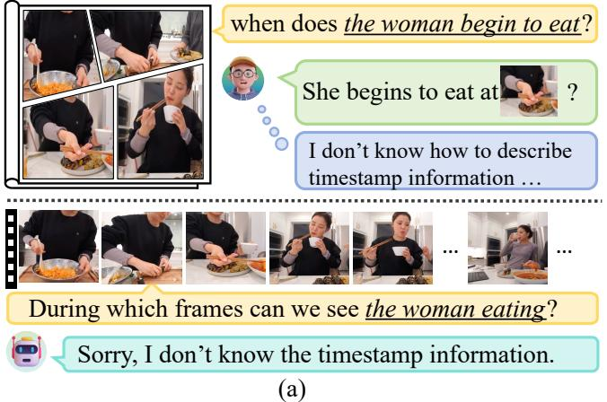
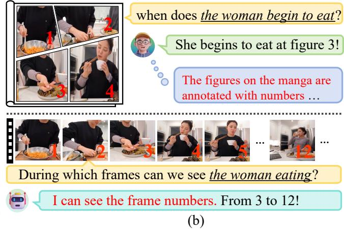
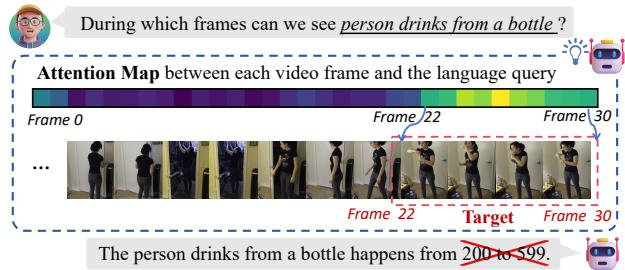
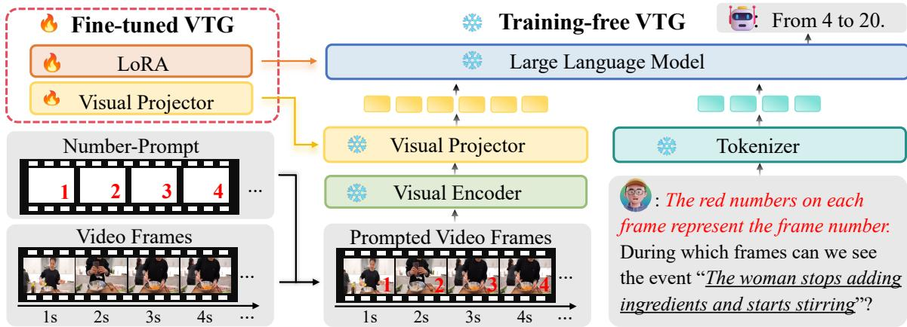
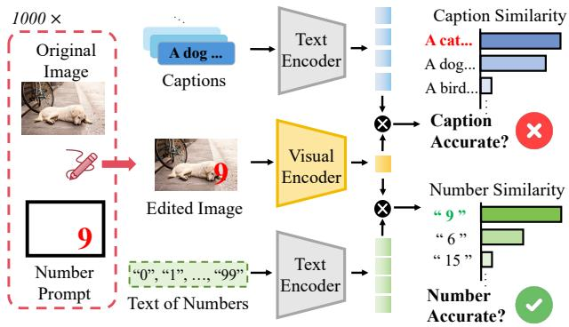
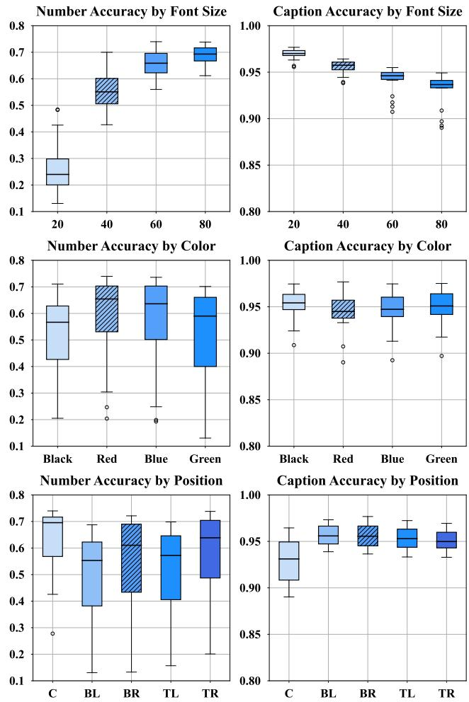
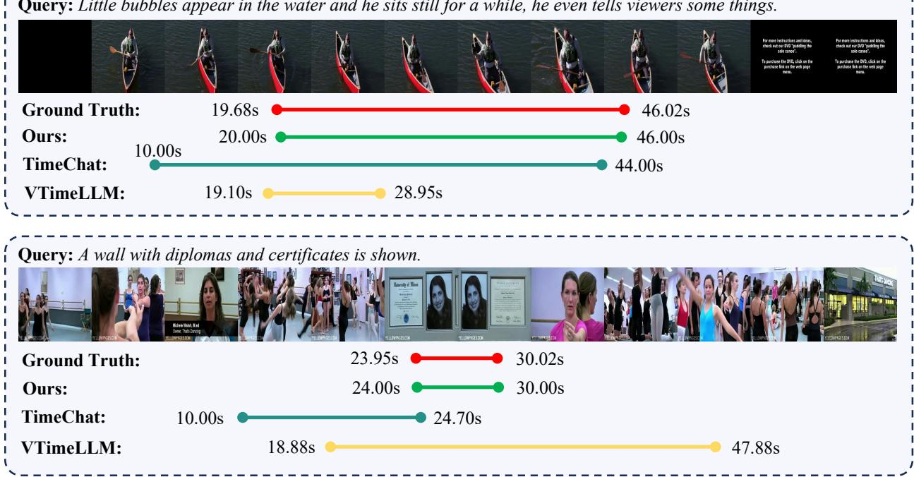
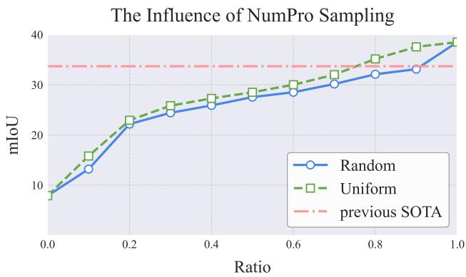

# Number it: Temporal Grounding Videos like Flipping Manga

Yongliang Wu1,2,4\*† Xinting Hu3\* Yuyang Sun1,2 Yizhou Zhou4‡ Wenbo Zhu5 Fengyun Rao4 Bernt Schiele3 Xu Yang1,2§

1Southeast University

2Key Laboratory of New Generation Artificial Intelligence Technology and Its Interdisciplinary Applications (Southeast University), Ministry of Education, China 3Max Planck Institute for Informatics, Saarland Informatics Campus, Germany 4WeChat Vision, Tencent Inc. 5University of California, Berkeley yongliang0223@gmail.com xuyang palm@seu.edu.cn

  
Figure 1. Effectiveness of Adding Frame Numbers for Temporal Grounding: (a) Without numbered images or frames, both humans and Vid-LLMs struggle to locate specific timestamps accurately. (b) Once numbered, grounding temporal cues becomes as intuitive as flipping manga, where timestamps are accessible at a glance

## Abstract

Video Large Language Models (Vid-LLMs) have made remarkable advancements in comprehending video content for QA dialogue. However, they struggle to extend this visual understanding to tasks requiring precise temporal localization, known as Video Temporal Grounding (VTG). To address this, we introduce Number-Prompt (NumPro), a novel method that empowers Vid-LLMs to bridge visual comprehension with temporal grounding by adding unique numerical identifiers to each video frame. Treating a video as a sequence of numberedframe images, NumPro transforms VTG into an intuitive process: flipping through manga panels in sequence. This allows Vid-LLMs to “read” event timelines, accurately linking visual content with corresponding temporal information. Our experiments demonstrate that NumPro significantly boosts VTG performance of top-tier Vid-LLMs without additional computational cost. Furthermore, fine-tuning on a NumPro-enhanced dataset defines a new state-of-the-art for VTG, surpassing previous top-performing methods by up to 6.9% in mIoU for moment retrieval and 8.5% in mAPfor highlight detection. The code is available at https://github.com/yongliangwu/NumPro.

## 1. Introduction

Imagine you are watching a cooking video, and trying to locate the exact moment when the chef stirs in the spices. While recognizing such actions is feasible, translating that visual information into precise timing, i.e., a specific second or frame number, is surprisingly difficult. This challenge is central to the field of Video Temporal Grounding (VTG) [4, 18, 25, 36, 52, 58]. In the realm of Video Large Language Models (Vid-LLMs) [35, 43, 54, 66, 84, 89] which process videos as a sequence of frame images, the integration of VTG allows for fine-grained visual and temporal understanding and reasoning of videos, which is pivotal for developing end-to-end video dialogue systems.

Despite advances of Vid-LLMs, endowing these models with effective VTG abilities presents a unique challenge: enhancing the model’s visual recognition of an event within a video does not inherently enable it to describe when the event begins and ends using language [25, 58]. For instance, advanced Vid-LLMs like Qwen2-VL [66], while excelling at video comprehension, can struggle with grounding specific events in time. When asked, e.g., to locate “when does the woman eat food” in a 10-frame video, the model can hallucinate an illogical answer like “from frame 000 to 580.”\* This limitation arises because these models are primarily trained to align visual content with language descrip tions (what happens) while lacking mechanisms to directly interpret the temporal boundaries (when does it happen). a˚

This gap in powerful Vid-LLMs leads us to think: How can we empower Vid-LLMs to extract temporal cues directly through visual recognition? A familiar human experience – flipping manga – provides an intuitive solution. When flipping manga, each numbered panel guides readers to follow the sequence of the narrative, linking visual content with a clearly defined timeline. Inspired by this, we introduce Number-Prompt (NumPro), which places unique numerical identifiers on each video frame, similar to manga panel numbers.

With NumPro, VTG is as intuitive as flipping manga. As shown in Figure 1, NumPro augments each frame with a unique numerical identifier denoting its position in the temporal sequence. Given a language query targeting an event, Vid-LLMs retrieve relevant visual features of video frames and associate them with the frame numbers overlaid. These numerical identifiers are then directly translated into textual outputs. In practice, we strategically position frame numbers in the bottom-right corner, using a defined font size and distinct color. This design ensures numbers visibility without obstructing essential visual content. Overall, NumPro allows Vid-LLMs to “read” the video timeline, effectively converting visual recognition into a temporal narrative.

NumPro’s elegance lies in its simplicity: by subtly adding frame numbers as temporal markers into video frames, we enable Vid-LLMs to naturally correlate each frame to its temporal location in the video sequence. Unlike previous approaches [20, 25, 26, 40, 55, 58, 68], NumPro does not introduce additional tokens or modify model vocabulary to provide temporal cues, thus avoiding additional learning complexities and maintaining strong transferability across various tasks and datasets. Temporal grounding, therefore, becomes an accessible, “free-lunch” enhancement for Vid-LLMs already proficient in understanding video content. Additionally, fine-tuning on a specially curated NumPro-enhanced VTG dataset (NumPro-FT) further advances state-of-the-art performance.

  
Figure 2. Attention Analysis between Video Frames and Event Query. Although the model accurately attends to regions of interest related to the query, it struggles to generate precise temporal boundaries in its response.

Our contributions can be summarized as follows:

• We introduce NumPro, a novel approach that enhances Video Temporal Grounding (VTG) capabilities of Vid-LLMs by overlaying frame numbers onto video frames, making temporal grounding as intuitive as following numbered panels in flipping manga.

• Through an experimental study, we find a suitable NumPro design (font size, color, and position) that ensures high detectability by the model while minimally interfering with the original video content.

• We thoroughly evaluate NumPro on standard VTG benchmarks and metrics in both training-free and fine-tuned scenarios, demonstrating its effectiveness across various models and datasets.

## 2. Related Work

Video Temporal Grounding with Vid-LLMs. Video Temporal Grounding (VTG) [39, 52, 65, 90] focuses on the precise identification of event timestamps within videos, covering tasks such as moment retrieval [3, 4, 7, 15, 17, 18, 34, 45, 64, 75, 76, 81–83, 86], dense captioning [4, 9, 19, 22, 28, 31, 56, 64, 67, 77, 85], and highlight detection [33, 58]. For current Video Large Language Models (Vid-LLMs) [35, 66, 89], which leverage powerful LLMs [1] for cross-modal understanding and videobased reasoning, VTG is crucial for achieving fine-grained temporal and visual comprehension, enabling end-to-end video dialogue systems with integrated temporal reasoning [25, 58, 68]. To achieve this, some methods rely on refined instruction datasets with temporal information (timestamps or frame numbers) for model fine-tuning [25, 40], while others concatenate additional textual temporal timestamps tokens with visual inputs [23, 61] or introduce specific temporal embeddings [20, 58]. Additional strategies model video structure [21, 26, 68] to better segment or organize videos into parts suitable for VTG. However, these approaches often require extensive retraining or specialized model adaptations, limiting their flexibility and transferability. In contrast, our NumPro aims to improve VTG for existing Vid-LLMs without additional training costs or architectural modifications.

  
Figure 3. Framework of Our Approach in Two Settings: (1) Training-free VTG with NumPro, where frame numbers are directly added to video frames, enabling Vid-LLMs to locate events temporally without additional training, and (2) Fine-tuned VTG with NumPro-FT, which further improves VTG performance by fine-tuning Vid-LLMs on a dataset NumPro-enhanced with no architectural modifications.

Visual Prompt in VLMs. Visual prompts [70], taking various forms such as circles [5, 78], bounding boxes [11, 14, 47] and semantic masks [49, 80], enhance vision-language models (VLMs) [48, 62, 69, 72, 79, 88] to focus on and reason about specific visual regions and reduce the occurrence of hallucination [5]. For CLIP [57], a simple red circle [60] or colored region [80] can effectively guide model attention. Multi-modal large language models (MLLMs) [2, 6, 38] are also sensitive to specific visual prompts [5]. For example, ViP-LLaVA [5] and SoM [78] prompt MLLMs to answer about specific image regions with graphic shapes or numeric tags. CoLLaVO [32] and DOrA [71] utilize pixel-level prompts in images or videos to enhance the semantic localization capability of MLLMs. Additionally, toolchain [59, 63, 73, 92] approaches aggregate various visual prompts into multi-step reasoning paradigm to support reasoning complex tasks. While prior works focus on enhancing the region-based visual understanding of VLMs with visual prompts, our NumPro is the first to employ simple numerical tags as visual prompts within video frames to improve the temporal grounding capability.

## 3. Number-Prompt Approach

Our Number-Prompt (NumPro) approach provides a simple yet effective solution to enhance Video Temporal Grounding (VTG) capabilities of existing Video Large Language Models (Vid-LLMs) in both training-free and fine-tuned settings, as shown in Figure 3. Section 3.1 presents an attention analysis based on Qwen2-VL [66] to highlight the challenge of aligning visual features with textual temporal boundaries. Section 3.2 describes the construction of NumPro and the fine-tuning process of Vid-LLMs on a NumPro-augmented VTG dataset, referred to as NumPro-FT. Finally, Section 3.3 details the design optimization of NumPro for maximizing its effectiveness.

## 3.1. Attention Analysis

Current Vid-LLMs process videos as a sequence of frames. Visual representations of the video can be taken as the concatenated representations from each individual frame, aggregating the information from discrete frames into a comprehensive video level. This allows Vid-LLMs to understand videos by aligning visual representations of frame images with the textual representations of language queries.

To explore the challenge in video temporal grounding (VTG), we analyze the attention map between representations of the frame image tokens and the query language tokens, and then we assess the temporal description of relevant video frames. Using Qwen2-VL-7B [66] as a case study, we highlight the challenge of VTG for Vid-LLMs: while Vid-LLMs can understand what event is happening within a video, they struggle to translate this understanding into a textual description that describes when the event begins and ends.

Specifically, we take a video and a language query as input, and extract the attention scores from the final multihead self-attention layer of Qwen2-VL-7B [66]. For each frame within the video sequence, we aggregate the attention scores from all the visual tokens corresponding to that frame across all attention heads. As illustrated in Figure 2, the attention map reveals a strong correlation between the text query of an event and targeted video segments. It indicates that Qwen2-VL-7B can effectively focus on queryrelevant frames, which is consistent with the model’s strong performance in other content-related video understanding tasks [16, 37, 74]. However, the model struggles to verbalize the correct temporal boundaries, and generates surprising hallucinations such as “from 200 to 599.”†. This observation underscores the need for mechanisms that can bridge the gap between spatial feature alignment and temporal reasoning with Vid-LLMs, which we aim to address.

## 3.2. NumPro and NumPro-FT

Our approach, Number-Prompt (NumPro), empowers Vid-LLMs to directly associate specific visual content with its temporal information, turning temporal localization into a visual alignment task. As shown in Figure 3, NumPro operates in both training-free and fine-tuned scenarios.

In the training-free setting, each video frame is marked with its corresponding frame number. By utilizing the builtin Optical Character Recognition (OCR) capabilities of Vid-LLMs, we enable them to “read” the timeline through the frame numbers associated with visual content. To clarify the purpose of the added numbers to Vid-LLMs, we prepend a simple instruction to each event query: “The red numbers on each frame represent the frame number.” This approach allows Vid-LLMs to identify frame-level boundaries by directly linking the frame numbers to language queries.

For improved performance, NumPro-FT fine-tunes Vid-LLMs on a NumPro-augmented dataset. This stage aligns frame numbers with temporal spans within the training data, embedding temporal grounding capabilities into the model’s learned representations. During fine-tuning, we freeze the visual encoder and only fine-tune the visual projector and LLM components. To reduce parameter count and training overhead, we apply Low-Rank Adaptation (LoRA) [24] to adjust the LLM. Our training objective is to maximize the likelihood of generating the correct answer tokens A via auto-regressive language modeling:

$$
P (\mathbf {A} \mid V, T _ {\text {instruct}}) = \prod_ {j = 1} ^ {L} P _ {\theta} (A _ {j} \mid V, X _ {\text {instruct}}, \mathbf {A} _ {<   j})\tag{1}
$$

Here, V represents the input video, ω denotes the trainable parameters, $T _ { \mathrm { i n s t r u c t } }$ is the text instruction, L is the length of the answer sequence A, and $\mathbf { A } _ { < j }$ includes all preceding answer tokens before the current token $A _ { j }$

## 3.3. Design of Numerical Prompt

An effective NumPro design must ensure: (1) numbers are easily recognized by the model, and (2) minimal interference with visual content. Previous research [5] indicates that the appearance and placement of visual prompts can influence model attention. Given that all Vid-LLMs operate at a fixed resolution of 336 336, we optimize NumPro by assessing three factors: font size, color, and placement position of the frame number.

  
Figure 4. Our NumPro Design Algorithm. We overlay different numbers onto COCO images and obtain visual and textual representations using CLIP encoders. For each configuration, we calculate Number/Caption Similarity and derive Number/Caption Accuracy, to identify the optimal NumPro design that balances recognizability and minimal disruption to the visual content.

To determine an effective NumPro design, we use two primary metrics: Number Accuracy, assessing how well the model identifies overlaid numbers, and Caption Accuracy, measuring how accurately the original caption aligns with frame content after adding numbers. Balancing these two metrics allows us to select NumPro configurations where the numbers are clearly recognizable without disrupting the main video content.

To make the design choices robust across various models and datasets, we employ CLIP-based experiments on a subset of MSCOCO dataset [42] to calculate Number Accuracy and Caption Accuracy separately. We use the CLIP ViT-B/32 [8, 12, 27, 30, 46, 57, 91] model to generate visual and textual representations, as many Vid-LLMs utilize CLIPstyle vision encoders [13, 44, 66], allowing our findings to generalize well across Vid-LLMs. COCO image-caption pairs serve as proxies for video frames, avoiding the high costs and limited scalability of direct VTG testing. Specifically, we randomly select 1,000 distinct image-caption pairs from MSCOCO [42] and overlay numbers ranging from “0” to “99” onto the image in various configurations.

As shown in Figure 4, we first obtain representations from CLIP [57] vision and text encoders and compute intermediate similarity scores (i.e., Number and Caption Similarity) between them. Using the added numbers and original captions as ground truth, we select the text numbers and captions with the highest similarity scores as predictions to calculate Number and Caption Accuracy. Configurations balancing these accuracies are optimal for NumPro design.

As shown in Figure 5, our findings indicate that increasing the font size improves number accuracy but reduces caption accuracy, suggesting that a moderate font size (40 or 60) is optimal. For color selection, caption accuracy remains relatively stable across different colors. Red shows the best performance for number accuracy, while black was the least effective. This finding is also consistent with previous works [5, 60]. Additionally, positioning the text in the center of the image significantly reduced caption accuracy due to overlaps with key visual elements, while placing the numbers in the bottom-right corner provides the best balance between caption and number accuracy. Finally, we select a font size of 40, the color red, and the bottom-right position for our final NumPro design.

  
Figure 5. The Impact of Different Number-Prompt Designs. We categorize the design into three dimensions: font size, position, and color. BL stands for Bottom Left, BR for Bottom Right, TL for Top Left, TR for Top Right, and C for Center.

In practice, CLIP-based designs provide approximate rather than definitive guidance, further testing on Vid-LLMs with a VTG dataset may yield additional model-specific insights. In Sec 4.3, consistent results further validate the effectiveness of our design.

## 4. Experiments

We evaluate our model on two Video Temporal Grounding (VTG) tasks: Moment Retrieval [4, 18] and Highlight Detection [33]. Moment Retrieval, given a language query describing an event, identifies the specific start and end video frames of the event. We utilize Charades-STA [18] and ActivityNet [4] as evaluation datasets, following previous works [25, 55, 58, 68]. Evaluation metrics include the mean Intersection over Union (mIoU) and recall@1 at various IoU thresholds m (R@m), where m is set to 0.3, 0.5, 0.7 following previous work [25, 58]. For Highlight Detection, which aims to locate and rank video frames based on their relevance to the language query, we use QVHighlights [33] for evaluation. Evaluation metrics include mean Average Precision (mAP) and HIT@1 (the hit ratio of the highestscored clip), as in [20, 33, 58]. Please see Appendix 13 for more task examples.

## 4.1. Implementation Details for NumPro-FT

Dataset Preparation. Our temporal grounding dataset consists of 70k question-answer pairs from DiDeMo [51] and ActivityNet Caption [4] datasets. Additionally, we incorporate data from Stage 2 and Stage 3 of VTimeLLM dataset [25]. After filtering out invalid videos, we obtain a comprehensive instruction dataset totaling 220k samples. Each video in our dataset is augmented with our NumPro method by overlaying frame numbers directly onto the video frames. The question-answer pairs follow a consistent template: questions are formatted as “During which frames can we see query ?” and answers are formatted as “From x to y”, where x and y denote the start and end frame numbers of the query event.

Training Details. We utilize the LongVA-7B-DPO [87] as our base model, taking into account its uncomplicated design and its extensive capacity to handle context length. Additionally, it has not been trained on any video data. The model is trained for 3 epochs over our curated dataset with a total batch size of 128. We use the AdamW optimizer [29] with cosine learning rate decay. The learning rate is set to 1e-4, and the warm-up ratio is 0.05. The LLM component utilizes LoRA with parameters r = 64 and ε = 128. All experiments are conducted on 8 H800 GPUs.

## 4.2. Main Results

## 4.2.1. Comparison with State-of-the-Art Methods

Table 1 presents a comparative analysis of Vid-LLMs enhanced with our NumPro/NumPro-FT against existing state-of-the-art (SOTA) methods on Moment Retrieval and Highlight Detection tasks.

Moment Retrieval: Applying training-free NumPro enables Vid-LLMs to approach or exceed previous SOTA performance, benefiting both closed-source and open-source

Table 1. Comparison of performance on the video temporal grounding task with previous state-of-the-art methods. NumPro refers to the use of number prompts for augmentation during inference, while NumPro-FT indicates fine-tuning with the number prompt aug mentation instruction dataset. The best results are highlighted in bold, and the second-best are underlined

<table><tr><td rowspan="2">Model</td><td colspan="4">Charades-STA</td><td colspan="4">ActivityNet</td><td colspan="2">QVHighlights</td></tr><tr><td>R@0.3</td><td>R@0.5</td><td>R@0.7</td><td>mIoU</td><td>R@0.3</td><td>R@0.5</td><td>R@0.7</td><td>mIoU</td><td>mAP</td><td>HIT@1</td></tr><tr><td colspan="11">VTG-Tuned Vid-LLMs</td></tr><tr><td>GroundingGPT [40]</td><td>-</td><td>29.6</td><td>11.9</td><td>-</td><td>-</td><td>-</td><td>-</td><td>-</td><td>-</td><td>-</td></tr><tr><td>LITA [26]</td><td>-</td><td>-</td><td>-</td><td>-</td><td>-</td><td>25.9</td><td>-</td><td>28.6</td><td>-</td><td>-</td></tr><tr><td>VTG-LLM [20]</td><td>52.0</td><td>33.8</td><td>15.7</td><td>-</td><td>-</td><td>-</td><td>-</td><td>-</td><td>16.5</td><td>33.5</td></tr><tr><td>TimeChat [58]</td><td>47.7</td><td>22.9</td><td>12.5</td><td>30.6</td><td>30.2</td><td>16.9</td><td>8.2</td><td>21.8</td><td>14.5</td><td>23.9</td></tr><tr><td>VTimeLLM [25]</td><td>51.0</td><td>27.5</td><td>11.4</td><td>31.2</td><td>44.0</td><td>27.8</td><td>14.3</td><td>30.4</td><td>-</td><td>-</td></tr><tr><td>Momentor [55]</td><td>42.9</td><td>23.0</td><td>12.4</td><td>29.3</td><td>42.6</td><td>26.6</td><td>11.6</td><td>28.5</td><td>7.6</td><td>-</td></tr><tr><td>HawkEye [68]</td><td>50.6</td><td>31.4</td><td>14.5</td><td>33.7</td><td>49.1</td><td>29.3</td><td>10.7</td><td>32.7</td><td>-</td><td>-</td></tr><tr><td colspan="11">General Vid-LLMs</td></tr><tr><td>GPT-4o [53]</td><td>55.0</td><td>32.0</td><td>11.5</td><td>35.4</td><td>33.3</td><td>21.2</td><td>10.4</td><td>23.7</td><td>39.5</td><td>68.7</td></tr><tr><td>+NumPro</td><td>57.1</td><td>35.5</td><td>13.5</td><td>37.6</td><td>45.5</td><td>30.8</td><td>18.4</td><td>33.6</td><td>40.5</td><td>70.7</td></tr><tr><td>Qwen2-VL-7B [66]</td><td>8.7</td><td>5.4</td><td>2.4</td><td>7.9</td><td>17.0</td><td>9.4</td><td>3.9</td><td>12.5</td><td>21.5</td><td>42.2</td></tr><tr><td>+NumPro</td><td>60.7</td><td>36.8</td><td>15.9</td><td>38.5</td><td>44.2</td><td>26.4</td><td>14.4</td><td>31.3</td><td>23.6</td><td>43.4</td></tr><tr><td>LongVA-7B-DPO [87]</td><td>22.6</td><td>10.1</td><td>2.2</td><td>14.6</td><td>11.8</td><td>5.3</td><td>1.9</td><td>8.2</td><td>14.2</td><td>20.4</td></tr><tr><td>+NumPro</td><td>27.2</td><td>10.3</td><td>2.9</td><td>18.9</td><td>20.1</td><td>10.8</td><td>5.4</td><td>15.2</td><td>15.3</td><td>24.3</td></tr><tr><td>+NumPro-FT</td><td>63.8</td><td>42.0</td><td>20.6</td><td>41.4</td><td>55.6</td><td>37.5</td><td>20.6</td><td>38.8</td><td>25.0</td><td>37.2</td></tr></table>

Vid-LLMs. GPT-4o [53] already exhibits strong moment retrieval capabilities, and our NumPro further enhances the performance. In particular, NumPro achieves a 9.9% increase in mIoU on ActivityNet, surpassing the previous SOTA by 0.9%. Qwen2-VL-7B performs poorly initially and also sees a significant improvement with NumPro, averaging a 24.7% increase in mIoU across datasets.

Moreover, starting from a relatively low baseline on LongVA-7B-DPO [87], our fine-tuning approach, NumPro-FT, establishes new SOTA across all metrics. On Charades-STA, it surpasses previous SOTA by 11.8%, 8.2%, 4.9%, 7.7% (R@0.3, R@0.5, R@0.7, mIoU), and on ActivityNet, it surpasses previous SOTA by 6.5%, 8.2%, 6.3%, 6.1% (R@0.3, R@0.5, R@0.7, mIoU). These results demonstrate that NumPro and NumPro-FT can utilize the superior video understanding abilities of existing Vid-LLMs and significantly enhance their moment retrieval capabilities.

Highlight Detection: In this task, models like GPT-4o [53] and Qwen2-VL have already achieved state-of-theart (SOTA) performance. However, our NumPro approach consistently enhances their performance, with an average increase of 1.55% in mean Average Precision (mAP) and 1.6% in the hit ratio of the highest-scored clip (HIT@1). Additionally, applying NumPro-FT enables LongVA-7B-DPO to surpass existing SOTA by a large margin (+8.5% in mAP and +3.7% in HIT@1). These findings suggest that NumPro and NumPro-FT, which can be easily appended to current Vid-LLMs, hold substantial potential for further advancing temporal reasoning capabilities.

## 4.2.2. Effectiveness of NumPro across Vid-LLMs

Beyond surpassing SOTA, Table 2 demonstrates the broad applicability and scalability of NumPro across various Vid-LLMs in Video Temporal Grounding. We apply NumPro to additional Vid-LLMs, including LLaVA-Video-7B [89], LLaVA-OneVision-7B [35], and Qwen2-VL-72B [66], and observe notable performance improvements, with average mIoU gains reaching up to 18.1% on Charades and 14.0% on ActivityNet. Moreover, we conduct fine-tuning experiments with and without NumPro-augmented data (indicated as +FT in Table 2). Results show that NumPro-FT consistently outperforms conventional fine-tuning, particularly on longer video datasets like ActivityNet, where it achieves a substantial 9.8% gain in mIoU. Additional studies on NumPro’s effectiveness for QVHighlights are provided in Appendix 10. Those observations underscore the effectiveness of NumPro across models and highlight its superior impact when combined with fine-tuning.

## 4.2.3. Qualitative Results

In Figure 6, we compare our method with SOTA methods, TimeChat [58] and VTimeLLM [25], through two visualization cases from our ActivityNet dataset. The first example features minimal scene changes between video frames. TimeChat predicts an early start, while VTimeLLM fails to capture the full event duration. In contrast, our method precisely captures the correct event boundaries. The second case involves a shorter event duration and frequent scene changes. TimeChat completely misses the event, and VTimeLLM overestimates the event duration by including irrelevant segments. Our approach, again, precisely delineates the event boundaries. These qualitative examples underscore the robustness and precision of our method in scenarios that are especially challenging for other SOTA methods. We provide additional cases on moment retrieval and highlight detection in Appendix 13.

Table 2. Performance of Applying NumPro to Various Vid-LLMs and Ablation Results on NumPro-FT.

<table><tr><td rowspan="2">Model</td><td colspan="4">Charades-STA</td><td colspan="4">ActivityNet</td></tr><tr><td>R@0.3</td><td>R@0.5</td><td>R@0.7</td><td>mIoU</td><td>R@0.3</td><td>R@0.5</td><td>R@0.7</td><td>mIoU</td></tr><tr><td>LLaVA-OneVision-7B [35]</td><td>22.3</td><td>7.9</td><td>2.1</td><td>15.9</td><td>7.1</td><td>3.1</td><td>1.1</td><td>6.1</td></tr><tr><td>+NumPro</td><td>42.9(+20.6)</td><td>19.4(+11.5)</td><td>6.6(+4.5)</td><td>28.1(+12.2)</td><td>14.4(+7.3)</td><td>7.9(+4.8)</td><td>3.8(+2.7)</td><td>11.3(+5.2)</td></tr><tr><td>LLaVA-Video-7B [89]</td><td>11.8</td><td>2.7</td><td>0.1</td><td>9.8</td><td>7.4</td><td>3.1</td><td>1.2</td><td>6.2</td></tr><tr><td>+NumPro</td><td>56.7(+44.8)</td><td>25.6(+22.9)</td><td>8.6(+8.5)</td><td>34.6(+24.8)</td><td>25.2(+17.8)</td><td>15.2(+12.1)</td><td>8.4(+7.2)</td><td>18.6(+12.4)</td></tr><tr><td>Qwen2-VL-72B [66]</td><td>0.0</td><td>0.0</td><td>0.0</td><td>0.2</td><td>1.0</td><td>0.6</td><td>0.3</td><td>1.0</td></tr><tr><td>+NumPro</td><td>25.8(+25.8)</td><td>9.9(+9.9)</td><td>3.0(+3.0)</td><td>17.4(+17.2)</td><td>35.5(+34.5)</td><td>21.4(+20.8)</td><td>11.0(+10.7)</td><td>25.5(+24.5)</td></tr><tr><td>LongVA-7B-DPO [87]</td><td>22.6</td><td>10.1</td><td>2.2</td><td>14.6</td><td>11.8</td><td>5.3</td><td>1.9</td><td>8.2</td></tr><tr><td>+FT</td><td>62.0</td><td>41.6</td><td>19.9</td><td>40.2</td><td>41.8</td><td>25.7</td><td>13.7</td><td>29.0</td></tr><tr><td>+NumPro-FT</td><td>63.8(+41.2)</td><td>42.0(+31.9)</td><td>20.6(+18.4)</td><td>41.4(+26.8)</td><td>55.6(+43.8)</td><td>37.5(+32.2)</td><td>20.6(+18.7)</td><td>38.8(+30.6)</td></tr></table>

Table 3. Ablation study on various NumPro designs. We divide the designs into three dimensions: font size, color, and position.

<table><tr><td rowspan="2">Size</td><td rowspan="2">Color</td><td rowspan="2">Position</td><td colspan="4">Charades-STA</td></tr><tr><td>R@0.3</td><td>R@0.5</td><td>R@0.7</td><td>mIoU</td></tr><tr><td>40</td><td>Red</td><td>Top Left</td><td>56.7</td><td>32.9</td><td>13.8</td><td>35.8</td></tr><tr><td>40</td><td>Red</td><td>Top Right</td><td>58.2</td><td>34.0</td><td>13.0</td><td>36.8</td></tr><tr><td>40</td><td>Red</td><td>Center</td><td>53.7</td><td>29.5</td><td>10.4</td><td>34.1</td></tr><tr><td>40</td><td>Red</td><td>Bottom Left</td><td>61.6</td><td>37.8</td><td>15.9</td><td>39.3</td></tr><tr><td>40</td><td>Red</td><td>Bottom Right</td><td>60.7</td><td>36.8</td><td>15.9</td><td>38.5</td></tr><tr><td>20</td><td>Red</td><td>Bottom Right</td><td>53.6</td><td>34.0</td><td>14.0</td><td>34.6</td></tr><tr><td>40</td><td>Red</td><td>Bottom Right</td><td>60.7</td><td>36.8</td><td>15.9</td><td>38.5</td></tr><tr><td>60</td><td>Red</td><td>Bottom Right</td><td>58.0</td><td>34.5</td><td>14.1</td><td>37.1</td></tr><tr><td>80</td><td>Red</td><td>Bottom Right</td><td>58.0</td><td>33.9</td><td>13.7</td><td>36.9</td></tr><tr><td>40</td><td>Red</td><td>Bottom Right</td><td>60.7</td><td>36.8</td><td>15.9</td><td>38.5</td></tr><tr><td>40</td><td>Blue</td><td>Bottom Right</td><td>57.8</td><td>34.2</td><td>14.6</td><td>36.6</td></tr><tr><td>40</td><td>Black</td><td>Bottom Right</td><td>56.6</td><td>36.0</td><td>15.9</td><td>36.6</td></tr><tr><td>40</td><td>Green</td><td>Bottom Right</td><td>56.0</td><td>33.8</td><td>14.5</td><td>36.0</td></tr></table>

## 4.3. Validation of NumPro Design

Following our heuristic design process in Sec 3.3, we validate its effectiveness in temporal grounding tasks to confirm that these design choices generalize beyond the COCO dataset. We conduct moment retrieval experiments on Charades-STA [18] with Qwen2-VL-7B [66] in a trainingfree setting. As shown in Table 3, the results align closely with our initial observations from the COCO dataset, confirming the effectiveness of our design choices in VTG tasks. Specifically, (1) Position: Consistent with our CLIPbased findings, placing the text in the center has the largest impact on performance due to overlaps, while our choice of the bottom-right performs comparably to the best position; (2) Font Size: Both very large and very small fonts yield suboptimal results, supporting our balanced selection; (3) The performance on VTG is sensitive to number color, yet the red color consistently delivers the best performance, which may attribute to its high contrast against typical backgrounds [60]. Overall, the alignment between the CLIPbased design choices and the VTG results shows the validity and robustness of our NumPro design. Please refer to Appendix 11 for the ablation results of NumPro-FT. We also try directly overlaying timestamps (e.g., “10.5s”) on frames, which show inferior performance than frame numbers (Appendix 12).

## 4.4. Investigation on the Sampling of NumPro

Typically, we augment every frame in a video with NumPro. In this section, we evaluate the impact of varying the sampling ratio and sampling method (randomly or uniformly) when selecting a subset of frames from the video to augment NumPro. As depicted in Figure 7, performance increases with more labeled frames, with uniform sampling generally maintaining higher accuracy. Notably, labeling just 20% of the frames provides a substantial performance boost and uniform sampling of 80% of the frames surpasses previous state-of-the-art, underscoring the robustness of our NumPro approach.

## 4.5. Influence on General Video-QA

To explore the broader applicability of NumPro, we integrate it into general video-QA tasks, using VideoInstruct [50] as our benchmark. As detailed in Table 4, the incorporation of NumPro minimally affects general comprehension metrics, with a slight decrease in Distraction Overlap (DO, -0.02) and an enhancement in Temporal Understanding (TU, +0.1). This indicates that Vid-LLMs equipped with NumPro maintain robust performance in general video-QA while excelling in precise video temporal grounding (VTG) tasks. This dual capability allows us to harness a powerful Vid-LLM for end-to-end video understanding that can flexibly adapt to both general and temporally nuanced questions within conversational AI systems. Moreover, we examine NumPro on more video-QA bench marks including MVBench [37] and VideoMME [16], and we show Vid-LLMs enhanced with NumPro achieve robust performance across a variety of downstream tasks. Details can be found in Appendix 9.

  
Figure 6. Qualitative Comparison with State-of-the-Art. Our LongVA-7B-DPO model, fine-tuned with NumPro-FT, outperforms TimeChat [58] and VTimeLLM [25] on ActivityNet by accurately identifying event boundaries in challenging scenes.

  
Figure 7. Performance Comparison of Sampling Strategies for NumPro. We compare the effects of NumPro with different sampling ratios and sampling methods (random vs. uniform), as tested on the Charades-STA [18] using the Qwen2-VL-7B [66] model.

## 5. Conclusion

In this paper, we propose Number-Prompt (NumPro), a simple yet efficient visual prompt designed to enhance the video temporal grounding (VTG) capabilities of Video Large Language Models (Vid-LLMs) with no effort. By overlaying frame numbers onto video content, NumPro leverages the inherent Optical Character Recognition (OCR) and visual-language alignment capabilities of Vid-LLMs, allowing them to accurately map events to specific temporal boundaries. Through systematic design informed by COCO-based heuristics and validated across VTG benchmarks, we demonstrated that NumPro effectively supports fine-grained temporal understanding while preserving general video comprehension. Through extensive evaluations, we demonstrated that NumPro consistently achieves state-of-the-art performance in both training-free and fine-tuned settings, enabling adaptable integration into both closed-source and open-source Vid-LLMs. NumPro-FT further refines temporal grounding performance, establishing new SOTA across VTG tasks. Besides, the minimal impact on general video-QA shows that NumPro can augment VTG while maintaining robust video understanding.

Table 4. The influence of applying NumPro to general video-QA. CI stands for correctness of information, DO stands for detail orientation, CU stands for contextual understanding, TU stands for temporal understanding, and CO stands for consistency.

<table><tr><td>Model</td><td>CI</td><td>DO</td><td>CU</td><td>TU</td><td>CO</td></tr><tr><td>Qwen2-VL</td><td>3.10</td><td>2.57</td><td>3.46</td><td>2.47</td><td>3.30</td></tr><tr><td>+NumPro</td><td>3.10</td><td>2.55</td><td>3.46</td><td>2.57</td><td>3.30</td></tr></table>

## Acknowledgement

This work is supported by the National Science Foundation of China (62206048), the Natural Science Foundation of Jiangsu Province (BK20220819), the Fundamental Research Funds for the Central Universities (2242024k30035), and the Southeast University Big Data Computing Center.

## References

[1] Jinze Bai, Shuai Bai, Yunfei Chu, Zeyu Cui, Kai Dang, Xiaodong Deng, Yang Fan, Wenbin Ge, Yu Han, Fei Huang, et al. Qwen technical report. arXiv preprint arXiv:2309.16609, 2023. 2

[2] Yang Bai, Min Cao, Daming Gao, Ziqiang Cao, Chen Chen, Zhenfeng Fan, Liqiang Nie, and Min Zhang. Rasa: Relation and sensitivity aware representation learning for text-based person search. arXiv preprint arXiv:2305.13653, 2023. 3

[3] Meinardus Boris, Batra Anil, Rohrbach Anna, and Rohrbach Marcus. The surprising effectiveness of multimodal large language models for video moment retrieval. arXiv preprint arXiv:2406.18113, 2024. 2

[4] Fabian Caba Heilbron, Victor Escorcia, Bernard Ghanem, and Juan Carlos Niebles. Activitynet: A large-scale video benchmark for human activity understanding. In Proceedings of the ieee conference on computer vision and pattern recognition, pages 961–970, 2015. 2, 5

[5] Mu Cai, Haotian Liu, Siva Karthik Mustikovela, Gregory P Meyer, Yuning Chai, Dennis Park, and Yong Jae Lee. Vipllava: Making large multimodal models understand arbitrary visual prompts. In Proceedings ofthe IEEE/CVF Conference on Computer Vision and Pattern Recognition, pages 12914– 12923, 2024. 3, 4, 5

[6] Min Cao, Chen Chen, Hao Dou, Xiyuan Hu, Silong Peng, and Arjan Kuijper. Progressive bilateral-context driven model for post-processing person re-identification. IEEE Transactions on Multimedia, 23:1239–1251, 2020. 3

[7] Min Cao, Shiping Li, Juntao Li, Liqiang Nie, and Min Zhang. Image-text retrieval: A survey on recent research and development. arXiv preprint arXiv:2203.14713, 2022. 2

[8] Min Cao, Yang Bai, Ziyin Zeng, Mang Ye, and Min Zhang. An empirical study of clip for text-based person search. In Proceedings of the AAAI Conference on Artificial Intelligence, pages 465–473, 2024. 4

[9] Min Cao, Yang Bai, Ziyin Zeng, Mang Ye, and Min Zhang. An empirical study of clip for text-based person search. In Proceedings of the AAAI Conference on Artificial Intelligence, pages 465–473, 2024. 2

[10] Yi-Wen Chen, Yi-Hsuan Tsai, and Ming-Hsuan Yang. Endto-end multi-modal video temporal grounding. Advances in Neural Information Processing Systems, 34:28442–28453, 2021. 2

[11] Ronghao Dang, Jiangyan Feng, Haodong Zhang, Chongjian Ge, Lin Song, Lijun Gong, Chengju Liu, Qijun Chen, Feng Zhu, Rui Zhao, et al. Instructdet: Diversifying referring object detection with generalized instructions. arXiv preprint arXiv:2310.05136, 2023. 3

[12] Alexey Dosovitskiy. An image is worth 16x16 words: Transformers for image recognition at scale. arXiv preprint arXiv:2010.11929, 2020. 4

[13] Haodong Duan, Junming Yang, Yuxuan Qiao, Xinyu Fang, Lin Chen, Yuan Liu, Xiaoyi Dong, Yuhang Zang, Pan Zhang, Jiaqi Wang, et al. Vlmevalkit: An open-source toolkit for evaluating large multi-modality models. arXiv preprint arXiv:2407.11691, 2024. 4

[14] Zhizhao Duan, Hao Cheng, Duo Xu, Xi Wu, Xiangxie Zhang, Xi Ye, and Zhen Xie. Cityllava: Efficient fine-tuning for vlms in city scenario. In Proceedings of the IEEE/CVF Conference on Computer Vision and Pattern Recognition, pages 7180–7189, 2024. 3

[15] Lin Geng Foo, Jia Gong, Zhipeng Fan, and Jun Liu. Systemstatus-aware adaptive network for online streaming video understanding. In Proceedings of the IEEE/CVF Conference on Computer Vision and Pattern Recognition, pages 10514– 10523, 2023. 2

[16] Chaoyou Fu, Yuhan Dai, Yondong Luo, Lei Li, Shuhuai Ren, Renrui Zhang, Zihan Wang, Chenyu Zhou, Yunhang Shen, Mengdan Zhang, et al. Video-mme: The first-ever comprehensive evaluation benchmark of multi-modal llms in video analysis. arXiv preprint arXiv:2405.21075, 2024. 4, 8, 2

[17] Junyu Gao and Changsheng Xu. Fast video moment retrieval. In Proceedings of the IEEE/CVF International Conference on Computer Vision, pages 1523–1532, 2021. 2

[18] Jiyang Gao, Chen Sun, Zhenheng Yang, and Ram Nevatia. Tall: Temporal activity localization via language query. In Proceedings of the IEEE international conference on computer vision, pages 5267–5275, 2017. 2, 5, 7, 8

[19] Wei Guo, Hao Wang, Luankang Zhang, Jin Yao Chin, Zhongzhou Liu, Kai Cheng, Qiushi Pan, Yi Quan Lee, Wanqi Xue, Tingjia Shen, et al. Scaling new frontiers: Insights into large recommendation models. arXiv preprint arXiv:2412.00714, 2024. 2

[20] Yongxin Guo, Jingyu Liu, Mingda Li, Xiaoying Tang, Xi Chen, and Bo Zhao. Vtg-llm: Integrating timestamp knowledge into video llms for enhanced video temporal grounding. arXiv preprint arXiv:2405.13382, 2024. 2, 3, 5, 6

[21] Yongxin Guo, Jingyu Liu, Mingda Li, Xiaoying Tang, Qingbin Liu, and Xi Chen. Trace: Temporal grounding video llm via causal event modeling. arXiv preprint arXiv:2410.05643, 2024. 3

[22] Yuting He, Boyu Wang, Rongjun Ge, Yang Chen, Guanyu Yang, and Shuo Li. Homeomorphism prior for false positive and negative problem in medical image dense contrastive representation learning. IEEE Transactions on Pattern Analysis and Machine Intelligence, 2025. 2

[23] Wenyi Hong, Weihan Wang, Ming Ding, Wenmeng Yu, Qingsong Lv, Yan Wang, Yean Cheng, Shiyu Huang, Junhui Ji, Zhao Xue, et al. Cogvlm2: Visual language models for image and video understanding. arXiv preprint arXiv:2408.16500, 2024. 2

[24] Edward J Hu, Phillip Wallis, Zeyuan Allen-Zhu, Yuanzhi Li, Shean Wang, Lu Wang, Weizhu Chen, et al. Lora: Lowrank adaptation of large language models. In International Conference on Learning Representations, 2021. 4

[25] Bin Huang, Xin Wang, Hong Chen, Zihan Song, and Wenwu Zhu. Vtimellm: Empower llm to grasp video moments. In Proceedings of the IEEE/CVF Conference on Computer Vision and Pattern Recognition, pages 14271–14280, 2024. 2, 5, 6, 8, 1

[26] De-An Huang, Shijia Liao, Subhashree Radhakrishnan, Hongxu Yin, Pavlo Molchanov, Zhiding Yu, and Jan Kautz. Lita: Language instructed temporal-localization assistant. arXiv preprint arXiv:2403.19046, 2024. 2, 3, 6

[27] Jincen Jiang, Qianyu Zhou, Yuhang Li, Xuequan Lu, Meili Wang, Lizhuang Ma, Jian Chang, and Jian Jun Zhang. Dgpic: Domain generalized point-in-context learning for point cloud understanding. In European Conference on Computer Vision, pages 455–474. Springer, 2024. 4

[28] Minkuk Kim, Hyeon Bae Kim, Jinyoung Moon, Jinwoo Choi, and Seong Tae Kim. Do you remember? dense video captioning with cross-modal memory retrieval. In Proceedings of the IEEE/CVF Conference on Computer Vision and Pattern Recognition, pages 13894–13904, 2024. 2

[29] Diederik P Kingma. Adam: A method for stochastic optimization. arXiv preprint arXiv:1412.6980, 2014. 5

[30] Youyong Kong, Xiaotong Zhang, Wenhan Wang, Yue Zhou, Yueying Li, and Yonggui Yuan. Multi-scale spatial-temporal attention networks for functional connectome classification. IEEE Transactions on Medical Imaging, 2024. 4

[31] Ranjay Krishna, Kenji Hata, Frederic Ren, Li Fei-Fei, and Juan Carlos Niebles. Dense-captioning events in videos. In Proceedings of the IEEE international conference on computer vision, pages 706–715, 2017. 2

[32] Byung-Kwan Lee, Beomchan Park, Chae Won Kim, and Yong Man Ro. Collavo: Crayon large language and vision model. arXiv preprint arXiv:2402.11248, 2024. 3

[33] Jie Lei, Tamara L Berg, and Mohit Bansal. Detecting moments and highlights in videos via natural language queries. Advances in Neural Information Processing Systems, 34: 11846–11858, 2021. 2, 5, 3

[34] Bozheng Li, Mushui Liu, Gaoang Wang, and Yunlong Yu. Frame order matters: A temporal sequence-aware model for few-shot action recognition. arXiv preprint arXiv:2408.12475, 2024. 2

[35] Bo Li, Yuanhan Zhang, Dong Guo, Renrui Zhang, Feng Li, Hao Zhang, Kaichen Zhang, Yanwei Li, Ziwei Liu, and Chunyuan Li. Llava-onevision: Easy visual task transfer. arXiv preprint arXiv:2408.03326, 2024. 2, 6, 7, 1

[36] Hongyu Li, Jinyu Chen, Ziyu Wei, Shaofei Huang, Tianrui Hui, Jialin Gao, Xiaoming Wei, and Si Liu. Llava-st: A multimodal large language model for fine-grained spatialtemporal understanding. arXiv preprint arXiv:2501.08282, 2025. 2

[37] Kunchang Li, Yali Wang, Yinan He, Yizhuo Li, Yi Wang, Yi Liu, Zun Wang, Jilan Xu, Guo Chen, Ping Luo, et al. Mvbench: A comprehensive multi-modal video understanding benchmark. In Proceedings ofthe IEEE/CVF Conference on Computer Vision and Pattern Recognition, pages 22195– 22206, 2024. 4, 8, 2

[38] Shiping Li, Min Cao, and Min Zhang. Learning semanticaligned feature representation for text-based person search.

In ICASSP 2022-2022 IEEE International Conference on Acoustics, Speech and Signal Processing (ICASSP), pages 2724–2728. IEEE, 2022. 3

[39] Yan Li, Bin Ji, Xintian Shi, Jianguo Zhang, Bin Kang, and Limin Wang. Tea: Temporal excitation and aggregation for action recognition. In Proceedings of the IEEE/CVF conference on computer vision and pattern recognition, pages 909–918, 2020. 2

[40] Zhaowei Li, Qi Xu, Dong Zhang, Hang Song, Yiqing Cai, Qi Qi, Ran Zhou, Junting Pan, Zefeng Li, Van Tu Vu, et al. Groundinggpt: Language enhanced multi-modal grounding model. arXiv preprint arXiv:2401.06071, 2024. 2, 6

[41] Kevin Qinghong Lin, Pengchuan Zhang, Joya Chen, Shraman Pramanick, Difei Gao, Alex Jinpeng Wang, Rui Yan, and Mike Zheng Shou. Univtg: Towards unified videolanguage temporal grounding. In Proceedings of the IEEE/CVF International Conference on Computer Vision, pages 2794–2804, 2023. 2

[42] Tsung-Yi Lin, Michael Maire, Serge Belongie, James Hays, Pietro Perona, Deva Ramanan, Piotr Dollar, and C Lawrence ´ Zitnick. Microsoft coco: Common objects in context. In Computer Vision–ECCV 2014: 13th European Conference, Zurich, Switzerland, September 6-12, 2014, Proceedings, Part V 13, pages 740–755. Springer, 2014. 4

[43] Haotian Liu, Chunyuan Li, Qingyang Wu, and Yong Jae Lee. Visual instruction tuning. Advances in neural information processing systems, 36, 2024. 2

[44] Mushui Liu, Bozheng Li, and Yunlong Yu. Omniclip: Adapting clip for video recognition with spatial-temporal omniscale feature learning. arXiv preprint arXiv:2408.06158, 2024. 4

[45] Yang Liu, Dingkang Yang, Yan Wang, Jing Liu, Jun Liu, Azzedine Boukerche, Peng Sun, and Liang Song. Generalized video anomaly event detection: Systematic taxonomy and comparison of deep models. ACM Computing Surveys, 56(7):1–38, 2024. 2

[46] Jinqi Luo, Zhaoning Wang, Chen Henry Wu, Dong Huang, and Fernando De la Torre. Zero-shot model diagnosis. In Proceedings of the IEEE/CVF Conference on Computer Vi sion and Pattern Recognition, pages 11631–11640, 2023. 4

[47] Chuofan Ma, Yi Jiang, Jiannan Wu, Zehuan Yuan, and Xiaojuan Qi. Groma: Localized visual tokenization for grounding multimodal large language models. In European Conference on Computer Vision, pages 417–435. Springer, 2025. 3

[48] Feipeng Ma, Hongwei Xue, Guangting Wang, Yizhou Zhou, Fengyun Rao, Shilin Yan, Yueyi Zhang, Siying Wu, Mike Zheng Shou, and Xiaoyan Sun. Visual perception by large language model’s weights. arXiv preprint arXiv:2405.20339, 2024. 3

[49] Huan Ma, Yan Zhu, Changqing Zhang, Peilin Zhao, Baoyuan Wu, Long-Kai Huang, Qinghua Hu, and Bingzhe Wu. Invariant test-time adaptation for vision-language model generalization. arXiv preprint arXiv:2403.00376, 2024. 3

[50] Muhammad Maaz, Hanoona Rasheed, Salman Khan, and Fahad Shahbaz Khan. Video-chatgpt: Towards detailed video understanding via large vision and language models. arXiv preprint arXiv:2306.05424, 2023. 7, 2

[51] Niluthpol Chowdhury Mithun, Sujoy Paul, and Amit K Roy-Chowdhury. Weakly supervised video moment retrieval from text queries. In Proceedings of the IEEE/CVF Conference on Computer Vision and Pattern Recognition, pages 11592– 11601, 2019. 5

[52] Guoshun Nan, Rui Qiao, Yao Xiao, Jun Liu, Sicong Leng, Hao Zhang, and Wei Lu. Interventional video grounding with dual contrastive learning. In Proceedings of the IEEE/CVF conference on computer vision and pattern recognition, pages 2765–2775, 2021. 2

[53] OpenAI. Hello gpt-4o. https://openai.com/ index/hello-gpt-4o/, 2024. Accessed: 2024-10-21. 6

[54] Yingzhe Peng, Gongrui Zhang, Miaosen Zhang, Zhiyuan You, Jie Liu, Qipeng Zhu, Kai Yang, Xingzhong Xu, Xin Geng, and Xu Yang. Lmm-r1: Empowering 3b lmms with strong reasoning abilities through two-stage rule-based rl. arXiv preprint arXiv:2503.07536, 2025. 2

[55] Long Qian, Juncheng Li, Yu Wu, Yaobo Ye, Hao Fei, Tat-Seng Chua, Yueting Zhuang, and Siliang Tang. Momentor: Advancing video large language model with fine-grained temporal reasoning. arXiv preprint arXiv:2402.11435, 2024. 2, 5, 6

[56] Rui Qian, Weiyao Lin, John See, and Dian Li. Controllable augmentations for video representation learning. Visual Intelligence, 2(1):1, 2024. 2

[57] Alec Radford, Jong Wook Kim, Chris Hallacy, Aditya Ramesh, Gabriel Goh, Sandhini Agarwal, Girish Sastry, Amanda Askell, Pamela Mishkin, Jack Clark, et al. Learning transferable visual models from natural language supervision. In International conference on machine learning, pages 8748–8763. PMLR, 2021. 3, 4

[58] Shuhuai Ren, Linli Yao, Shicheng Li, Xu Sun, and Lu Hou. Timechat: A time-sensitive multimodal large language model for long video understanding. In Proceedings of the IEEE/CVF Conference on Computer Vision and Pattern Recognition, pages 14313–14323, 2024. 2, 3, 5, 6, 8, 1

[59] Dianmo Sheng, Dongdong Chen, Zhentao Tan, Qiankun Liu, Qi Chu, Jianmin Bao, Tao Gong, Bin Liu, Shengwei Xu, and Nenghai Yu. Towards more unified in-context visual understanding. In Proceedings of the IEEE/CVF Conference on Computer Vision and Pattern Recognition, pages 13362– 13372, 2024. 3

[60] Aleksandar Shtedritski, Christian Rupprecht, and Andrea Vedaldi. What does clip know about a red circle? visual prompt engineering for vlms. In Proceedings of the IEEE/CVF International Conference on Computer Vision (ICCV), pages 11987–11997, 2023. 3, 5, 7

[61] Gemini Team, Rohan Anil, Sebastian Borgeaud, Yonghui Wu, Jean-Baptiste Alayrac, Jiahui Yu, Radu Soricut, Johan Schalkwyk, Andrew M Dai, Anja Hauth, et al. Gemini: a family of highly capable multimodal models. arXiv preprint arXiv:2312.11805, 2023. 2

[62] Yoad Tewel, Rinon Gal, Dvir Samuel, Yuval Atzmon, Lior Wolf, and Gal Chechik. Add-it: Training-free object insertion in images with pretrained diffusion models, 2024. 3

[63] Georgios Tziafas and Hamidreza Kasaei. Towards open world grasping with large vision-language models. arXiv preprint arXiv:2406.18722, 2024. 3

[64] Haibo Wang, Zhiyang Xu, Yu Cheng, Shizhe Diao, Yufan Zhou, Yixin Cao, Qifan Wang, Weifeng Ge, and Lifu Huang. Grounded-videollm: Sharpening fine-grained temporal grounding in video large language models. arXiv preprint arXiv:2410.03290, 2024. 2

[65] Limin Wang, Yuanjun Xiong, Zhe Wang, Yu Qiao, Dahua Lin, Xiaoou Tang, and Luc Van Gool. Temporal segment networks for action recognition in videos. IEEE transactions on pattern analysis and machine intelligence, 41(11):2740– 2755, 2018. 2

[66] Peng Wang, Shuai Bai, Sinan Tan, Shijie Wang, Zhihao Fan, Jinze Bai, Keqin Chen, Xuejing Liu, Jialin Wang, Wenbin Ge, et al. Qwen2-vl: Enhancing vision-language model’s perception of the world at any resolution. arXiv preprint arXiv:2409.12191, 2024. 2, 3, 4, 6, 7, 8, 1

[67] Yizhe Wang, Congqi Cao, and Yanning Zhang. Visualsemantic network: a visual and semantic enhanced model for gesture recognition. Visual Intelligence, 1(1):25, 2023. 2

[68] Yueqian Wang, Xiaojun Meng, Jianxin Liang, Yuxuan Wang, Qun Liu, and Dongyan Zhao. Hawkeye: Training videotext llms for grounding text in videos. arXiv preprint arXiv:2403.10228, 2024. 2, 3, 5, 6

[69] Cong Wei, Zheyang Xiong, Weiming Ren, Xinrun Du, Ge Zhang, and Wenhu Chen. Omniedit: Building image editing generalist models through specialist supervision, 2024. 3

[70] Junda Wu, Zhehao Zhang, Yu Xia, Xintong Li, Zhaoyang Xia, Aaron Chang, Tong Yu, Sungchul Kim, Ryan A Rossi, Ruiyi Zhang, et al. Visual prompting in multimodal large language models: A survey. arXiv preprint arXiv:2409.15310, 2024. 3

[71] Tung-Yu Wu, Sheng-Yu Huang, and Yu-Chiang Frank Wang. Dora: 3d visual grounding with order-aware referring. arXiv preprint arXiv:2403.16539, 2024. 3

[72] Yongliang Wu and Xu Yang. A glance at in-context learning. Frontiers ofComputer Science, 18(5):185347, 2024. 3

[73] Yixuan Wu, Yizhou Wang, Shixiang Tang, Wenhao Wu, Tong He, Wanli Ouyang, Jian Wu, and Philip Torr. Dettoolchain: A new prompting paradigm to unleash detection ability of mllm. arXiv preprint arXiv:2403.12488, 2024. 3

[74] Yongliang Wu, Wenbo Zhu, Jiawang Cao, Yi Lu, Bozheng Li, Weiheng Chi, Zihan Qiu, Lirian Su, Haolin Zheng, Jay Wu, et al. Video repurposing from user generated content: A large-scale dataset and benchmark. arXiv preprint arXiv:2412.08879, 2024. 4

[75] Li Xu, He Huang, and Jun Liu. Sutd-trafficqa: A question answering benchmark and an efficient network for video reasoning over traffic events. In Proceedings of the IEEE/CVF conference on computer vision and pattern recognition, pages 9878–9888, 2021. 2

[76] Li Xu, Haoxuan Qu, Jason Kuen, Jiuxiang Gu, and Jun Liu. Meta spatio-temporal debiasing for video scene graph generation. In European Conference on Computer Vision, pages 374–390. Springer, 2022. 2

[77] Antoine Yang, Arsha Nagrani, Paul Hongsuck Seo, Antoine Miech, Jordi Pont-Tuset, Ivan Laptev, Josef Sivic, and

Cordelia Schmid. Vid2seq: Large-scale pretraining of a visual language model for dense video captioning. In Proceedings of the IEEE/CVF Conference on Computer Vision and Pattern Recognition, pages 10714–10726, 2023. 2

[78] Jianwei Yang, Hao Zhang, Feng Li, Xueyan Zou, Chunyuan Li, and Jianfeng Gao. Set-of-mark prompting unleashes extraordinary visual grounding in gpt-4v. arXiv preprint arXiv:2310.11441, 2023. 3

[79] Xu Yang, Yongliang Wu, Mingzhuo Yang, Haokun Chen, and Xin Geng. Exploring diverse in-context configurations for image captioning. Advances in Neural Information Processing Systems, 36, 2024. 3

[80] Yuan Yao, Ao Zhang, Zhengyan Zhang, Zhiyuan Liu, Tat-Seng Chua, and Maosong Sun. Cpt: Colorful prompt tuning for pre-trained vision-language models. AI Open, 5:30–38, 2024. 3

[81] Xinyu Ye and Jiayi Ma. Visual place recognition via local affine preserving matching. In 2021 IEEE International Conference on Robotics and Automation (ICRA), pages 12954– 12960. IEEE, 2021. 2

[82] Xinyu Ye and Jiayi Ma. Neighborhood manifold preserving matching for visual place recognition. IEEE Transactions on Industrial Informatics, 19(7):8127–8136, 2022.

[83] Xinyu Ye, Ge Yan, and Junchi Yan. Vqne: Variational quantum network embedding with application to network alignment. In Proceedings of the 29th ACM SIGKDD Conference on Knowledge Discovery and Data Mining, pages 3105– 3115, 2023. 2

[84] Chao Yi, Yuhang He, De-Chuan Zhan, and Han-Jia Ye. Bridge the modality and capability gaps in vision-language model selection. Advances in Neural Information Processing Systems, 37:34429–34452, 2024. 2

[85] Mingjia Yin, Hao Wang, Wei Guo, Yong Liu, Suojuan Zhang, Sirui Zhao, Defu Lian, and Enhong Chen. Dataset regeneration for sequential recommendation. In Proceedings of the 30th ACM SIGKDD Conference on Knowledge Discovery and Data Mining, pages 3954–3965, 2024. 2

[86] Abhay Zala, Jaemin Cho, Satwik Kottur, Xilun Chen, Barlas Oguz, Yashar Mehdad, and Mohit Bansal. Hierarchical video-moment retrieval and step-captioning. In Proceedings of the IEEE/CVF Conference on Computer Vision and Pattern Recognition, pages 23056–23065, 2023. 2

[87] Peiyuan Zhang, Kaichen Zhang, Bo Li, Guangtao Zeng, Jingkang Yang, Yuanhan Zhang, Ziyue Wang, Haoran Tan, Chunyuan Li, and Ziwei Liu. Long context transfer from language to vision. arXiv preprint arXiv:2406.16852, 2024. 5, 6, 7

[88] Wenyu Zhang, Xin Deng, Baojun Jia, Xingtong Yu, Yifan Chen, Jin Ma, Qing Ding, and Xinming Zhang. Pixel adapter: A graph-based post-processing approach for scene text image super-resolution. In Proceedings ofthe 31st ACM International Conference on Multimedia, pages 2168–2179, 2023. 3

[89] Yuanhan Zhang, Jinming Wu, Wei Li, Bo Li, Zejun Ma, Ziwei Liu, and Chunyuan Li. Video instruction tuning with synthetic data. arXiv preprint arXiv:2410.02713, 2024. 2, 6, 7, 1

[90] Yue Zhao, Yuanjun Xiong, Limin Wang, Zhirong Wu, Xiaoou Tang, and Dahua Lin. Temporal action detection with structured segment networks. In Proceedings of the IEEE international conference on computer vision, pages 2914– 2923, 2017. 2

[91] Zhen Zhao, Jingqun Tang, Chunhui Lin, Binghong Wu, Can Huang, Hao Liu, Xin Tan, Zhizhong Zhang, and Yuan Xie. Multi-modal in-context learning makes an ego-evolving scene text recognizer. In Proceedings ofthe IEEE/CVF Conference on Computer Vision and Pattern Recognition, pages 15567–15576, 2024. 4

[92] Enshen Zhou, Yiran Qin, Zhenfei Yin, Yuzhou Huang, Ruimao Zhang, Lu Sheng, Yu Qiao, and Jing Shao. Minedreamer: Learning to follow instructions via chain-ofimagination for simulated-world control. arXiv preprint arXiv:2403.12037, 2024. 3